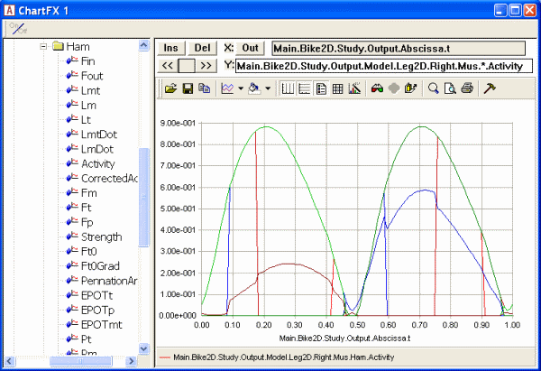
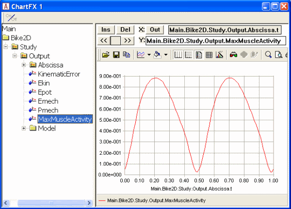
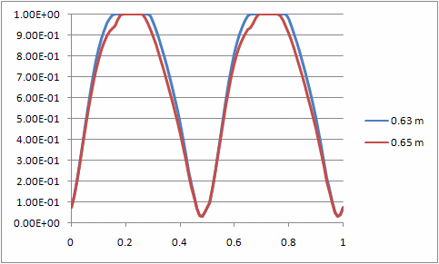

Lesson 5: Min/Max Muscle Recruitment
====================================

.. include:: /caution_old_tutorial.rst

With the exception of the linear criterion, each of the options
presented in the previous lessons have produced plausible muscle
recruitment patterns. We have found that polynomial criteria of
increasing order produce increasing degrees of synergism between the
muscles. Maximum synergism would be the case where all muscles capable
of a positive contribution to balancing the external load work together
in such a way that the maximum relative load of any muscle in the system
is as small as possible. This would physiologically be a minimum fatigue
criterion because fatigue is likely to happen first in the muscle with
the maximum relative load, and it makes physiological sense that the
body might work that way. It would mean that the body would maximize its
endurance and precisely this criterion might decide survival of the
fittest in an environment where organisms are competing with each other
for limited resources.

Mathematically, it turns out that we would get exactly that kind of
recruitment if we let the power of the polynomial criterion go to
infinity. It would not be numerically possible to do that with the
polynomial algorithm we presented in the previous lesson, so it is
necessary to use a dedicated algorithm for that purpose. In its pure
form it is called MinMaxStrict, and we might as well try it out on the
bicycle example right away. It is necessary to change just a little bit
in the definition of the study:

.. code-block:: AnyScriptDoc

    AnyBodyStudy Study = {
      AnyFolder &Model = .Model;
      Gravity = {0.0, -9.81, 0.0};
      tEnd = Main.BikeParameters.T;
      nStep = 100;
      InverseDynamics.Criterion = {
        §Type = MR_MinMaxStrict;§
      };
    };

Reloading and rerunning give us the following result:

|Chart view Muscle activity MinMaxStrict|

When comparing with the muscle activation curves we have seen earlier it
looks like there are less muscles represented on this one, but that is
not actually the case. It just looks like there are fewer curves here
because a lot of them are exactly on top of each other. This is a
logical consequence of minimizing the maximum muscle activity: when
muscles help each other as much as they can, many of them end up with
the same activity.

Min/max recruitment leads to a very well-defined envelope of muscle
activation, and it plays an important role in a lot of cases of
ergonomic design. It is so important, in fact, that the envelope has its
own predefined output variable placed alongside the other global values
such in the study:

|Chart view Max Muscle activty|

The variable, MaxMuscleActivity, is interesting because the maximally
activated muscle(s) in the problem likely determine the perceived
effort. To illustrate this, think of lifting an average size bag. It may
not be difficult to do with your hand, but if you were to grab the
handle with your little finger only, then you would perceive the lifting
of the bag as rather laborious because its weight would now have to be
carried by a much higher maximum muscle activity in much smaller
muscles. This means that the maximum muscle activity is a good measure
to use in ergonomic design cases where we want to determine a tool or a
posture that minimizes the effort of a given work task. Rather than
having to review a lot of muscle activations in the entire body we can
capture the effort in a single curve as shown above.

Closer inspection of the curve above shows that the muscle activation
peaks at 88.2%. Near the top of the Bike2D file you find the variable
SaddleHeight. As the name indicates, it determines the height of the
saddle of the bike, or more precisely the vertical distance between the
crank shaft and the hip joints. The current value is 0.63 m. Try raising
the saddle by 2 cm by the following change:

.. code-block:: AnyScriptDoc

    AnyVar SaddleHeight = 0.6§5§; //Height of hip joint measured vertically from the crank

Then load and run the problem again and plot the MaxMuscleActivity. It
now peaks at 83.5% indicating that the higher saddle has made it
somewhat easier for the rider to pedal the bicycle.

Notice that the maximum muscle activity is defined for any type of
muscle recruitment, but the min/max muscle recruitment illustrates its
definition better because it leads to such a clear envelope.
Furthermore, because min/max recruitment causes the muscle to cooperate
as much as possible, the envelope simulated by this criterion is smaller
than or equal to the envelope of any other criterion that can be
defined. In terms of maximum muscle activity, the min/max muscle
recruitment simply leads to the lowest possible maximum activation by
which the external load can be carried. While this may or may not be the
way muscle are recruited in reality, it is a better way of assessing
ergonomics than most of the other criteria we can think of. If we run
the bicycle simulation with AnyBody’s standard muscle recruitment (third
order polynomial with upper bounds on activities) for saddle heights of
0.63 m and 0.65 m and plot the two curves of maximum muscle activation,
we can get the following:

|Chart view saddle height 63 vs 65|

Notice that because the upper bounds on muscle activation become active,
the curves have the same maxima despite the change of saddle height, and
the ergonomic advantage of the higher saddle comes out as a smaller area
under the red curve compared to the blue.

The reason why the MinMaxStrict criterion is not the default in AnyBody
despite its attractive properties for ergonomic investigations is that
it switches muscles in and out very abruptly when they change moment
arms from negative to positive. These sudden shifts may sometimes happen
faster than physiologically possible and they also mean that muscles
with just a marginally positive contribution will be activates to their
full potential. As we have seen in the previous sections, lower order
polynomial criteria do not have that type of behavior.

It is tempting to think that there might be a compromise between
polynomial and the min/max criterion that would have the attractive
properties of both strategies, i.e. get close to the minimum activation
or fatigue of the muscle system and also have relatively smooth
activation curves. In the next tutorial we shall look at composite
criteria that might combine some of the attractive features of the pure
criteria we have investigated so far. This takes place in

.. rst-class:: without-title
.. seealso::
    **Next lesson:** :doc:`lesson6`.

