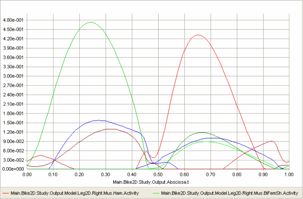
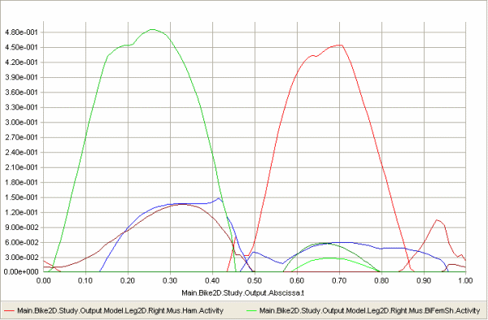
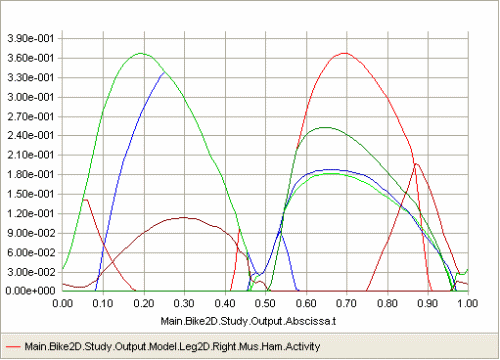

Lesson 6: Composite Recruitment Criteria
========================================

So far we have investigated recruitment criteria in the form of
polynomial sums with degrees ranging from 1 (linear recruitment) to
infinity (min/max recruitment). It is not given, however, that any
single degree criterion is the right one.

It seems reasonable that a high order criterion is correct when the
external load approaches the limit of the organism’s strength because
that enables the organism to use its full strength. On the other hand,
it might also be unreasonable that a lot of muscles should be activated
if the external load is very small and/or some of the muscles have a
very unfavorable moment arm and therefore can contribute very little.

Praagman et al (2003, 2006) reviewed the physiological mechanisms behind
muscle contraction and concluded that there are two energy-consuming
processes, namely detachment of cross bridges and re-uptake of calcium.
If muscle recruitment is based on minimization of energy, then it is
reasonable to think that the objective function contains a contribution
from both these processes and they turn out to be represented by an
objective function with a linear as well as a quadratic term. To
investigate this, let us change the muscle recruitment to the type of
quadratic criterion that also accepts a linear term:

.. code-block:: AnyScriptDoc

    // The study: Operations to be performed on the model
    AnyBodyStudy Study = {
      AnyFolder &Model = .Model;
      Gravity = {0.0, -9.81, 0.0};
      tEnd = Main.BikeParameters.T;
      nStep = 100;
      §InverseDynamics.Criterion = {
        Type = MR_QuadraticAux;
        AuxLinearTerm.Weight = 0.0;
      };§
    };

…and let us also reduce the power consumption to a level that does not
require upper limits on the muscle activation:

.. code-block:: AnyScriptDoc

    // Kinematic parameters
    AnyVar Cadence = 60.0; //Cadence in RPM
    AnyVar MechOutput = §250§; //Average Mechanical output over a cycle in Watt

Loading and running this version will produce the exact same result as
the standard quadratic criterion because the weight on the linear term
is set to zero. The result looks like this:

|Chart view Muscle activty|

However, if we add a bit of weight to the linear term:

.. code-block:: AnyScriptDoc

    InverseDynamics.Criterion = {
      Type = MR_QuadraticAux;
      AuxLinearTerm.Weight = §0.1§;
    };

…we can influence the resulting recruitment and get the following
result:

|Chart view Muscle activty linear weight|

The muscle synergy is slightly reduced by the linear term in the
objective function, and the maximum muscle activation is consequently
slightly higher. Is this better than the pure quadratic recruitment?
That is difficult to answer, but the option allows a discerning user to
influence the recruitment criterion and to build in physiological
considerations such as those by Praagman et al.

The min/max muscle recruitment has a similar alternative form that
allows for the addition of a linear or quadratic term to the objective
function. In this case the quadratic term turns out to be the more
interesting, and it does in fact allow for a recruitment behavior that
combines some of the good features of quadratic and min/max
recruitments. To investigate this in more detail, let us first take a
look at the optimization problem that is solved in the min/max muscle
recruitment problem. We mentioned before that min/max can be interpreted
as a polynomial criterion for which the power is going to infinity.
Obviously, the solution of an infinity-powered objective function
requires some additional mathematical tricks. The trick is to redefine
the muscle recruitment problem to the following form:

Minimize

.. math:: \beta

Subject to

.. math:: \frac{f_{i}^{\left( M \right)}}{N_{i}} \leq \beta,\ \ for\ i = 1..n^{(M)}

.. math:: \mathbf{\text{Cf}} = \mathbf{r}

.. math:: f_{i}^{(M)} \geq 0,\ \ for\ i = 1..n^{(M)}

It is easy to see why this minimizes the maximum muscle activity: The
only way to reduce the objective function, :math:`\beta`, and to honor the
constraints is to simultaneously reduce all the muscle activities. The
question now is: what happens if we add a quadratic auxiliary term to
the objective function, :math:`\beta`, this way:

Minimize

.. math:: \beta + \varepsilon\sum_{i}^{}\left( \frac{f_{i}^{(M)}}{N_{i}} \right)^{2}

Subject to

.. math:: \frac{f_{i}^{\left( M \right)}}{N_{i}} \leq \beta,\ \ for\ i = 1..n^{(M)}

.. math:: \mathbf{\text{Cf}} = \mathbf{r}

.. math:: f_{i}^{(M)} \geq 0,\ \ for\ i = 1..n^{(M)}

where :math:`\varepsilon` is the weight we use to tune the influence of the quadratic
term.

We can do this in AnyBody by choosing the auxiliary form of the min/max
recruitment criterion:

.. code-block:: AnyScriptDoc

    AnyBodyStudy Study = {
    InverseDynamics.Criterion = {
    Type = §MR\_MinMaxAux;§
    §AuxQuadraticTerm.Weight = 1§;
    };

Reloading and rerunning produces the following rather attractive result:

|Chart view Muscle activity MinMaxAux|

This appears to produce a combination of soft onset and offset of
muscles together with a clearly defined envelope on which several
muscles cooperate evenly to carry the load. Please notice, however, that
the effect of the Weight property, i.e. the :math:`\varepsilon` in the objective
function, is somewhat problem dependent because the size of the sum that
it multiplies depends on the number of muscles in the system while the
size of the :math:`\beta` variable remains between 0 and 1 for normal problems. So
models with many muscles would typically require a smaller value of:math:`\varepsilon`.

From what we have seen so far, the MinMaxAux criterion looks ideal from
a mathematical and physiological point-of-view. Unfortunately, there is
one additional, physiological requirement that we have not touched upon,
and on the MinMaxAux criterion fails on that. To understand it, let us
make a thought experiment:

1. We create a model of a person lifting a box. The mass of the box is
   10 kg. The muscle recruitment algorithm will return some distribution
   of load between the muscles in the system.

2. Then we change the mass of the box to 5 kg and run the model again.
   This gives us a different muscle recruitment pattern. Probably the
   muscles would now be somewhat less loaded than before.

3. Now we create a model with two people in it. This is entirely
   possible to do in AnyBody. The two human models are exactly the same
   as before and one is lifting a 10 kg box, and the other is lifting a
   5 kg box. Since the two body models are completely independent from
   each other, except from the fact that they are present in the same
   computer model, we would expect the muscle recruitment we get when
   they are inside a single model to be exactly the same as we got for
   the two single-body models we had before. And this would be the case
   with the polynomial criteria of any degree and with the MinMaxStrict
   criterion, but it would not be the case with the MinMaxAux criterion,
   and this does not seem to be right.

So the conclusion is that the MinMaxAux criterion, despite its
attractive features, should be used with care in models where there is a
chance that some model parts are independent of each other.

.. rst-class:: without-title
.. seealso::
    **Next lesson:** Let us carry on with :doc:`Lesson 7: Calibration <lesson_calibration>`

References
----------

Praagman, M., Veeger, H.E.J., Chadwick, E.K., Colier, W.N., van der
Helm, F.C. (2003). Muscle oxygen consumption, determined by NIRS, in
relation to external force and EMG. Journal of Biomechancis, 36,
905–912.

Praagman M, Chadwick EKJ, van der Helm FCT, Veeger HEJ (2006): The
relationship between two different mechanical cost functions and muscle
oxygen consumption. Journal of Biomechanics, 39, 758–765.

