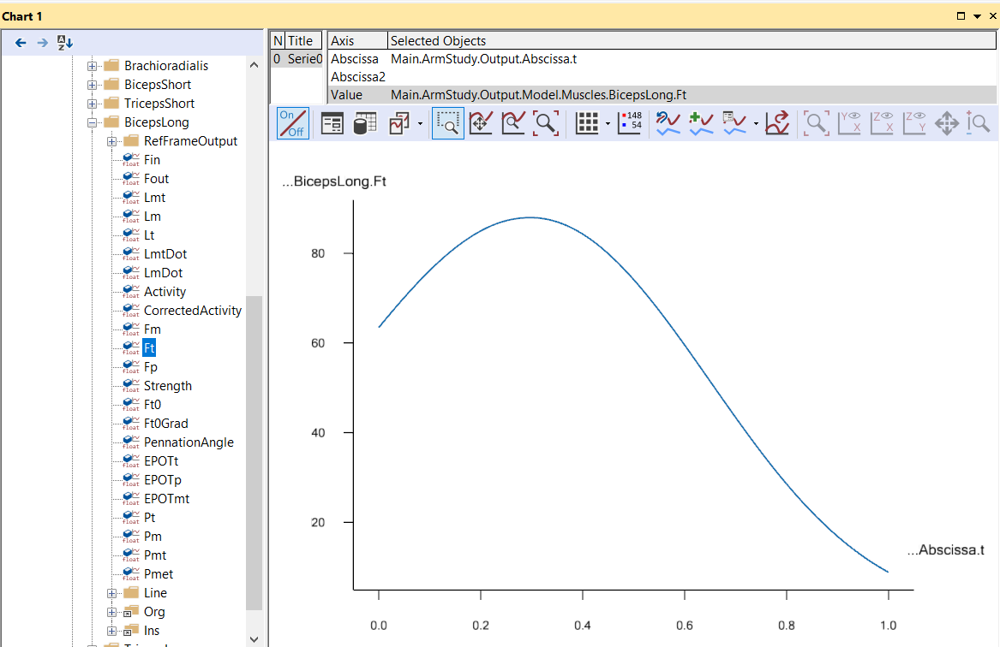

Lesson 7: Calibration
=====================

One of the challenges in body modeling is that models must be able to
change size to reflect individuals of different statures. Even if you
are working on a model of a particular individual, you will almost
always want to change the dimensions of the model as you are building
it. And if you are developing a generic model to represent a range of
body proportions, you are likely to want the model to depend on the
anthropometrical parameters you define. For instance, the weight of a
segment is often represented as some fraction of the full body weight.
Such a property you could make parametric by simply defining it as a
function of the full body weight by means of a simple formula.

But other dimensions are more subtle and difficult to establish as a
direct functional dependency of other parameters. Tendon lengths are
perhaps the most prominent example. If you are in doubt of the
importance of tendon lengths, just try to bend over and touch your toes
with your knees stretched. Some of us have hamstring tendons that are so
short that we can hardly reach beyond our knees, so tendon lengths
directly limit our ranges of motion. But they also influence the working
conditions of our muscles even when the muscle-tendon unit is not
stretched to its limit, so it is important that we define the muscle
tendon unit so that it fits the body model.

A muscle-tendon unit is attached to at least two segments at its origin
and insertion respectively. To make things worse, some muscles span
several joints, and most muscles wrap over bones and other tissues with
complex geometries on their way from origin to insertion. So, the basic
idea behind calibration of tendon lengths in AnyBody is the assumption
that each muscle-tendon unit has its optimal length at some particular
position of the joints it spans. We simply define one or several studies
that put the body model in these positions and adjust the lengths of the
tendons to give the attached muscles their optimal lengths in those
positions. When you subsequently run an analysis, the system uses the
calibrated tendon lengths regardless of how they are defined in the
AnyScript file. (This means that you have to run the calibration(s)
every time you have reloaded the model if they are to take effect).

AnyBody has several different types of muscle models. Some are very
simple and contain no strength-length relationship, while others do. It
goes almost without saying that the former type is not affected by
calibration. If you use one of the latter - more advanced - models,
however, calibration may be crucial. If the tendon is too long, the
muscle will end up working in an unnaturally contracted state where it
has very little strength. If the tendon is too short, the muscle will be
stretched, and its passive elasticity will affect the force balance in
the system. Since the passive elastic force in a muscle-tendon unit
typically grows very rapidly with stretching, a too short tendon can
cause very large antagonistic muscle actions.

Enough talk! Let's define a muscle and calibrate it. We shall begin with
the simple arm model we developed in the "Getting Started: AnyScript
Programming" tutorial. If you have not already saved the model in a
file, get it here: arm2d.any.

In that simple example, all the muscles were assumed to be of a simple
type with constant strength. We shall add another and much more detailed
muscle model:

.. code-block:: AnyScriptDoc

    // -----------------------------------------------------
    // Muscles
    // -----------------------------------------------------
    AnyFolder Muscles = {
    
      //---------------------------------
      // We define one simple muscle model, which we will use
      // for all muscles §except biceps long§
      AnyMuscleModel MusMdl = {
        F0 = 300;
      };
    
      §AnyMuscleModel3E BicepsLongModel = {
        AnyVar PCSA = 2.66; // Physiological cross sectional area [cm^2]
        F0 = PCSA*30; // Presuming a maximum muscle stress of 30 N/cm^2
        Lfbar = 0.123; //Optimum fiber length [m]
        Lt0 = 0.26; //First guess of tendon slack length [m]
        Gammabar = 0.3*(pi/180); //Pennation angle converted to radians
        Epsilonbar = 0.053; //Tendon strain at F0
        K1 = 10; //Slow twitch factor
        K2 = 0; //Fast twitch factor(zero when no info available)
        Fcfast = 0.4; //Percentage of fast to slow factor
        Jt = 3.0; //Shape parameter for the tendon stiffness
        Jpe = 3.0; //Shape parameter for the parallel stiffness
        PEFactor = 5.0; //Parameter for influence of parallel stiffness
      }; // End of BicepsLongModel§
    };

As you can see from the comments, the muscle has many parameters you
have to set. The significance of each of these is explained in detail in
the muscle modeling tutorial. For this model to take effect, we must
assign it to the biceps long muscle. It is a little further down in the
file, where the red line must be changed:

.. code-block:: AnyScriptDoc

    //---------------------------------
    AnyViaPointMuscle BicepsLong = {
      §AnyMuscleModel &MusMdl = .BicepsLongModel;§
      AnyRefNode &Org = Main.ArmModel.GlobalRef.BicepsLong;
      AnyRefNode &Ins = ..Segs.LowerArm.Biceps;
      AnyDrawViaPointMuscle DrwMus = {};
    };

What we have done here is to give BicepsLong a new and more advanced
muscle model. In this lesson, we also switch to a different muscle
recruitment criteria MR\_MinMaxStrict, which is better suited for
InverseDynamics of overloaded models:

.. code-block:: AnyScriptDoc

    AnyBodyStudy ArmStudy = {
      AnyFolder &Model = .ArmModel;
      InverseDynamics.Criterion.Type = MR_MinMaxStrict;
      Gravity = {0.0, -9.81, 0.0};
    };

Let's have a look at the consequences. Press the M<-S button or F7 and
subsequently run the InverseDynamics. Then, open a new ChartFX window to
investigate the results.

|Chart view BicepsLong.Ft|

This graph shows the muscle force or more precisely the force in the
tendon. The force in this more complex muscle model is composed of two
elements: The active part coming from the contractile element of the
muscle, and the passive part due to the stretching of the
parallel-elastic part of the muscle. The two parts come together in the
tendon force, Ft. The parallel-elastic part of the muscle is represented
by Fp in the result tree. If you pick this property, you should get the
following graph:

|Chart view BicepsLong.Fp|

The parallel-elastic force sets in when the muscle is stretched beyond
its optimal fiber length. In the movement of this example, the elbow
starts at 90 degrees flexion, and as the graph shows, this gives rise to
about 10 N of passive force at the beginning of the movement. This
indicates that the tendon we have specified is too short. If the
movement was extending the elbow instead of flexing it, the passive
force would rise sharply. This means that the result of the simulation
depends a lot on having the correct length of the tendon. If it is too
short, too much of the load will be carried by passive muscle forces. In
this example where we have only one muscle with a complex model, it
would not be too difficult to adjust the tendon length manually until we
get it right, but in models with many muscles, this can be a very
tedious task, particularly since it has to be repeated every time the
dimensions of the model are changed. Instead, the answer is to let
AnyBody calibrate the tendon length automatically.

AnyBody's advanced muscle model, the AnyMuscleModel3E, is basically a
phenomenological model based on the classical works of Hill. It presumes
that each muscle has an optimum contraction in which its fibers have
their best force-producing capability. If we knew the set of joint
positions corresponding to this optimum fiber length for each muscle,
then those joint positions were the ones we would be calibrating the
muscle in.

Finding joint positions corresponding to optimum muscle fiber lengths is
an active and rather young area of research, and the correct values are
only known for a few muscles in the body. However, it is not surprising
that we seem to have been built in such a way that our muscles attain
their optimum fiber lengths in the joint positions where they do most of
their work, and if you are unable to find the information about optimum
joint positions you need, then your best choice may be to calibrate the
muscle in the joint position where it primarily works.

Calibrating the muscle in a particular position requires a calibration
study. Its basic definition is very simple:

.. code-block:: AnyScriptDoc

     // =======================================================
     // "The body study"
     // =======================================================
     AnyBodyStudy ArmModelStudy = {
       AnyFolder &Model = Main.ArmModel;
       InverseDynamics.Criterion.Typer = MR_MinMaxStrict;
       Gravity = {0.0, -9.81, 0.0};
     };
    
     §// A new calibration study
       AnyBodyCalibrationStudy CalibrationStudy = {
         AnyFolder &Model = Main.ArmModel;
         nStep = 1;
       }; // End of study
     §

If you load the model in you can study the structure of the new study:

|Operations Main.InverseDynamics|

You can see that it has multiple operations. The interesting ones are
the two latter: TendonLengthAdjustment and LigamentLengthAdjustment. As
the names indicate they are for tendon and ligament calibration
respectively. Notice that the study only has one time step. The model
posture in that step should be the position in which you wish to
calibrate the tendon. If you run the TendonLengthAdjustment operation
you will notice that the model takes the initial posture of the flexion
movement it was doing in the InverseDynamics. This is because of the
line

.. code-block:: AnyScriptDoc

      AnyFolder &Model = Main.ArmModel;

The ArmModel contains movement drivers, and when they are included in
the study they cause the model to attain the same posture in the
calibration study as it does in the inverse dynamic analysis. To be able
to calibrate in another posture we must perform a small restructuring of
the model and perhaps recommend a organizing things a little differently
in general when making models.

We included the movement in the model when we developed it in the
"Getting Started with AnyScript" tutorial because we wanted things to be
simple. But think for a moment about how you would typically want to use
models. Let's imagine you have developed a model of a leg. One day you
might want to simulate squat, another day perhaps gait, and yet another
day a football kick. You would want to use the same model but with
different sets of drivers. This speaks in favor of having drivers,
loads, and other problem-specific properties outside the folder
containing the body model.

Calibration is actually an example of using the same model with two
different movements, so we have to place the drivers outside the
ArmModel folder. In the editor, highlight the entire Drivers folder, cut
it out, and paste it in right below the end of the ArmModel folder like
this:

.. code-block:: AnyScriptDoc

       }; // ArmModel
      
       §AnyFolder Drivers = {
        
         //---------------------------------
         AnyKinEqSimpleDriver ShoulderMotion = {
           AnyRevoluteJoint &Jnt = Main.ArmModel.Jnts.Shoulder;  // Changed!
           DriverPos = {-100*pi/180};
           DriverVel = {30*pi/180};
           Reaction.Type = {Off};
         }; // Shoulder driver
        
         //---------------------------------
         AnyKinEqSimpleDriver ElbowMotion = {
           AnyRevoluteJoint &Jnt = Main.ArmModel.Jnts.Elbow;  // Changed!
           DriverPos = {90*pi/180};
           DriverVel = {45*pi/180};
           Reaction.Type = {Off};
         }; // Elbow driver
       }; // Driver folder§

Notice that after moving the Drivers folder we have changed the
references to the joints. We also have to change the study a little bit.
This is because the study points at the ArmModel folder, and that no
longer contains a movement, so the study would not know how to move the
model, unless we add this line:

.. code-block:: AnyScriptDoc

     // =======================================================
     // "The body study"
     // =======================================================
     AnyBodyStudy ArmStudy = {
         AnyFolder &Model = .ArmModel;
         AnyFolder &Drivers = .Drivers;
         InverseDynamics.Criterion.Type = MR_MinMaxStrict;
         Gravity = {0.0, -9.81, 0.0};
     };

Now we are ready to define a couple of static drivers specifically for
calibration of the muscles. We create a CalibrationDrivers folder right
below the Drivers folder:

.. code-block:: AnyScriptDoc

     §// -----------------------------------------------------
     // Calibration Drivers
     // -----------------------------------------------------
     AnyFolder CalibrationDrivers = {
    
         //---------------------------------
         AnyKinEqSimpleDriver ShoulderMotion = {
           AnyJoint &Jnt = Main.ArmModel.Jnts.Shoulder;
           DriverPos = {-90*pi/180}; // Vertical upper arm
           DriverVel = {0.0};
           Reaction.Type = {Off};
         };
         //---------------------------------
         AnyKinEqSimpleDriver ElbowMotion = {
           AnyJoint &Jnt = Main.ArmModel.Jnts.Elbow;
           DriverPos = {30*pi/180}; // 20 degrees elbow flexion
           DriverVel = {0.0};
           Reaction.Type = {Off};
         };
     };§
    

These drivers are static because their velocities are zero. They specify
a posture with the upper arm vertical and the elbow at 30 degrees
flexion. Notice the expressions converting degrees to radians.

The final step is to modify the calibration study to use the calibration
drivers:

.. code-block:: AnyScriptDoc

       // A new calibration study
       AnyBodyCalibrationStudy CalibrationStudy = {
         AnyFolder &Model = Main.ArmModel;
         §AnyFolder &Drivers = .CalibrationDrivers;§
         nStep = 1;
       }; // End of study

What we have now is a study that uses the model together with two static
drivers for calibration of the muscles, and a study that uses the model
with the previous set of dynamic drivers. If you run the
CalibrationStudy first, the system will adjust the tendon lengths and
remember the values for the subsequent run of the AnyBodyStudy. Running
this sequence of two studies reveals that there is no more passive force
present in the BicepsLong muscle because it has now been calibrated in a
more natural position.

The final issue of this tutorial is: How can we handle calibration of
different muscles in different positions? For instance, it might be
reasonable to believe that the elbow extensors should be calibrated in a
different elbow position than the elbow flexors. How can we accomplish
that? Well a closer investigation of the calibration study listed above
can actually give us a clue. The study contains the following two lines:

.. code-block:: AnyScriptDoc

     AnyFolder &Model = Main.ArmModel;
     AnyFolder &Drivers = Main.CalibrationDrivers;

This tells us that a study manipulates the objects mentioned inside the
study folder, in this case the ArmModel and the CalibrationDrivers.
Perhaps you remember that we took the drivers out of the ArmModel, so
that we could refer separately to them in the study? We did this to be
able to not refer to the movement drivers when we run the calibration
study and vice versa. Similarly, if we want to calibrate a subset of the
muscles, we simply make it possible to just refer to precisely this
subset in the study and leave the others out.

Let us create a new muscle model for TricepsLong and calibrate that in
another position.

.. code-block:: AnyScriptDoc

    }; // End of BicepsLongModel
    
     §AnyMuscleModel3E TricepsLongModel = {
       AnyVar PCSA = 15; // Physiological cross sectional area [cm^2]
       F0= PCSA*30; // Presuming a maximum muscle stress of 30 N/cm^2
       Lfbar= 0.194; //Optimum fiber length [m]
       Lt0 = 0.35; //First guess of tendon slack length [m]
       Gammabar = 2.0*(pi/180); //Pennation angle converted to radians
       Epsilonbar = 0.053; //Tendon strain at F0
       K1 = 10.0; //Slow twitch factor
       K2 = 0.0; //Fast twitch factor(zero when no info available)
       Fcfast = 0.4; //Percentage of fast to slow factor
       Jt = 3.0; //Shape parameter for the tendon stiffness
       Jpe = 3.0; //Shape parameter for the parallel stiffness
       PEFactor = 5.0; //Parameter for influence of parallel stiffness
     }; // End of TricepsLongModel§

.. code-block:: AnyScriptDoc

    AnyViaPointMuscle TricepsLong = {
      §AnyMuscleModel &MusMdl = .TricepsLongModel;§
      AnyRefNode &Org = ..GlobalRef.TricpesLong;
      AnyRefNode &Ins = ..Segs.ForeArmArm.Tricpes;
      AnyDrawViaPointMuscle DrwMus = {};
    };

Once again we need two drivers to put the model into the posture for
calibration of the TricepsLong muscle:

.. code-block:: AnyScriptDoc

     §// -----------------------------------------------------
     // Triceps Calibration Drivers
     // -----------------------------------------------------
     AnyFolder TricepsCalibrationDrivers = {
    
       //---------------------------------
       AnyKinEqSimpleDriver ShoulderMotion = {
         AnyJoint &Jnt = Main.ArmModel.Jnts.Shoulder;
         DriverPos = {-90*pi/180}; // Vertical upper arm
         DriverVel = {0.0};
         Reaction.Type = {Off};
       };
      
       //---------------------------------
       AnyKinEqSimpleDriver ElbowMotion = {
         AnyJoint &Jnt = Main.ArmModel.Jnts.Elbow;
         DriverPos = {90*pi/180}; // 30 degrees elbow flexion
         DriverVel = {0.0};
         Reaction.Type = {Off};
       };
     };§
    

As you can see, this differs from the drivers for calibration of
BicepsLong only by using 90 degrees elbow flexion rather than 30
degrees.

What we could do now is to take the two advanced muscle models out of
the ArmModel folder, so that we could refer to them individually in the
study; just like we did with the drivers. But let's try something else
instead. We'll simply refer directly to the individual elements of the
ArmModel in the calibration study rather than the entire ArmModel. This
way we are able to leave out the muscles we do not want to include. So
we simply make a new study that looks like this:

.. code-block:: AnyScriptDoc

      §// A calibration study for TricepsLong
      AnyBodyCalibrationStudy TricepsCalibrationStudy = {
         AnyFixedRefFrame &GlobalRef = Main.ArmModel.GlobalRef;
         AnyFolder &Segs = Main.ArmModel.Segs;
         AnyFolder &Jnts = Main.ArmModel.Jnts;
         AnyViaPointMuscle &TricepsLong = Main.ArmModel.Muscles.TricepsLong;
         AnyFolder& Drivers = Main.TricepsCalibrationDrivers;
         nStep = 1;
   }; // End of study§

 

Notice that this study refers to each folder inside the ArmModel
individually. This way, we can restrict our references only to the
TricepsLong muscle and leave all the other muscles out. This means that
the other muscles will not be affected by this calibration. So if you
initially calibrate all the muscles by the CalibrationStudy and
subsequently run the TricepsCalibrationStudy, then the latter will not
overwrite the effect of the former, but only for the muscle mentioned in
the study, i.e. the TricepsLong.

Here's a link to the finished :download:`calibration.any example <Downloads/calibration.any>`.

.. |Chart view BicepsLong.Fp| image:: _static/lesson_calibration/image2.png
   :width: 5.62778in
   :height: 4.88403in
.. |Operations Main.InverseDynamics| image:: _static/lesson_calibration/image3.png
   :width: 2.81389in
   :height: 2.46528in