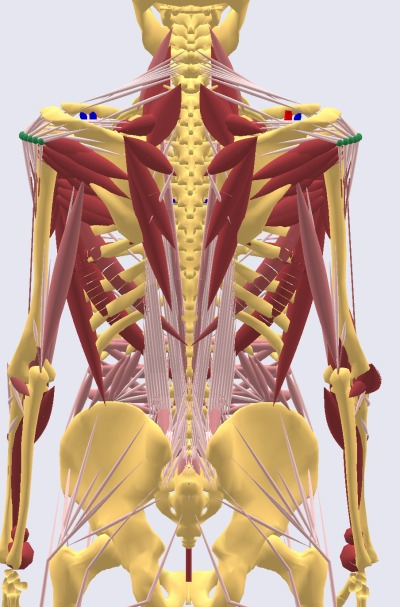

Introduction to Muscle Modeling
=================================

|Muscles back|

Muscles are the actuators of living bodies. They are activated by the
central nervous system (CNS) by a complicated electro-chemical process.
Determining the activation that realizes a desired movement requires an
extremely intricate control algorithm. The CNS is superior to any
computer man has made in this respect. AnyBody mimics the workings of
the CNS by computing backwards from the movement and load specified by
the user to the necessary muscle forces in a process known as inverse
dynamics. To do so, the system must know the properties of the muscles
involved, and this is where muscle modeling comes into the picture.

AnyBody contains four different muscle models ranging from simple to
more complicated physiological behavior. The simplest model just assumes
a constant strength of the muscle regardless of its working conditions.
The more complicated models take such conditions as current length,
contraction velocity, fiber length, pennation angle, tendon elasticity,
and stiffness of passive tissues into account. Please refer to the
AnyScript Reference Manual (Find it in AnyBody->Help) for concise
information about the available muscle models:

1. AnyMuscleModel - assuming constant strength of the muscle

2. AnyMuscleModel3E - a three element model taking serial and parallel
   elastic elements into account along with fiber length and contraction
   velocity

3. AnyMuscleModel2ELin - a bilinear model taking length and contraction
   velocity into account.
   
4. AnyMuscleModelUsr1 - a custom user-defined strength that can be an explicit function of muscle variables, such as length and contraction velocity. 

The muscle models can be linked to different types of muscles:

1. AnyViaPointMuscle - a muscle that passes through any number of nodes
   on segments on its way from origin to insertion

2. AnyShortestPathMuscle - a muscle that can wrap over geometries such
   as cylinders and ellipsoids and even CAD-defined surfaces. Please
   beware that this muscle type is very computationally demanding and
   requires careful adjustment.

3. AnyGeneralMuscle - a more standard actuator-type muscle that can be
   attached to a kinematic measure.

Please refer to the AnyScript Reference for more information, or proceed
to the basics of muscle modeling in :doc:`Lesson 1 <lesson1>`.

.. rst-class:: without-title
.. seealso::
    **Next lesson:** :doc:`lesson1`.

