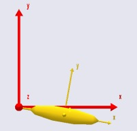
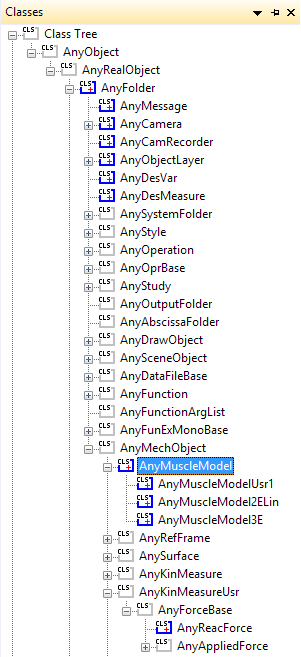
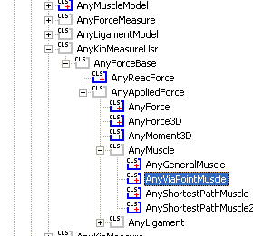
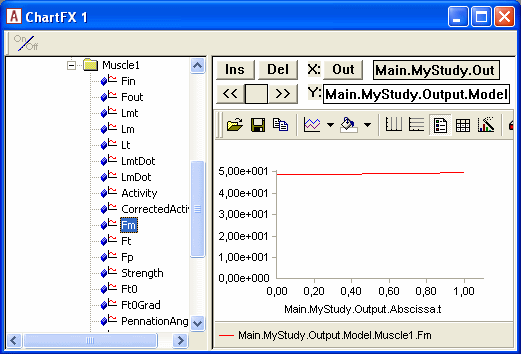

Lesson 1: The Basics of Muscle Definition
=========================================

The key to understanding muscles in the AnyBody Modeling System is to
realize that they mechanically consist of two separate computational
models:

1. The kinematic model, which determines the muscle's path from origin
   to insertion depending on the posture of the body. This also entails
   finding the length and contraction velocity of the muscle.

2. The strength model which determines the muscle's strength and
   possible its passive elastic force depending on the kinematic state
   of the muscle.

 This would be a sad excuse for a tutorial if we did not have an example
to work on. So let us quickly construct a very simple example that will
enable us to examine the properties of muscles. `*Here's an extremely
simple one-degree-of-freedom model (right-click and save to
disk)* <Downloads/MuscleDemo.Ini.any>`__:

.. code-block:: AnyScriptDoc

    // This is a very simple model for demonstration of muscle modeling
    Main = {
      
       AnyFolder MyModel = {
        
         // Global Reference Frame
         AnyFixedRefFrame GlobalRef = {
           AnyDrawRefFrame drw = {
             RGB = {1,0,0};
           };
         };  // Global reference frame
        
         // Define one simple segment
         AnySeg Arm = {
           r0 = {0.500000, 0.000000, 0.000000};
           Mass = 1.000000;
           Jii = {0.100000, 1.000000, 1.000000}*0.1;
           AnyRefNode Jnt = {
             sRel = {-0.5, 0.0, 0};
           };     
           AnyDrawSeg drw = {};
         };
        
         // Attach the segment to ground by a revolute joint
         AnyRevoluteJoint Jnt = {
           AnyRefFrame &ref1 = .GlobalRef;
           AnyRefFrame &ref2 = .Arm.Jnt;
           Axis = z;
         };
        
         // Drive the revolute joint at constant velocity
         AnyKinEqSimpleDriver Drv = {
           DriverPos = {-10*pi/180};
           DriverVel = {40*pi/180};
           AnyRevoluteJoint &Jnt = .Jnt;
           Reaction.Type = {0};
         };
        
       }; // MyModel
      
       // The study: Operations to be performed on the model
       AnyBodyStudy MyStudy = {
         AnyFolder &Model = .MyModel;
         InverseDynamics.Criterion.Type = MR*MinMaxStrict;
         Gravity = {0.0, -9.81, 0.0};
       };
     };  // Main

When you load the model, open a model view window, and run the
SetInitialConditions operation, you should get the following picture:

|simple model|

The model has a driver, so you can run the kinematic analysis and see
the movement. The arm flexes about the origin of the red reference
frame. If you try to run the InverseDynamicAnalysis, you will get an
error:

ERROR: Muscle recruitment analysis failed, simplex solver reports that
solution does not satisfy all constraints.

This is because the model does not have any muscles to balance the arm
against the downward pull of gravity. Let us define the simplest
possible muscle to carry the load. As mentioned above, a muscle has two
basic components: a kinematic model, and a strength model. We shall
begin with the latter, and for the time being define the simplest
possible version.

If you pick the Classes tab in the right-hand side of the Window, then
you will get access to the class tree. Expand the tree as shown in the
picture until you get to the AnyMuscleModel.

|class tree|

Notice that this class has three derived classes. These are more
advanced muscle models, and we shall get to those later. However for the
time being, place the cursor in the Editor View on an empty line just
after the end brace of the driver definition, right-click the
AnyMuscleModel class in the tree, and select "Insert Class
Template".This causes an instance of the AnyMuscleModel class to be
inserted into the model (new code marked with red):

.. code-block:: AnyScriptDoc

         // Drive the revolute joint at constant velocity
         AnyKinEqSimpleDriver Drv = {
           DriverPos = {-10*pi/180};
           DriverVel = {40*pi/180};
           AnyRevoluteJoint &Jnt = .Jnt;
           Reaction.Type = {0};
         };
        
         §AnyMuscleModel <ObjectName> = {
           F0 = 0;
         };§

This is the simplest type of muscle model the system provides, and it is
simply a specification of strength corresponding to the assumed maximum
voluntary contraction of the muscle. A muscle with this type of model
does not have any dependency on length or contraction velocity, and it
does not take the passive elasticity of the tissue into account. Despite
this simplicity, it is used with considerable success for many studies
where the movements or postures are within the normal range of the
involved joints, and where contraction velocities are small.

Let us perform the necessary modifications to make the model useful to
us:

.. code-block:: AnyScriptDoc

         AnyMuscleModel §SimpleModel§ = {
           F0 = §100§;
         };

The next step is to define a muscle that can use the model. This is
actually the first of the two elements mentioned above: Muscle
kinematics.

Again, the AnyBody Modeling System provides a number of choices, and we
shall start by picking the simplest one. It is instructive to once again
use the tree to insert a template of the muscle object, because the tree
reveals the class dependency. A muscle resolves kinematical information
in the sense that it has a certain path from origin to insertion, and it
also provides force. These two properties are reflected in the way the
muscle classes are derived from a kinematic measure as well as force
classes.

The simplest type of muscle is the AnyViaPoint muscle. It spans the path
between origin and insertion by passing through any number of via points
on the way. The via points are fixed to segments or to the global
reference frame. It is a simple and convenient way to define many of the
simpler muscles of the body, primarily those in the extremities and the
spine. You can, in fact, make a pretty decent model of the legs entirely
with via point muscles.

Place the cursor right after the end brace of the musle model,
right-click the AnyViaPointMuscle class in the tree, and insert an
instance of it:

|class tree AnyViaPointMuscle|

.. code-block:: AnyScriptDoc

     AnyMuscleModel SimpleModel = {
           F0 = 100;
        };
        
        § AnyViaPointMuscle <ObjectName> = {
           AnyMuscleModel &<Insert name0> = <Insert object reference (or full object definition)>;
           AnyRefFrame &<Insert name0> = <Insert object reference (or full object definition)>;
           AnyRefFrame &<Insert name1> = <Insert object reference (or full object definition)>;
           //AnyRefFrame &<Insert name2> = <Insert object reference (or full object definition)>;
         };§

Let us start by filling out what we can and removing what we have no use
for:

.. code-block:: AnyScriptDoc

         AnyViaPointMuscle §Muscle1§ = {
           AnyMuscleModel &§Model§ = §.SimpleModel§;
           AnyRefFrame &<Insert name0> = <Insert object reference (or full object definition)>;
           AnyRefFrame &<Insert name1> = <Insert object reference (or full object definition)>;
         };

Notice that we have left only two points in the list of via points. This
is obviously the minimal requirement and will create a muscle in a
single line from origin to insertion. But before we proceed with the
definition of the muscle we must define the necessary points on the
model to attach the muscle to. We shall define the origin on the global
reference frame and the insertion on the segment:

.. code-block:: AnyScriptDoc

         // Global Reference Frame
         AnyFixedRefFrame GlobalRef = {
           AnyDrawRefFrame drw = {
             RGB = {1,0,0};
           };
           §AnyRefNode M1Origin = {
             sRel = {0.0, 0.1, 0};
           };§           
         };  // Global reference frame
    
         // Define one simple segment
         AnySeg Arm = {
           r = {0.500000, 0.000000, 0.000000};
           Mass = 1.000000;
           Jii = {0.100000, 1.000000, 1.000000}*0.1;
           AnyRefNode Jnt = {
             sRel = {-0.5, 0.0, 0};
           };     
          § AnyRefNode M1Insertion = {
             sRel = {0.0, 0.1, 0};
           };§
           AnyDrawSeg drw = {};
         };

 With these two points, we can complete the definition of the muscle:

.. code-block:: AnyScriptDoc

       AnyViaPointMuscle Muscle1 = {
           AnyMuscleModel &Model = .SimpleModel;
           AnyRefFrame &§Orig = .GlobalRef.M1Origin§;
           AnyRefFrame &§Ins = .Arm.M1Insertion§;
           §AnyDrawMuscle drw = {};§
         };

Notice that we have added an AnyDrawMuscle object to the definition.
Like other classes in AnyScript, muscles are not drawn in the model view
window unless you specifically ask for it. When you load the model and
run the SetInitialConditions study you will get the following picture
(if your model does not load, and you cannot find the error, :download:`click
here to download a model that works <Downloads/MuscleDemo.1.any>`
(MuscleDemo.1.any)):

|simple model with muscle|

Notice that the muscle is now able to balance the gravity, and we are
able to run the InverseDynamicAnalysis. If you try it out and
subsequently open a chart view, you are able to plot the muscle force:

|http://www.anybodytech.com/fileadmin/AnyBody.3.x.x/tutorial/MuscleModeling/muscleforce1.gif|

The muscle force is the item Fm in the list of properties you can plot
for a muscle. As you can see, lots of other properties are available,
but if you try to plot them you will find that many of them are zero.
This is because they are not relevant for this very simple type of
muscle. We shall return to the significance of the different properties
later in this tutorial. 

.. rst-class:: without-title
.. seealso::
    **Next lesson:** For now, :doc:`let's proceed to the next lesson <lesson2>` to learn
    how to control the way a muscle is displayed. 

 

.. |simple model with muscle| image:: _static/lesson1/image4.jpeg

