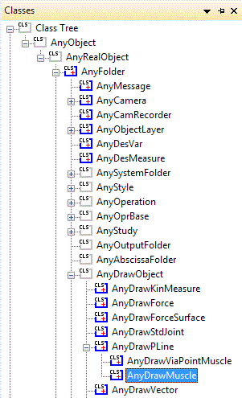
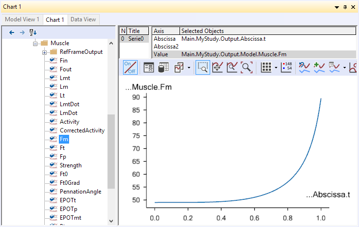
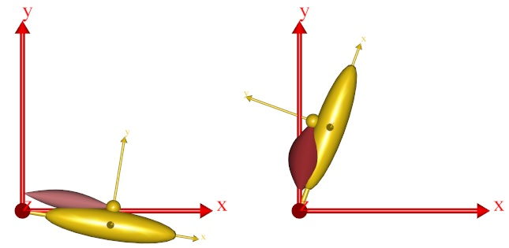

Lesson 2: Controlling Muscle Drawing
====================================

Muscles can be displayed in a variety of fashions depending on the
specifications in the AnyDrawMuscle object. Let us take a look at its
definition again:

.. code-block:: AnyScriptDoc

    
          AnyDrawMuscle drw = {};
    

It obviously does not contain much, so every setting is at its default
value leading to the following display of the muscle:

|simple model with muscle|

Let us play around with the settings a bit. An easy way to display all
the settings is to discard our manually defined AnyDrawMuscle object and
insert a template from the class tree instead:

|class tree AnyDrawMuscle|

Erase the previous AnyDrawMuscle, right-click the AnyDrawMuscle in the
tree view, an insert an instance:

.. code-block:: AnyScriptDoc

    
         AnyViaPointMuscle Muscle1 = {
           AnyMuscleModel &Model = .SimpleModel;
           AnyRefFrame &Orig = .GlobalRef.M1Origin;
           AnyRefFrame &Ins = .Arm.M1Insertion;
           §AnyDrawMuscle drw = {
             //RGB = {0.554688, 0.101563, 0.117188};
             //Opacity = 1.000000;
             //DrawOnOff = 1.000000;
             //Bulging = 0.000000;
             //ColorScale = 0.000000;
             //RGBColorScale = {0.957031, 0.785156, 0.785156};
             //MaxStress = 250000.000000;
           };§
         };
    

Notice that the <ObjectName> must be manually changed to drw (or any
other sensible name). The commented lines (with // in front) are the
optional settings. Un-commenting them will not change much because the
values they have listed are the default settings. So we need to change
some of the values.

The first thing we shall try is to make the muscle bulge. We do this by
setting the value of the Bulge variable to 1. What this transates to is
to make the muscle bulging proportional to the force in the muscle:

.. code-block:: AnyScriptDoc

    
           AnyDrawMuscle drw = {
             //RGB = {0.554688, 0.101563, 0.117188};
             //Opacity = 1.000000;
             //DrawOnOff = 1.000000;
             §Bulging = 1;§
             //ColorScale = 0.000000;
             //RGBColorScale = {0.957031, 0.785156, 0.785156};
             //MaxStress = 250000.000000;
           };
    

When you try this, you will find that the muscle has become thinner, but
you really cannot see it bulge much. The problem is that the thickness
of the muscle is scaled by another factor in addition to the force. This
enables the system to create nice visualizations for intensive and light
exercises alike. The additional factor is the variable MaxStress. The
following will increase the muscle thickness:

.. code-block:: AnyScriptDoc

    
           AnyDrawMuscle drw = {
             //RGB = {0.554688, 0.101563, 0.117188};
             //Opacity = 1.000000;
             //DrawOnOff = 1.000000;
             Bulging = 1;
             //ColorScale = 0.000000;
             //RGBColorScale = {0.957031, 0.785156, 0.785156};
             §MaxStress = 2500;§
           };
    

Why does a smaller value of MaxStress lead to a thicker muscle? Well,
you can think of the force in a muscle as being the product of a tissue
stress and the cross sectional area. So, the smaller the tissue stress,
the larger the cross sectional area for a given force. Thus, reducing
the value of MaxStress increases the muscle thickness. If you reload and
run the inverse dynamic analysis you will see that the muscle now has a
significant thickness. Its thickness does not change much over the
movement, though. This is because the muscle force is nearly constant
over time for the problem we have defined. If we let the joint flex a
bit more, then the moment arm of the muscle will become progressively
smaller, and we will get a larger muscle force. The easy way to
accomplish this is to increase the angular velocity of the joint driver:

.. code-block:: AnyScriptDoc

    
         // Drive the revolute joint at constant velocity
         AnyKinEqSimpleDriver Drv = {
           DriverPos = {-10*pi/180};
           DriverVel = {§80§*pi/180};
           AnyRevoluteJoint &Jnt = .Jnt;
           Reaction.Type = {0};
         };
    

Reload the model and run the InverseDynamicAnalysis operation again. You
will see that the arm now flexes up to an almost vertical position. If
you plot the muscle force, Fm, again in a chart view, then you can see
how the muscle force goes up drastically with the reduced moment arm:

 

Consequently the muscle now bulges more towards the end of the movement
than it does in the beginning: 

|Chart view Muscle1.Fm|

The muscle thickness does not have to reflect force. Choosing other
values for the Bulging property will give other results:

 

+---------------------+-------------------+------------------------------------------------------------------------+
| **Bulging value**   | **Effect**        | **Comment**                                                            |
+=====================+===================+========================================================================+
|  0                  | No bulging        | This is the default value                                              |
+---------------------+-------------------+------------------------------------------------------------------------+
|  1                  | Muscle force      | Thickness is proportional to force                                     |
+---------------------+-------------------+------------------------------------------------------------------------+
|  2                  | Muscle strength   | Constant in this case (but relevant for more advanced muscle models)   |
+---------------------+-------------------+------------------------------------------------------------------------+
|  3                  | Muscle activity   | The ratio between muscle force and muscle strength                     |
+---------------------+-------------------+------------------------------------------------------------------------+
|  4                  | Constant volume   | The muscle gets thicker when it contracts                              |
+---------------------+-------------------+------------------------------------------------------------------------+

Muscle state can also be visualized with color. This allows for using
bulging to visualize the force, while, for instance, muscle activity can
be visualized with color. Try the following:

.. code-block:: AnyScriptDoc

    
           AnyDrawMuscle drw = {
             //RGB = {0.554688, 0.101563, 0.117188};
             //Opacity = 1.000000;
             //DrawOnOff = 1.000000;
             Bulging = 1;
             §ColorScale = 1;§
             //RGBColorScale = {0.957031, 0.785156, 0.785156};
             MaxStress = 2500;
           };
    

When you reload and run the InverseDynamicAnalysis, you will notice that
the red shade of the muscle changes as its activity grows:

|Simple model two positions|

When the activity is zero, the color defaults to a rather pale red. You
can control this "initial" value of the scaled color through the
property RGBColorscale. As the activity grows towards 1, the color
approaches the default value of the muscle given in the RGB property.
For instance, if you want the color interpolated from a cold blue to a
warm red as the muscle activity increases, you can use the following
settings:

.. code-block:: AnyScriptDoc

    
           AnyDrawMuscle drw = {
             §RGB = {1, 0, 0};  //Red§
             //Opacity = 1.000000;
             //DrawOnOff = 1.000000;
             Bulging = 1;
             ColorScale = 1;
             §RGBColorScale = {0, 0, 1}; //Blue§
             MaxStress = 2500;
           };
    

Finally, the muscle drawing object has a couple of properties in common
with other drawing objects: You can control the transparency of the
object through the property of that name. Opacity = 1 means opaque, and
with Opacity = 0, the object becomes completely invisible. All values in
between causes the object to be semi-transparent. You can also turn of
the display of the object entirely off by setting DrawOnOff = 0;

With the drawing of muscles under control, let us proceed to another
important issue. *Lesson 3: Via point muscles*.

 

.. |simple model with muscle| image:: _static/lesson2/image1.jpeg
   :width: 2.08333in
   :height: 2.00000in

