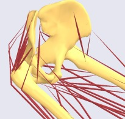
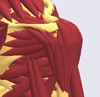
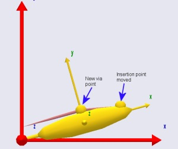

# Lesson 3: Via-point Muscles

Although the name of the muscle class we have used so far is
AnyViaPointMuscle, the example has only shown the muscle passing in a
straight line between two points. Real muscles in the body rarely do so.
They are usually constrained by various obstacles on their way from
origin to insertion, either by connective tissues or by the contact with
bone surfaces.

In the former case, the muscle tends to pass as a piecewise straight
line between the constrained points, and this is relatively easy to
accomplish by means of an AnyViaPointMuscle. In the latter case, the
muscle may engage and release contact with the bone surfaces it
encounters. This wrapping over bones is a problem of contact mechanics
and optimization. It requires a different muscle class and it is
computationally much more demanding. In this lesson we shall look at
AnyViaPointMuscles and postpone the discussion of wrapping to the next
lesson.

Anatomically, via point muscles are mostly found in the lower
extremities and in the spine, while the arms and shoulders almost
exclusively have wrapping muscles.



*Most muscles in the legs can be modeled
reasonably with via point muscles.*



*The deltoid muscle wraps over the head
of the humerus.*

## Via Point Muscles

Via point muscles pass through a set of at least two points on their way
from origin to insertion. Each of the via points must be attached to a
segment or the global reference frame of the model. The first and the
last of the point sequence are special because the muscle is rigidly
fixed to them and hence transfers forces in its local longitudinal
direction to them. Conversely, the muscle passes through the interior
via points like a thread through the eye of a needle. This means that
the muscle transfers only forces to interior via points along a line
that bisects the angle formed by the muscle on the two sides of the via
point.

Let us modify the model we have been working on to investigate the
properties of via point muscles. Initially we reduce the bulging to
facilitate study of the muscle path.

```AnyScriptDoc
AnyDrawMuscle drw = {
  //RGB = {0.554688, 0.101563, 0.117188};
  //Opacity = 0.2;
  //DrawOnOff = 1;
  Bulging = 2;
  ColorScale = 1;
  //RGBColorScale = {0.957031, 0.785156, 0.785156};
  MaxStress = 2500§00§;
};
```

We then move the insertion point of the muscle a bit further out and
closer to the axis of the Arm segment to make room for a via point:

```AnyScriptDoc
AnySeg Arm = {
  r0 = {0.500000, 0.000000, 0.000000};
  Mass = 1.000000;
  Jii = {0.100000, 1.000000, 1.000000}*0.1;
  AnyRefNode Jnt = {
    sRel = {-0.5, 0.0, 0};
  };
  AnyRefNode M1Insertion = {
    sRel = {§0.3, 0.05§, 0};
  };
  AnyDrawSeg drw = {};
};
```

The next step is to introduce a new point on the Arm segment to function
as the via point:

```AnyScriptDoc
AnySeg Arm = {
  r = {0.500000, 0.000000, 0.000000};
  Mass = 1.000000;
  Jii = {0.100000, 1.000000, 1.000000}*0.1;
  AnyRefNode Jnt = {
    sRel = {-0.5, 0.0, 0};
  };
  AnyRefNode M1Insertion = {
    sRel = {0.3, 0.05, 0};
  };
 §AnyRefNode ViaPoint = {
    sRel = {0.0, 0.1, 0};
  };§
  AnyDrawSeg drw = {};
};
```

We can then introduce the new point in the sequence of points defining
the muscle:

```AnyScriptDoc
AnyViaPointMuscle Muscle1 = {
  AnyMuscleModel &Model = .SimpleModel;
  AnyRefFrame &Orig = .GlobalRef.M1Origin;
 §AnyRefFrame &Via = .Arm.ViaPoint;§
  AnyRefFrame &Ins = .Arm.M1Insertion;
  AnyDrawMuscle drw = {
    //RGB = {0.554688, 0.101563, 0.117188};
    //Opacity = 0.2;
    //DrawOnOff = 1;
    Bulging = 2;
    ColorScale = 1;
    //RGBColorScale = {0.957031, 0.785156, 0.785156};
    MaxStress = 250000;
  };
};
```

The figure below shows the result:



A muscle can pass through an unlimited number of via points, and the
points can be attached to different segments. This can be used to create
rather complex kinematic behaviors of muscles, but it also requires care
in the definition to avoid unrealistic muscle paths when the via points
move around with the different segments.

From-the-point of view of kinematic robustness, the wrapping muscles are
easier to handle than via point muscles, but the price is much higher
computationally. Wrapping muscles is the subject of {doc}`Lesson
4 <lesson4>`.

:::{rst-class} without-title
:::

:::{seealso}
**Next lesson:** {doc}`lesson4`.
:::
