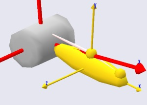
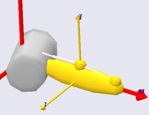
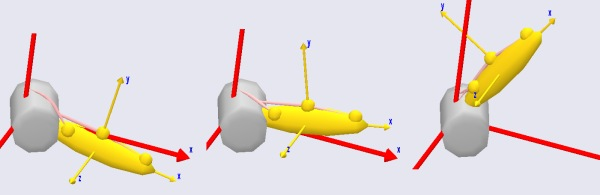
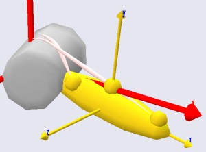
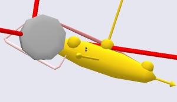

Lesson 4: Wrapping Muscles
==========================

.. include:: /caution_old_tutorial.rst

Many muscles in the body are wrapped over bones and slide on the bony
surfaces when the body moves. This means that the contact forces between
the bone and the muscle are always perpendicular to the bone surface,
and the muscle may in fact release the contact with the bone and resume
the contact later depending on the movement of the body. Via point
muscles are not capable of modeling this type of situation, so the
AnyBody Modeling System has a special muscle object for this purpose.

A wrapping muscle is presumed to have an origin and an insertion just
like the via point muscle. However, instead of interior via points it
passes a set of surfaces. If the surfaces are blocking the way then the
muscles finds the shortest geodetic path around the surface. For that reason, the
name of the class is AnyShortestPathMuscle. The fact that the muscle
always uses the shortest path means that it slides effortlessly on the
surfaces, and hence there is no friction between the muscle and the
surface. 

Enough talk! Let us prepare for addition of a wrapping muscle to our
model. If for some reason you do not have a working model from the
previous lessons, :download:`you can download one
here <Downloads/MuscleDemo.4.any>`.

A wrapping muscle needs one or several surfaces to wrap on, so the first
thing to do is to define a surface. For convenience we shall attach the
surface to the global reference frame, but such wrapping surfaces can be
attached to any reference frame in the system, including segments. To be
able to play around with the position of the surface, we initially
define a point on GlobalRef for the purpose:

.. code-block:: AnyScriptDoc

         // Global Reference Frame
         AnyFixedRefFrame GlobalRef = {
           AnyDrawRefFrame drw = {
             RGB = {1,0,0};
           };
           AnyRefNode M1Origin = {
             sRel = {0.0, 0.1, 0};
           };
           
         § AnyRefNode CylCenter = {
             sRel = {0, 0, -0.2};
           };§
          
         };  // Global reference frame

Having defined the point, we can proceed to create a surface. The
wrapping algorithm in AnyBody will in principle work with any sort of
surface including real bone surfaces, but for the time being only
parametric surfaces are used. The reason is that the bony surfaces are
really a lot of small planar triangles, and the corners and edges of the
triangles will cause the muscles to slide discontinuously over the
surface, which disturbs the analysis result. The parametric surfaces
currently available are cylinders and ellipsoids. Let us try our luck
with a cylinder. Go to the class tree, locate the class AnySurfCylinder,
and insert an instance into the newly defined node on GlobalRef.
Then define the name of the cylinder, add an AnyDrawParamSurf
statement, and change the cylinder parameters as shown below:

.. code-block:: AnyScriptDoc

           AnyRefNode CylCenter = {
             sRel = {0, 0, -0.2};
             
            §AnySurfCylinder WrapSurf = {
               Radius = 0.15;
               Length = 0.4;
               //CapRatio = 0.1;
               //CapRatio2 = 0.1;
             };§
           };
          
         };  // Global reference frame

Most of this should be self explanatory. However, please notice that the
insertion point of the cylinder is at {0, 0, 0.2} corresponding exactly
to half of the length of the cylinder of 0.4. This causes the cylinder
to be inserted symmetrically about the xy plane as illustrated below:

|wrapcylinder|

The cylinder direction is always z in the coordinate direction of the
object that the cylinder is inserted into. So, if the cylinder does not
have the orientation you want, then the key to rotate it correctly is to
control the direction of the AnyRefNode that it is inserted into. In
fact, let us rotate it just a little bit to make things a bit more
interesting:

.. code-block:: AnyScriptDoc

           AnyRefNode CylCenter = {
             sRel = {0, 0, -0.2};
            §ARel = RotMat(20*pi/180,y);§
            
             AnySurfCylinder WrapSurf = {
               Radius = 0.15;
               Length = 0.4;
               //CapRatio = 0.1;
               //CapRatio2 = 0.1;
             };
           };

 Which causes the cylinder to rotate 20 degrees about the y axis.

|wrap cylinder rotated|

There are a couple of things to notice about the cylinder: First of all
the graphics looks like the cylinder is faceted. This is not really the
case. Graphically it is displayed with facets out of consideration of
the efficiency of the graphics display, but from the point-of-view of
the muscle it is a perfect cylinder. The second thing to notice is that
the ends are capped in such a way that the edges are rounded. You can
control the curvature of this cap by means of the CapRatio variable that
is currently commented out in the cylinder object definition. If you
play a bit around with different values of the cap ratio then you will
quickly get a feel for the effect of the variable. The caps allow you to
let the muscle wrap over the edge of the cylinder if necessary.

The next step is to define a wrapping muscle. We shall create one point
on the global reference frame and one point on the arm, and we can then
articulate the joint and study the behavior of the wrapping algorithm.
The point on the global reference frame is added like this:

.. code-block:: AnyScriptDoc

         // Global Reference Frame
         AnyFixedRefFrame GlobalRef = {
           AnyDrawRefFrame drw = {
             RGB = {1,0,0};
           };
           AnyRefNode M1Origin = {
             sRel = {0.0, 0.1, 0};
           };
          
         § AnyRefNode M2Origin = {
             sRel = {0.0, 0.15, -0.05};
           };§

Similarly we add a point to the arm:

.. code-block:: AnyScriptDoc

         // Define one simple segment
         AnySeg Arm = {
           r = {0.500000, 0.000000, 0.000000};
           Mass = 1.000000;
           Jii = {0.100000, 1.000000, 1.000000}*0.1;
           AnyRefNode Jnt = {
             sRel = {-0.5, 0.0, 0};
           };     
           AnyRefNode M1Insertion = {
             sRel = {0.3, 0.05, 0};
           };
          §AnyRefNode M2Insertion = {
             sRel = {-0.2, 0.05, 0.05};
           };§

Notice that we have given the origin and insertion points a bit of
offset in the z direction to make the problem a bit more exciting. The
offset will cause the muscles to cross the cylinder in a
non-perpendicular path to the cylinder axis such as for instance the
pronator muscles of the human forearm do.

It is now possible to define the muscle wrapping over the cylinder. The
easiest way to do it is to make a copy of the via point muscle, Muscle1,
and then make the necessary changes:

.. code-block:: AnyScriptDoc

         AnyViaPointMuscle Muscle1 = {
           AnyMuscleModel &Model = .SimpleModel;
           AnyRefFrame &Orig = .GlobalRef.M1Origin;
           AnyRefFrame &Via = .Arm.ViaPoint;
           AnyRefFrame &Ins = .Arm.M1Insertion;
           AnyDrawMuscle drw = {
             //RGB = {0.554688, 0.101563, 0.117188};
             //Opacity = 0.2;
             //DrawOnOff = 1;
             Bulging = 2;
             ColorScale = 1;
             //RGBColorScale = {0.957031, 0.785156, 0.785156};
             MaxStress = 250000;
           };
         };
          
       §AnyShortestPathMuscle Muscle2 = {
           AnyMuscleModel &Model = .SimpleModel;
           AnyRefFrame &Orig = .GlobalRef.M2Origin;
           AnySurface &srf = .GlobalRef.CylCenter.WrapSurf;
           AnyRefFrame &Ins = .Arm.M2Insertion;
           SPLine.StringMesh = 20;
           AnyDrawMuscle drw = {
             Bulging = 2;
             ColorScale = 1;       
             MaxStress = 250000;
           };
         };§

The two muscles are very similar in their definitions. They both have an
origin and an insertion, and they are both displayed on the screen by
means of the same type of drawing object. Notice that if you have many
muscles in a model and you want to have an easy way of controlling the
display of all of them, then you can define the drawing object in an
`#include` file, and include that same file in the definition of all the
muscles. This way, when you change the display definition in the include
file, it influences all the muscles simultaneously.

The difference between the two definitions is that the via point of
Muscle1 has been replaced by a wrapping surface in Muscle2. Shortest
path muscles can have any number of wrapping surfaces specified in
sequence just like via point muscles can have any number of via points.
In fact, a shortest path muscle can also have via points as we shall see
later.

There is one additional specification necessary for a shortest path
muscle. The line:

.. code-block:: AnyScriptDoc

           SPLine.StringMesh = 20;

This line generates a sequence of 20 equidistant points on the shortest
path muscle, and these are the points that are actually in contact with
the wrapping surface(s). More points will give you a more accurate
solution, but they also require more computation time. For shortest path
muscles the computation time can be an important issue. Solving the
shortest path problem is a matter of contact mechanics, and with many
muscles in the model this is easily the more computationally demanding
operation of all the stuff that the system does during an analysis. If
you have too few points and a complex case of wrapping, the system may
sometimes fail to solve the wrapping problem and exit with an error. In
that case the solution is to increase the number of points.

It is time to see what we have done. If you load the model and run the
InverseDynamics analysis (and have done everything right), you will see
the model moving through a sequence of positions like this:

|wrap cylinder with via point sequence|

As mentioned above, wrapping muscles can also have via points. In fact,
we can easily change the via point muscle, Muscle1,  to wrap over the
cylinder even though it also has a via point:

.. code-block:: AnyScriptDoc

         Any§ShortestPath§Muscle Muscle1 = {
           AnyMuscleModel &Model = .SimpleModel;
           AnyRefFrame &Orig = .GlobalRef.M1Origin;
           AnyRefFrame &Via = .Arm.ViaPoint;
         § AnySurface &srf = .GlobalRef.CylCenter.WrapSurf;§
           AnyRefFrame &Ins = .Arm.M1Insertion;
          §SPLine.StringMesh = 20;§
           AnyDrawMuscle drw = {
             Bulging = 2;
             ColorScale = 1;
             MaxStress = 250000;
           };
         };

The definition of the two muscle types is very similar, so we only had
to change the type from AnyViaPointMuscle to AnyShortestPathMuscle and
insert the wrapping surface and the StringMesh specification. This gives
us the following result:

|wrap cylinder two muscles|

As you can see, both muscles are now wrapping over the cylinder, and we
can run the InverseDynamics analysis. It seems to work, but the system
provides the following warning:

``WARNING - Via-point 'Main.MyModel.GlobalRef.M1Origin' on
'Main.MyModel.Muscle1.SPLine'``
``is located below the wrapping surface
'Main.MyModel.GlobalRef.CylCenter.WrapSurf'.``

This is a warning that you will see rather frequently when working with
complex models with wrapping. The warning comes when one of the end
points or a via point is located below the surface over which the muscle
is supposed to wrap. This means that it is impossible for the muscle to
pass through the via point without penetrating the wrapping surface. In
this case the system chooses to let the muscle pass through the via
point and come back to the wrapping surface as soon as possible. In the
present case, the origin point of Muscle1 is only slightly below the
cylinder surface, so the problem can be rectified by a small offset on
the origin point:

.. code-block:: AnyScriptDoc

           AnyRefNode M1Origin = {
             sRel = {0.0, 0.1§5§, 0};
           };

If you are analytically inclined, you may be thinking that the muscles
might equally well pass on the other side of the cylinder. And you are
quite right. The reason why both muscle pass over the cylinder rather
than under is that this is the side that is the closest to the muscles'
paths before the wrapping is resolved. This means that we can make a
muscle wrap on another side of a wrapping surface by making sure that
its initial position is closer to the side we want it to wrap on. The
way to do this is to specify one or more so-called initial wrapping
vectors. These are really points that the muscle initially should pass
through. You can specify as many of these points as you like. In the
example below we have used two:

.. code-block:: AnyScriptDoc

         AnyShortestPathMuscle Muscle2 = {
           AnyMuscleModel &Model = .SimpleModel;
           AnyRefFrame &Orig = .GlobalRef.M2Origin;
           AnySurface &srf = .GlobalRef.CylCenter.WrapSurf;
           AnyRefFrame &Ins = .Arm.M2Insertion;
           SPLine.StringMesh = 20;
          §SPLine.InitWrapPosVectors = {{-0.2, -0.2, 0}, {-0.05, -0.2, 0}};§
           AnyDrawMuscle drw = {
             Bulging = 2;
             ColorScale = 1;       
             MaxStress = 250000;
           };
         };

Notice that the InitWrapPosVectors like the StringMesh is part of an
object called SPLine. This is an object in its own right that gets
defined automatically inside a shortest path muscle. It is a special
kind of :doc:`kinematic
measure <../The_mechanical_elements/lesson4>` that is
really a string that wraps just like a muscle but does nothing else than
measure its own length. These objects can be used outside the muscle
definition for various purposes in the model, for instance for
definition of springs or rubber bands.

After you load the model with the added InitWrapVectors, try using the
Step button rather than the run button. This will show you how the
system uses the InitWrapVectors to pull the muscle to the other side of
the cylinder:

|wrap cylinder Init wrap vectors|

If you keep pressing the step button you will see how the muscle now
wraps on the other side of the cylinder.

With the kinematics of muscles well under control, we can proceed to
another important and interesting topic, :doc:`Lesson 5: Muscle
models <lesson5>`.

.. rst-class:: without-title
.. seealso::
    **Next lesson:** :doc:`lesson5`. 

