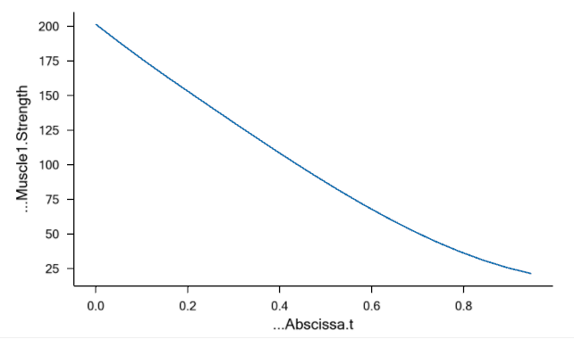
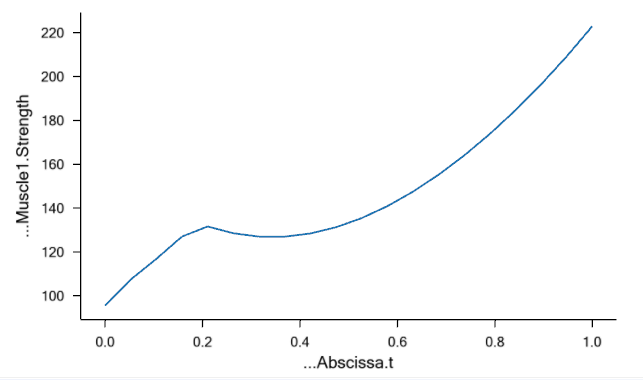
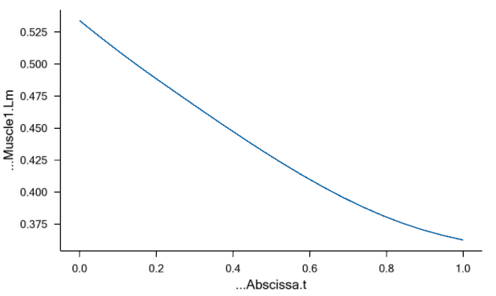
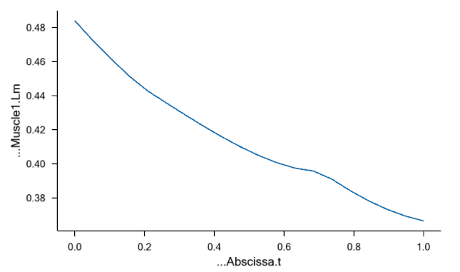

# Lesson 5: Muscle Models

Muscle model is a description of how a muscle behaves under different
operating conditions. There are two schools of thought within this area.

- The first school pursues phenomenological models based on
  the classical work by *A.V. Hill* [^cite_hill-1938]. These models are usually based on
  a description of a muscle as a contractile element in combination
  with a number of elastic elements. While these models make no attempt
  to directly model the microscopic mechanisms of muscle contraction,
  they do reproduce many properties of muscle behavior quite well, and
  most models of this class can be implemented with great numerical
  efficiency.
- The second school attempts to directly model the microscopic physical
  phenomena of cross bridge activity in muscle contraction. The origin
  of these models is usually attributed to *A.F. Huxley* [^cite_huxley-1957], and they lead
  to differential equations and consequently to much more
  computationally demanding models.

The AnyBody Modeling System requires muscle models because it must take
the strength of different muscles into account when distributing the
load over them. A traditional muscle model is one that takes an
activation signal and a present muscle state as input and produces a
force as output. But inverse dynamics, as it is used in the AnyBody
Modeling System, does not work quite like that. Instead of taking an
activation signal as input, AnyBody produces the muscle active state as
output. This means that typical muscle models from the literature must
be mathematically inverted before they can be used in the AnyBody
Modeling System. Depending on the complexity of the muscle model, this
may be more or less difficult.

AnyBody has four muscle model classes available differing in complexity and
accuracy of their representation of physiological muscles. All of these
are phenomenological, i.e. they make no attempt to capture the
complexity of cross bridge dynamics. You may ask why we would want four
different models? Why don't we just use the better of the four models?
The answer is that accurate models are good, but they are never more
accurate than the input data, and it is often difficult to find the
detailed physiological data that the complex models require. Instead of
basing a computation on data of unknown accuracy it is often preferable
to go with a simpler model where the approximations are clear.
Furthermore, more complex models need access to reliable source of data
for their parameters, and they also need fairly costly calibration steps to improve accuracy.

The following introduces the muscle models available in AnyBody. The simple (**AnyMuscleModel**) and the three-element (**AnyMuscleModel3E**) muscle models are the most commonly used ones in the AMMR, whereas the two-element (**AnyMuscleModel2ELin**) and the custom user-defined (**AnyMuscleModelUsr1**) models provide users with even more freedom to test, learn and benchmark muscle-tendon units.

- `AnyMuscleModel`: This is the simplest conceivable muscle model, and it is the one we have used in the preceding lessons of this tutorial. The only required input to the model is the muscle's presumed isometric strength, F0, i.e. the force that the muscle can exert in a static condition at its optimal length. F0 is often believed to be proportional to the physiological cross sectional area of the muscle, and it is possible to find that dimension for most significant muscles in the human body from cadaver studies reported in the scientific literature. It is important to stress that the strength of this muscle model is independent of the muscle's current length and contraction velocity. It is known for a fact that muscles do not behave that way, but for models with moderate contraction velocities and small joint angle variations even this simple model will work reasonably well. Such has been shown to be the case for bicycling and gait. This model has a lesser need for calibration steps, which makes it beneficial to save effort while just preparing preliminary results for instance in a model ptorotyping phase.
- `AnyMuscleModel3E`: This is a full-blown Hill model that takes parallel passive elasticity of the muscle, serial elasticity of the tendon, pennation angle of the fibers, and many other properties into account. The concepts for this model are adopted from [^cite_zajac-1989]. This model requires several physiological parameters that may be difficult to get or estimate for a particular muscle in a particular individual. Moreover, it applies non-linear force-length and force-velocity relationships, which means that the muscle vary strength depending on the length and contraction velocity. It also means and can loose its strength entirely and this calls for calibration of muscle parameters for each indivudualized model to match the muscle's working range to actual working range of the skeleton.
- `AnyMuscleModel2ELin`: This model is simpler multi-element model than the three-element model. It presumes that the muscle strength is proportional to its current length and contraction velocity. This means that the muscle gets weaker when its length decreases or the contraction velocity increases. In other words, the muscle strength is bilinear in the length and velocity space. The model also presumes that the tendon is linearly elastic and as such contains two elements: A contractile element (the muscle), and a serial-elastic element (the tendon). The rationale behind this model is that a muscle has a certain passive elasticity built into it. If the muscle it stretched far enough, the passive elasticity will build up force and reduce the necessity for active muscle force. This is in some cases equivalent to an increase of the muscle's strength. Notice, however, that this model has the significant drawback that the force can be switched off even if the muscle is stretched very far, while the true passive elasticity will always provide a force when it is stretched. While this model is simpler than the three-element model, it does not provide a more efficient workflow because calibration is typically also needed for this model. Therefore, this model is used less frequently for real applications, because it will be natural to consider the two previously described models when choosing will be between simplicity and accuracy.
- `AnyMuscleModelUsr1`: This is a custom user-defined muscle model. The user is free to define the strength of the muscle as any explicit expression of muscle variables (e.g. isometric strength (F0), volume(Vol0) or PCSA, fiber length (Lf0)), kinematic measures (e.g. actual fiber length and velocity), and even time. This freedom implies that it is also the user's task to make the most reasonable relationship to muscle and kinematic parameters for instance  to include when such paarmeters are affected by model scaling and calibration.

In the remainder of this lesson we shall experiment with the consequences
of the different muscle models and muscle model calibration.
The AnyScript model from the previous lesson will suffice very nicely.
You can download a functional version
of the model here: {download}`MuscleDemo.5.any<Downloads/MuscleDemo.5.any>`.

## AnyMuscleModel2ELin

Right-click and save the file to your local disk, and subsequently open
the model in the AnyBody Modeling System. We have already seen the
consequences of using the simple muscle model, so we shall proceed
directly to the two-element muscle, the AnyMuscleModel2ELin. Let us
define such a muscle model. If you click the Classes tab in the tree
view left of the edit window, expand the class tree, right-click the
AnyMuscleModel2ELin class, and insert a template, you will obtain the
following:

```AnyScriptDoc
 AnyMuscleModel SimpleModel = {
   F0 = 100;
   //Lf0 = 0;
   //Vol0 = 0;
 };

§AnyMuscleModel2ELin <ObjectName> = {
  F0 = 0.0;
  //Lf0 = 0.0;
  //Vol0 = 0.0;
  //Lfbar = 0.0;
  Lt0 = 0.0;
  //Epsilon0 = 0.05;
  //Epsilonbar = 0.05;
  V0 = 0.0;
 };§
```

Let us briefly review the parameters:

```{eval-rst}
.. list-table::
   :widths: 3 10
   :header-rows: 1

   * - Parameter
     - Function
   * - F0
     - In the simple muscle model, F0 is simply the strength of the muscle.
       In this two-parameter model, F0   is the ideal strength, i.e. the strength
       of the muscle at neutral fiber length and zero contraction velocity.
       F0 is measured in force units, i.e. Newton.
   * - Lf0
     - The neutral fiber length, i.e. the length of the contractile element at which the muscle has the strength of F0. Lf0 is measured in length units, i.e. meters.
   * - Vol0
     - Ensemble volume of the muscle fibers, which can be used during muscle recruitment. Volume must be positive; zero or negative values are ignored.
   * - Lt0
     - The muscle's total length from origin to insertion can be divided into two parts: the length of the muscle's contractile element plus the length of the tendon. The tendon is considered in this model to be linearly elastic, and Lt0 is the slack length of the tendon, i.e. the length when it is taut but carrying no force. Lt0 is measured in length units, i.e. meters.
   * - Epsilon0
     - This parameter controls the elasticity of the tendon. The physical interpretation is that it is the tendon's strain when subjected to a force of F0. Prescribing a strain rather than an ordinary spring stiffness is based on the idea that the tendon thickness must be related to the strength of the muscle: strong muscles need strong tendons. Hence, Epsilon0 can be presumed with good accuracy to be the same for a wide variety of very different muscles. Epsilon0 is measured in fractions and is therefore dimensionless.
   * - V0
     - This model presumes that the muscle's strength depends linearly on its contraction velocity. V0 is measured in absolute velocity, i.e. m/s.
   * - Lfbar
     - This is the deprecated parameter replaced by Lf0.
   * - Epsilonbar
     - This is the deprecated parameter replaced by Epsilon0.

```

We can study the significance of the parameters in more detail, if we
formulate the strength mathematically:

$Strength = F_0 \left(2\frac{L_m}{{L}_{f0}}-1 \right) \left( 1-\frac{\dot{L}_m}{V_0} \right)$

You can probably recognize the variable names in the table above from
the symbols in the equation. As you can see, this is really a bilinear
model, where the variables are Lm and Lmdot. The strength of the muscle
vanishes if any of the two parentheses becomes zero. This can happen if
either Lm, i.e. the current length of the contractile element, becomes
half the length of Lf0, or if Lmdot becomes equal to V0. Please notice
that Lmdot is negative when a muscle is contracting, so meaningful
values of V0 must also be negative. The system automatically truncates
negative values of the strength expression to zero.

In a few moments, when we start playing around with the muscle model in
AnyBody, you wll recognize these properties in the available muscle
variables in the Chart View.

Let us assign a name and some reasonable parameters to our two-element
muscle model:

```AnyScriptDoc
AnyMuscleModel2ELin §Model2§ = {
   F0 = §200§;
   Lf0 = §0.3§;
   Lt0 = §0.5§;
   Epsilon0 = §0.05§;
   V0 = §-8.0§;
 };
```

The parameters here are more or less random. In a moment we
shall explain the ones that are less random, but first we must assign
the new model to Muscle1:

```AnyScriptDoc
AnyShortestPathMuscle Muscle1 = {
  AnyMuscleModel &Model = §.Model2§;
  AnyRefFrame &Orig = .GlobalRef.M1Origin;
  AnyRefFrame &Via = .Arm.ViaPoint;
  AnySurface &srf = .GlobalRef.CylCenter.WrapSurf;
  AnyRefFrame &Ins = .Arm.M1Insertion;
  SPLine.StringMesh = 20;
  AnyDrawMuscle drw = {
    Bulging = 0;
    ColorScale = 1;
    MaxStress = 250000;
  };
};
```

We are ready to run the analysis again and investigate the results. Pick
the InverseDynamics analysis in the tree of operations and click the Run
button. Then open a new Chart View and expand the tree in the Chart View
as far down as Muscle1. You will see a whole list of muscle properties
that you can chart simply by clicking them. Let us initially see how the
properties Lm and Lmdot affecting the strength of the model. You can
plot several properties simultaneously in the Chart View by use of an
asterix in the variable specification field at the top of the window
like this:


Now we can compare the variation of Lm and Lmdot to our settings of
Lf0 and V0. Lm seems to vary between approximately 0.31 and 0.15. With
an Lf0 of 0.3 (= 2x0.15) this means that the muscle must come close to
the minimum length at which it has low strength when we approach the end
of the movement. Lmdot varies between -0.24 and -0.06, and this is far
from its speed limit V0 = -8, so the contraction speed is not expected
to have much effect. We can investigate the effect very easily simply by
clicking the Strength property of the muscle and obtain the following
graph:



The strength does indeed decrease drastically from around 200 N to
almost nothing as we expected when the muscle contracts.

Now that we have muscle data available, let us briefly review the
parameters presented in the Chart View:


```{eval-rst}
.. list-table::
  :widths: 3 10
  :header-rows: 1

  * - Variable
    - Description

  * - ``Fin`` and ``Fout``
    - are forces, but they have less physiological reference than other quatities below and they are mainly there for internal purposes. They are inherited from the AnyScript classes that the muscle class is derived from, in which they represent the force with direct reference to the associated kinematic measure of the muscle object. "Fin" means that it is the "input force" to dynamic analysis, which for the muscle implies that it holds the passive forces at a specific activity. "Fout" means that it is the "output force" from dynamic analysis, which for the muscle implies that it holds passive as well as active forces of the muscle-tendon unit.

  * - ``Lmt``
    - The total length of the muscle-tendon unit, i.e. the
      origin-insertion length.

  * - ``Lm``
    - The length of the muscle's contractile element.

  * - ``Lt``
    - The length of the tendon. This is not necessarily the same
      as Lt0 because the tendon is elastic and therefore stretches
      slightly with the force.

  * - ``LmtDot``
    - The rate of change of Lmt, i.e. the length change
      velocity of the total muscle-tendon unit.

  * - ``LmDot``
    - The contraction velocity of the contractile element.

  * - ``Activity``
    - The muscle active state in fractions of maxmum
      voluntary contraction.

  * - ``CorrectedActivity``
    - For this muscle model this  is the same as Activity.

  * - ``Fm``
    - The force in the muscle's contractile element. For this
      muscle type it is equal to the total force in the muscle-tendon unit
      because the muscle does not have any parallel components.

  * - ``Ft``
    - The force in the tendon. For this muscle model it is the
      same as Fm.

  * - ``Fp``
    - is not relevant for this type of muscle model.

  * - ``Strength``
    - The muscle's strength at each moment of the movement.

  * - ``Ft0``
    - is not relevant for this type of muscle model.

  * - ``Ft0Grad``
    - The derivative of tendon force with respect to active
      state. For this muscle model it amounts to exactly the same as the
      Strength variable, but for muscles with parallel elasticity the two
      properties will be different.

  * - ``PennationAngle``
    - This is not relevant for this muscle model type.

  * - ``EPOTt``
    - The potential elastic energy in the tendon.

  * - ``EPOTp``
    - The potential elastic energy in the parallel-elastic
      element, which is not included in this muscle model.

  * - ``EPOTmt``
    - The total elastic potential energy in the muscle-tendon
      unit.

  * - ``Pt``
    - This is not relevant for this muscle model.

  * - ``Pm``
    - The mechanical power exerted by the muscle's contractile
      element.

  * - ``Pmt``
    - The mechanical power of the muscle-tendon unit on the
      skeleton.

  * - ``Pmet``
    - This is a crude estimate of the metabolic power consumption of
      the muscle taking different efficiencies for concentric and eccentric
      work into account.
```

We have seen how the length of the muscle affects its strength, but what
about the velocity? Well, the specified values of -8 m/s is a reasonable
estimate for many physiological muscles, but let us try to decrease it
and thereby make the muscle more sensitive to contraction velocity:

```AnyScriptDoc
AnyMuscleModel2ELin Model2 = {
   F0 = 200;
   Lf0 = 0.3;
   Lt0 = 0.5;
   Epsilon0 = 0.05;
  §V0 = -0.3§;
 };
```

A value of V0 = -0.3 is close to the contraction velocity of the muscle
in the beginning of the simulation. This, this decreases the strength of
the muscle significantly as we can see by reloading, rerunning and
plotting the Strength variable again:


Instead of being monotonically decreasing, the muscle strength now
improves slightly in the initial part of the simulation, but it is all
through the simulation significantly weaker than before. The initial
increase is due to the beneficial effect of the decreasing contraction
velocity, so this muscle model in spite of its simplicity is capable of
balancing several of the effects of real muscle physiology.

Another of the important input parameters in this example is the nominal
tendon length, Lt0. This is a parameter that has a very large influence
on the muscle's performance. The total origin-insertion length of the
muscle-tendon unit depends on the size and posture of the body. The
muscle spans this length with the sum of muscle length, Lm, and tendon
length, Lt, such that Lmt = Lm + Lt. Both Lm and Lt change during the
movement of the body. Lt is given by its initial length, Lt0, and the
elastic deformation. Lm has to take up whatever rest of Lmt that is
available after Lt has been subtracted. In some cases, the tendon is
significantly longer than the muscle, and this means that a relatively
small variation of the tendon length results in a large relative
variation of the portion of Lmt that the muscle has to fill. Obviously
Lt0 plays a significant role for Lt and hence influences the working
length of the muscle. Let us investigate this effect by reducing Lt0:

```AnyScriptDoc
AnyMuscleModel2ELin Model2 = {
   F0 = 200;
   Lf0 = 0.3;
   Lt0 = §0.3§;
   Epsilon0 = 0.05;
   V0 = -0.3;
 };
```

This reduction of the tendon length from 0.5 to 0.3 m is very
significant compared to the nominal muscle fiber length of Lf0 = 0.3
m. Reducing the length of the tendon increases the length and thereby
the strength of the muscle:



The interdependency between the stretch of the tendon, the length of the
muscle, and the strength of the muscle is the origin of another
approximation in the model: The system computes the changed length of
the muscle due to the stretching of the tendon, but this length change
is not taken into account in the computation of the muscle strength.
Nevertheless, let us investigate how the stretch of the tendon
influences the muscle. We shall define an external load on the arm,
which causes the tendon to stretch. But before we change anything, let
us just notice that the variation of muscle length, Lm, over the
movement in the absence of an external load is as shown below:



Definition of an external force requires two new elements in the model:
The force itself and a new node on the arm, which we shall call hand, to
which the load can be applied:

```AnyScriptDoc
 // Define one simple segment
 AnySeg Arm = {
   r = {0.500000, 0.000000, 0.000000};
   Mass = 1.000000;
   Jii = {0.100000, 1.000000, 1.000000}*0.1;
   AnyRefNode Jnt = {
     sRel = {-0.5, 0.0, 0};
   };
   AnyRefNode M1Insertion = {
     sRel = {0.3, 0.05, 0};
   };
   AnyRefNode M2Insertion = {
     sRel = {-0.2, 0.05, 0.05};
   };
   AnyRefNode ViaPoint = {
     sRel = {0.0, 0.1, 0};
   };
   §AnyRefNode Hand = {
     sRel = {0.5, 0.0, 0};
   };§
   AnyDrawSeg drw = {};
 };
§AnyForce3D Load = {
   AnyRefNode &Attachment = .Arm.Hand;
   F = {-100, -100, 0};
 };§
```

The load is pointing down and backward at a 45 degree angle, so that it
changes its moment arm from positive to negative a shortly after the
midpoint of the analysis. This causes the muscle length to vary in the
following fashion:



The interesting point here is that with the long tendon and the high
load, the muscle no longer contracts uniformly. In fact, the muscle
extends for much of the movement due to the decreasing load which causes
the elastic tendon to contract instead.

While the two-parameter muscle model captures many of the properties of
real muscles it also fails to reflect important parts of muscle
physiology, so it should be applied with care. In particular it does not
model passive elasticity. The following section presents a full-blown
Hill-type model, which does not have these shortcomings.

## AnyMuscleModel3E

So far we have been focusing our attention on Muscle1 in the demo model
and left Muscle2 with the simple muscle model. Let us briefly study what
Muscle2 is actually doing (if you need an updated working model, you can
download it here:
{download}`MuscleDemo.5-2.any <Downloads/MuscleDemo.5-2.any>`. Muscle2 wraps
about the cylinder and obviously extends significantly as the arm turns
upward. If you run the analysis and plot the length of Muscle2, you will
see that it increases from 0.7 to 1 meter. For a normal muscle (actually a
muscle of this size would probably be found in a giraffe) a stretching
of that magnitude would almost certainly lead to some passive force in
the muscle.

Passive force is what comes from the structural integrity of the muscle.
If we disregard the active properties of the muscle and think of it as
simply a piece of material that we can stretch, then the material will
provide a passive resistance depending on how far we stretch it. This is
the passive component of the muscle force. We can easily find passive
muscle force in our own bodies: When we bend forward and try to touch
our toes with the straight legs, then most of us will feel the
hamstrings getting very taut. This is passive elasticity. The
two-element muscle model of the preceding section handles the presence
of this elasticity by increasing the strength of the muscle, and this
works fine if the muscle is supposed to be active in the sense that the
model in such a state would predict a high force with a low muscle
activity. But the passive muscle force cannot be switched off, so it
will still be present even if it is disadvantageous, and the two-element
model will not predict this.

The AnyMuscleModel3E is a full-blown Hill-type muscle model that does
not suffer from this deficiency. It is called a three-element model
because it has the following components:

1. A contractile element (CE) representing the active properties of the
   muscle fibers.
2. A serial-elastic (T) element representing the elasticity of the
   tendon.
3. A parallel-elastic element (PE) representing the passive stiffness of
   the muscle fibers.


The figure above is a schematic representation of the muscle model. We
can get a complete impression of the parameters of the model if we pick
the model from the Class List as we have done before and insert a
template into our AnyScript model:

```AnyScriptDoc
AnyMuscleModel2ELin Model2 = {
    F0 = 200;
    Lf0 = 0.3;
    Lt0 = 0.3;
    Epsilon0 = 0.05;
    V0 = -0.3;
 };

§AnyMuscleModel3E <ObjectName> = {
    F0 = 0.0;
    //Lf0 = 0.0;
    //Vol0 = 0.0;
    Lt0 = 0.0;
    //Gamma0 = 0.0;
    //Epsilon0 = 0.05;
    Fcfast = 0.0;
    //Jt = 3.0;
    //Jpe = 3.0;
    //K1 = 2.0;
    //K2 = 8.0;
    //PEFactor = 5.0;
    //Lfbar = 0.0;
    //Gammabar = 0.0;
    //Epsilonbar = 0.05;
};§
```

Several of these elements are described already in the two-element model
above, but some are new and described in the table below. No excuse we
can make is going to soften the fact that muscle modeling at this level
of detail is a technical matter, and it is not possible to describe the
physiological and mathematical background in detail. Instead please
refer to the publications at the end of this lesson for further
information:

`Gamma0`

: Gamma is the so-called pennation angle. It reflects that fact that most muscles have the fibers misaligned with the directions of action of the muscle. Gamma changes when the muscle extends or contracts, and Gamma0 is the value of Gamma in the muscle's neutral position. It is possible to find values for Gamma0 for most major muscles in the human body in the anatomical literature. Gamma0 is measured in radians.

`Fcfast`

: Muscle fibers come in two flavors: fast twitch and slow twitch, and the composition of these vary between the muscles as well as between individuals. Fast fibers, as the name indicates, have the ability of fast action at the cost of stamina, and slow fibers have opposite properties. Sprint runners have a high proportion of fast twitch muscles while marathon runners have many slow twitch muscles. Fcfast is the fraction of fast twitch fibers in the muscle. It is a fraction between 0 and 1 and hence dimensionless.

`Jt` and `Jpe`

: Jt and Jpe are elasticity factors for the tendon (serial-elastic) and parallel-elastic elements respectively. The background of these parameters is that the model presumes a nonlinear elasticity of these elements, and the precise shape of the force-deformation characteristics of the element are determined by Jt and Jpe respectively. In essence, Jt and Jpe are material constants and should not vary too much between different muscles or individuals. Recommended values are Jt = Jpe = 3.0. These two parameters are dimensionless.

`K1` and `K2`

: These two factors are used only to ensure a reasonable relationship between fiber length, fiber composition, and Fcfast. As discussed in the preceding section, the strength of a muscle tapers off when its contraction velocity grows. Rather than working with a given maximum contraction speed as the two-element model does, K1 and K2 enable us to link the maximum contraction speed to the physiological properties of the muscle. The idea is that muscles with longer fibers and a larger fraction of fast twitch muscles should have a higher maximum contraction velocity. Preferred values for K1 and K2 differ significantly between authors in the scientific literature, but a good guess would be K1 = 2 and K2 = 8. K1 and K2 formally have the unit of fractions per time unit, i.e. s{sup}`-1`.

`PEFactor`

: This factor is related to Jpe. Where Jpe controls the shape of the nonlinearity, PEFactor controls the steepness of the force in the parallel-elastic element as it is elongated. If we imagine a completely inactive muscle and load the muscle with a force corresponding to the active strength of the muscle, i.e. F0, then the length of the elongated muscle fibers will be PEFactor x Lf0. In other words PEFactor is a dimensionless measure of the flexibility of the parallel-elastic element of the muscle.

`Gammabar`

: This is the deprecated parameter replaced by Gamma0.

Knowing the significance of the different parameters, let us pick
reasonable values for Muscle2 and study their influences:

```AnyScriptDoc
AnyMuscleModel3E §Model3§ = {
    F0 = §100§;
    Lf0 = §0.3§;
    Gamma0 = §30*pi/180§;
    Epsilon0 = §0.05§;
    Lt0 = §0.5§;
    Fcfast = §0.4§;
    §Jt = 3.0§;
    §Jpe = 3.0§;
    §K1 = 2§;
    §K2 = 8§;
    §PEFactor = 5§;
  };
```

Notice that Lf0 + Lt0 = 0.8, which is in the range of the Lmt
variation of Muscle2. This is important because it gives the muscle a
reasonable chance of spanning the origin-insertion length.

We also have to associate Muscle2 with the new muscle model:

```AnyScriptDoc
AnyShortestPathMuscle Muscle2 = {
  AnyMuscleModel &Model = .§Model3§;
  AnyRefFrame &Orig = .GlobalRef.M2Origin;
  AnySurface &srf = .GlobalRef.CylCenter.WrapSurf;
  AnyRefFrame &Ins = .Arm.M2Insertion;
  SPLine.StringMesh = 20;
  SPLine.InitWrapPosVectors = {{-0.2, -0.2, 0},{-0.05,-0.2, 0}};
  AnyDrawMuscle drw = {
    Bulging = 0;
    ColorScale = 1;
    MaxStress = 250000;
  };
};
```

Finally, to have a more clean-cut case, we temporarily remove the
external force that we previously added

```AnyScriptDoc
§/*§
    AnyForce3D Load = {
      AnyRefNode &Attachment = .Arm.Hand;
      F = {-100, -100, 0};
    };
§*/§
```

We are ready to try running the InverseDynamics analysis again. Load the
model, pick InverseDynamics analysis in the operations tree, and click the
Run button. The arm should move as it did in the previous section. Now,
using a Chart View we can investigate the behavior of the new muscle. In
the Chart View's tree, expand the folders as far as Muscle2, and try
charting some of the parameters.

The key to understanding the muscle's behavior is to study the forces in
the muscle's different elements. The chart of Fm, which is the force in
the muscle's contractile element, is very uninteresting. This muscle
does not contribute to carrying the load, and hence the system does not
activate it. But the muscle is not without force. The property Fp, which
is the force in the parallel-elastic element of the muscle has the
following behavior:


In the initial phase of the movement, the parallel-elastic element is
slack and adds no force to the muscle. But as the muscle gets extended,
the passive muscle force sets in, and it continues to rise as the
movement progresses. Notice that this passive force acts against the
movement and hence requires Muscle1 to work that much more. But the
passive force has another interesting effect, which we can see if we
chart the property Lt, i.e. the length of the tendon (Notice that we
have changed the scale of the ordinate axis):


From the time the passive force sets in, the tendon starts to elongate a
little bit.

The total origin-insertion length of the muscle-tendon unit is the
tendon length plus the muscle length, i.e. Lm + Lt. When Lt is
stretched, the effect is that the muscle fibers stretch that much less,
and since the muscle's strength depends on the momentary length of the
contractile element, the strain in the tendon can influence the strength
of the muscle. The figure above shows that the tendon stretch is rather
limited and we might therefore expect that the influence on the muscle
strength is also limited. However, some muscles in the human body (for
instance m. soleus) have the property of relatively short fibers and a
long tendon, and in this case the effect can be significant.

The three-element muscle model attempts to take this into account in the
computation of muscle activity, coping with the fact that this is a
catch-22 type of problem in inverse dynamics:

- We cannot compute the elongation of the tendon until we know the
  force in the muscle.
- We do not know the force in the muscle until we have solved the
  muscle recruitment problem.
- To solve the muscle recruitment we need the momentary strength of
  each muscle.
- The momentary strength depends on the elongation of the tendon.

We seem to be faced with a circular dependency between the muscle
properties. The three-element model copes with this through a one-time
correction: It recruits the muscle without taking the tendon elongation
into account. Then it computes the tendon elongation. Finally, it
computes the influence of the elongation on the muscle's strength and
corrects the muscle activity to the level that provides the necessary
force with the modified strength. This is only an approximative
solution because the change of muscle strength may theoretically alter
the distribution of force between the muscles, and this alteration is
not done by the system; the correction is local to each muscle.

So much for passive properties! It is more instructive to investigate a
muscle model with active force. The easiest way to do so is to enable
our hand force again and change it to point directly upward. This causes
the previously inactive Muscle2 to become active:

```AnyScriptDoc
 // Define one simple segment
 AnySeg Arm = {
   r = {0.500000, 0.000000, 0.000000};
   Mass = 1.000000;
   Jii = {0.100000, 1.000000, 1.000000}*0.1;
   AnyRefNode Jnt = {
     sRel = {-0.5, 0.0, 0};
   };
   AnyRefNode M1Insertion = {
     sRel = {0.3, 0.05, 0};
   };
   AnyRefNode M2Insertion = {
     sRel = {-0.2, 0.05, 0.05};
   };
   AnyRefNode ViaPoint = {
     sRel = {0.0, 0.1, 0};
   };
   AnyRefNode Hand = {
     sRel = {0.5, 0.0, 0};
   };
   AnyDrawSeg drw = {};
 };

§AnyForce3D Load = {
   AnyRefNode &Attachment = .Arm.Hand;
   F = {0, 10, 0};
 };§
```

With this we can run the InverseDynamics analysis again and get the muscle
to do some work. Let us systematically investigate the output:

```{eval-rst}
.. list-table::
  :widths: 4 8 3
  :header-rows: 1

  * - Variable
    - Description
    - Plot

  * - ``Fin`` and ``Fout``
    - are forces, but they have less physiological reference than other quatities below and they are mainly there for internal purposes. They are inherited from the AnyScript classes that the muscle class is derived from, in which they represent the force with direct reference to the associated kinematic measure of the muscle object. "Fin" means that it is the "input force" to dynamic analysis, which for the muscle implies that it holds the passive forces at a specific activity. "Fout" means that it is the "output force" from dynamic analysis, which for the muscle implies that it holds passive as well as active forces of the muscle-tendon unit.
    -

  * - ``Lmt``
    - The length of the muscle-tendon unit. If you plot this property you will see that it rises almost linearly as the muscle is extended. Closer investigation, however, will reveal that it is offset slightly by the nonlinearity caused by the elongation of the tendon due to the varying force.
    - 

  * - ``Lm``
    - The length of the contractile element.
    - 


  * - ``Lt``
    - The length of the tendon. This appears to be constant, but the tendon length actually changes slightly over the movement with the changes of muscle force as described above.
    - 


  * - ``LmtDot``
    - The contraction velocity of the muscle-tendon unit. The value is positive because the muscle is getting longer.
    - 


  * - ``LmDot``
    - The contraction velocity of the contractile element of the muscle. The value is positive because the muscle is getting longer.
    - 


  * - ``Activity``
    - This is the muscle activity before correction for the change in muscle length caused by the elastic elongation of the muscle. The complicated variation is caused by the interplay between change of moment arm of the applied force, the passive force in the muscle and the change of muscle strength with the contraction.
    - 


  * - ``Corrected-Activity``
    - This is the muscle activity after correction for the tendon elongation. The difference between this graph and the one above is that the activity toward the end is higher after correction. This can be difficult to understand and illustrates the complexity of muscle modeling. The reason is the following: The force in the muscle decreases towards the end of the movement. When the force is reduced, the tendon contracts, and this means that the muscle must elongate even more. Since the muscle length is already in the interval where further elongation will cause decreased strength, the tendon contraction has the effect of increasing the muscle activity.
    - 


  * - ``Fm``
    - The force in the contractile element is decreasing throughout the movement because the moment arm of the external force is decreasing and also because the passive force in the muscle is contributing more and more to balancing the load.
    - 


  * - ``Ft``
    - The tendon force shows the reduction of the mucle action by virtue of the reduced external force's moment arm alone. A simplified explanation is that Ft = Fm + Fp, but this is not entirely true because we also have to account for the pennation angle.
    - 


  * - ``Fp``
    - The passive force in the muscle increases as the muscle is stretched.
    - 


  * - ``Strength``
    - This is the strength of the muscle. It is not corrected for the tendon elongation.
    - 


  * - ``Ft0``
    - The hypothetical force that the tendon would have if the activity of the muscle were zero. The reason why this is slightly different from Fp is that Ft0 acts directly along the action line of the muscle while Fp is diverted by the pennation angle. This property is mostly interesting to scientists involved in detailed modeling of single muscles.
    - 


  * - ``Ft0Grad``
    - The gradient of Ft0 with respect to the muscle activity. For mathematical reasons this is equal to the Strength, and the two graphs are identical. The reason why this property is included under to different names is that the simple muscle model, from which this model is derived, does not have Ft0Grad and hence needs a Strength property.
    - 

  * - ``Pennation-Angle``
    - The pennation angle is the angle between the muscle fiber direction and the muscle line of action. This angle changes when the muscle contracts and elongates, and the model takes this effect into account.
    - 


  * - ``EPOTt``
    - The elastic potential energy stored in the tendon.
    - 


  * - ``EPOTp``
    - The elastic potential energy stored in the parallel-elastic element of the muscle.
    - 


  * - ``EPOTmt``
    - The elastic potential energy stored in the entire muscle-tendon unit. This can have some practical significance for investigation of movement economy and sports activities in general.
    - 


  * - ``Pt``
    - The rate of change of elastic potential energy in the tendon.
    -


  * - ``Pm``
    - The mechanical power of the contractile element.
    - 


  * - ``Pmt``
    - The mechanical power of the entire muscle-tendon unit, i.e. the rate of work performed on the skeleton. Notice that the power is negative because the muscle is extending against the force. Muscles behaving like this in the human body are often termed antagonistic muscles.
    - 


  * - ``Pmet``
    - A crude estimate of the metabolism in the muscle. The estimate is based on presumed efficiencies of the contractile element of 25% for concentric work and -120% for eccentric work. The model does not take the metabolism of isometric force into account.
    - 

```

## Calibration

**Note:** This section describes calibration of muscle-tendon units briefly; for more details and more examples, please refer to {doc}`Inverse Dyanmics of Muscle Systems: Calibration <../MuscleRecruitment/lesson_calibration>`.

One of the practical challenges in working with detailed muscle models
in complex musculoskeletal systems is the dependency on defined fiber and tendon
length (i.e. Lf0 and Lt0, respectively). These are input to the model but they must match accurately to the operation range of the model, which governed by the skeletal structure. The challenge is to make matching skeletal and muscle parameters, also when the model is scaled to match different anthropometrics.

A brief experiment with our model can reveal where the
difficulty lies. In the model we have just investigated, the activity of
Muscle2 has the following development over the movement:


But what would happen if our guess of tendon length, Lt0, in the muscle
model definition was just slightly off the correct value? Well if we
change the current value from 0.5 m to 0.45 m, i.e. a reduction of 10%,
we get the following activity:


Not only is the shape of the graph different, the maximum activity is
also significantly higher. An error of 10% in anthropometric
data value is not uncommon considering the accuracy of measurement
methods and variation between individuals, and if the influence on the
final result is as strong as this, we would not be able to trust our
results. The problem is even more difficult if we desire to scale models
up and down in size: Muscles pass along complex paths from origin to
insertion, and the lengths of these paths do not scale in a simple
fashion with, for instance, overall subject height.

As usual in biomechanical modeling, the solution can be found by relying
on nature's ability to make the best of its resources. Nature has not
equipped humans with tendons whose lengths are very disadvantageous for
our normal activities. We can use this knowledge to calibrate the tendon
lengths for an individual of a certain size. Quite simply, we shall
presume that the tendon lengths are calibrated by nature to provide the
muscles with optimum fiber lengths at certain postures. The AnyBody
Modeling System provides two ways to do that: One is cheap and dirty,
and the other one requires additional information.

There are two approaches for calibration in AnyBody (AnyBodyCalibrationStudy class):

- Tendon-length calibration (operation: TendonLengthAdjustment)
  adjusts the tendon length (Lt0) to obtain optimal conditions at a specific location under the assumption that the inputted fiber length is correct.
- Two-parameter calibration adjusts both Lt0 and Lf0 (operation: FiberAndTendonAdjustment).
  This method requires input about two specific points of the muscles' operation range and thereby it can match both fiber and tendon length. This method is a fairly new feature in AnyBody (version 7) and is not the default method in AMMR (e.g. version 1.x and 2.0).

For details, please visit {doc}`Inverse Dyanmics of Muscle Systems: Calibration <../MuscleRecruitment/lesson_calibration>`.

In the following, we demonstrate calibration by examples using the tendon-length calibration, i.e. calibrating Lt0.
In the following two sections, we disucss two calibration strategies: "Cheap and dirty" and "Detailed" calibration.

### "Cheap and dirty" calibration

The *cheap and dirty* solution is of course easily available but also
not recommended for accurate analysis.

You must make an AnyBodyCalibrationStudy, which is the study type
specially designed for doing calibrations of muscle and ligament
objects. The AnyBodyCalibrationStudy needs model definitions and
motion/posture information in order to perform the calibration. In the
*cheap and dirty* solution, we simply use the same model definition,
hereunder the motion/posture, of your original AnyBodyStudy. You simply
need to insert the same references to the model in the
AnyBodyCalibrationStudy folder as you have in your AnyBodyStudy model.

Adding a single AnyBodyCalibrationStudy object next to your AnyBodyStudy
this way, allow you to run its operation called TendonLenghtAdjustment
(or FiberAndTendonAdjustment for executing two-parameter calibration).
If you run it, you will see the model moving as it does when running the
InverseDynamics operation of the original AnyBodyStudy. But when the
analysis is done, the following message appears in the message window:

```none
The tendon length of muscle Main.MyModel.Muscle2 was calibrated.
The muscle properties have been updated.
```

Try running the InverseDynamics again and plot the Activity of Muscle2.
You should see the following:


As you can see, this is again very different from what we have seen
before. Plotting the strength will reveal what has happened:


What FiberAndTendonAdjustment does is to run through the specified
movement and compute the variation of the origin-insertion length of the
muscle. It subsequently changes the user-defined value of Lt0 such that
the length of the contractile element equals the optimum fiber length,
Lf0, when the origin-insertion length is at its mean value. Notice that
this does not necessarily correspond to the length when 50% of the
movement has passed.

The rationale behind this method of tendon length calibration is that if
you analyze a movement that is representative for what the body is
created to do, then the muscles should probably attain their optimum
fiber lengths somewhere safely within the interval of movement.
Naturally this is not a very accurate way of doing it, and it will not
work if you are modeling a movement that is outside the typical posture
of the joints in the model.

Please notice that the tendon lengths specified in the AnyScript model
are not altered by this method. Every time you reload the model you must
run the FiberAndTendonAdjustment again.

### Detailed calibration

There is a more accurate and detailed way of calibrating tendons, but it
requires additional information. More precisely it calibrates the tendon
lengths at user-defined joint postures. So each muscle is associated
with a certain set of joint postures for which the muscle is presumed to
be at its neutral position. Please notice that the set of neutral joint
postures is in principle different for each muscle in the system. In
practice the calibration usually takes place on sets of muscles at a
time, where all the muscles in a set are calibrated at the same joint
postures. This way, all the muscles in a complicated system can be
calibrated with a reasonable number of operations.

Detailed muscle parameter calibration is covered in the {doc}`Inverse Dynamics of Muscle Systems tutorial <../MuscleRecruitment/Inverse_dynamics>`.
Calibration of ligaments is much the same type of process and is
described in detail in the {doc}`Ligament tutorial, Lesson 7 <lesson7>`.

But before we come to ligaments we must cover one last aspect of muscle
modeling, namely General Muscles. They are the topic of the next lesson,
{doc}`Lesson 6 <lesson6>`.

:::{rst-class} without-title
:::

:::{seealso}
**Next lesson:** {doc}`lesson6`.
:::

## References

[^cite_hill_1938]: Hill, A. V. (1938). The heat of shortening and the dynamic constants of muscle. Proceedings of the Royal Society of London B: Biological Sciences, 126(843), 136-195.

[^cite_huxley_1957]: Huxley, A. F. (1957). Muscle structures and theories of contraction. Progr Biophys Chem, 7, 255-318.

[^cite_zajac_1989]: Zajac, F. E. (1989). Muscle and tendon Properties models scaling and application to biomechanics and motor. Critical reviews in biomedical engineering, 17(4), 359-411.
