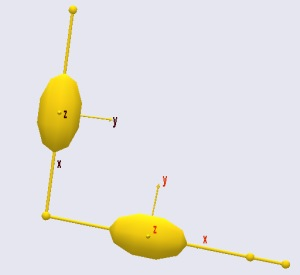
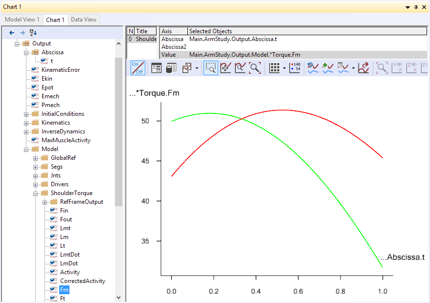
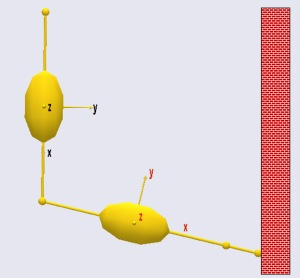
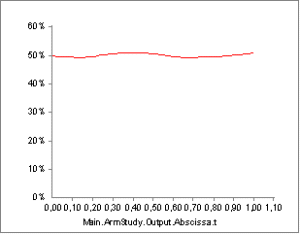
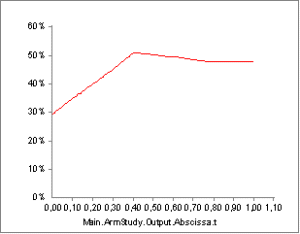
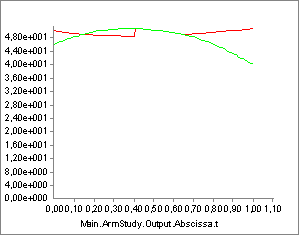
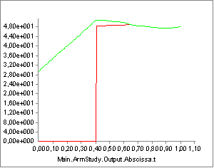

Lesson 6: General Muscles
=========================

.. include:: /caution_old_tutorial.rst

Physiological muscles are truly amazing machines, and despite many
attempts it has not been possible to make technical actuators that are
as light and efficient as natural muscles. As you may have seen in the
preceding sections, the mathematical modeling of muscles is not an easy
task either. But once it has been done, we can use some of the
properties of muscles to our advantage. We would like these "muscles" to
be able to have a slightly more general formulation than physiological
muscles, which are confined to acting along strings.

The solution is the AnyGeneralMuscle class. This type of muscle is
capable of acting on Kinematic Measures. Kinematic measures is an
abstract class representing anything you can measure on a model, and
there is in fact :doc:`*an entire tutorial lesson devoted to the
subject* <../The_mechanical_elements/lesson4>` in the
section on :doc:`*The Mechanical
Elements* <../The_mechanical_elements/intro>`. Some
examples are:

-  A general muscle working on a distance measure between two points
   becomes simply a linear force provider, or in fact a reaction
   provider in the sense that the force is not predetermined but will
   become whatever equilibrium requires.

-  A general muscle working on an angular measure, for instance a joint
   angle, becomes a torque provider.

-  A general muscle working on a Center of Mass measure becomes an
   abstract force working on all segments of the body contributing to
   the center of mass.

This lesson demonstrates how general muscles can be used for a variety
of modeling tasks.

Muscles as joint torque providers
---------------------------------

One of the purposes of the AnyBody Modeling System is to be able to
model the musculoskeletal system to a realistic level of detail.
However, there is a place in the world for traditional inverse dynamics,
where the muscles are disregarded and the body is balanced entirely by
joint torques. This type of analysis can provide important information
about the function of limbs and joints, and it is extremely numerically
efficient.

Joint torque inverse dynamics can be accomplished by adding general
muscles to the joints to replace the physiological muscles of the body.
This way, the "muscle forces" computed in the general muscles will
simply be the joint torques.

The example from the preceding lessons is not well suited to play with
joint torques, so please download a new example to start on by
:download:`*clicking here (right-click and save MuscleDemo.6.any to
disk).* <Downloads/MuscleDemo.6.any>` This is in fact a simplified
version of the simple arm example from the *Getting Started with
AnyScript* tutorial, where the muscles have been removed. The model has
two segments, an upper arm and a forearm, and is attached to the global
reference frame at the shoulder. It has a 100 N vertical load acting
downwards at the hand.

|Arm 2D|

The lack of muscles means that the model cannot currently do an inverse
dynamics analysis. If you try to run the InverseDynamicAnalysis
operation, you will get the following error message:

.. code-block:: none

    ERROR: MuscleDemo.6.any(103): ArmStudy: Muscle recruitment analysis failed, simplex solver found that problem was unbounded.

which is a mathematical way of stating that the model cannot be balanced
in the absence of muscles. In this case we are not going to add real
muscles. Instead we shall add general muscles to the revolute joints.
The best way to introduce a general muscle is to insert it from the
class tree. Place the cursor after the Drivers folder, locate the
AnyGeneralMuscle in the class tree, and insert a template:

.. code-block:: AnyScriptDoc

          AnyFolder Drivers = {
    
           //---------------------------------
           AnyKinEqSimpleDriver ShoulderMotion = {
             AnyRevoluteJoint &Jnt = ..Jnts.Shoulder;
             DriverPos = {-1.7};
             DriverVel = {0.4};
             Reaction.Type = {0};
           }; // Shoulder driver
    
           //---------------------------------
           AnyKinEqSimpleDriver ElbowMotion = {
             AnyRevoluteJoint &Jnt = ..Jnts.Elbow;
             DriverPos = {1.5};
             DriverVel = {0.7};
             Reaction.Type = {0};
           }; // Elbow driver
         }; // Driver folder
         
        §AnyGeneralMuscle <ObjectName> = {
           //ForceDirection = -1;
           AnyKinMeasure &<Insert name0> = <Insert object reference (or full object definition)>;
           AnyMuscleModel &<Insert name0> = <Insert object reference (or full object definition)>;
         };§

Just as normal muscles, general muscles must be associated with a muscle
model. Let us insert a simple one:

.. code-block:: AnyScriptDoc

        §AnyMuscleModel <ObjectName> = {
           F0 = 0;
         };§
         
        AnyGeneralMuscle <ObjectName> = {
           //ForceDirection = -1.000000;
           AnyKinMeasure &<Insert name0> = <Insert object reference (or full object definition)>;
           AnyMuscleModel &<Insert name0> = <Insert object reference (or full object definition)>;
         };

The empty fields in the muscle model must be filled in:

.. code-block:: AnyScriptDoc

       AnyMuscleModel §MusModel§ = {
           §F0 = 100.0;§
         };

We shall associate the muscle with the shoulder joint:

.. code-block:: AnyScriptDoc

       AnyMuscleModel MusModel = {
           F0 = 100.0;
         };
         
         AnyGeneralMuscle §ShoulderTorque§ = {
           //ForceDirection = -1;
           AnyKinMeasure &§Angle = .Jnts.Shoulder§;
           AnyMuscleModel &§Model = .MusModel§;
         };

Providing a torque for the shoulder is not enough. We also need a torque
in the elbow:

.. code-block:: AnyScriptDoc

         AnyGeneralMuscle ShoulderTorque = {
           //ForceDirection = -1;
           AnyKinMeasure &Angle = .Jnts.Shoulder;
           AnyMuscleModel &Model = .MusModel;
         };
         
        §AnyGeneralMuscle ElbowTorque = {
           //ForceDirection = -1;
           AnyKinMeasure &Angle = .Jnts.Elbow;
           AnyMuscleModel &Model = .MusModel;
         };§

Having provided torques for the shoulder and elbow it should be possible
to run the inverse dynamic analysis. However, attempting to do so will
provide the same depressing error message as before. The reason is that
general muscles share the ability to be unilateral with normal muscles.
The direction of action is controlled by the variable ForceDirection. If
the muscle acts in the positive direction of the joint angle, then it
direction should be set = 1, and if it is in the negative joint angle
direction it should be -1. In the present case the external load tends
to work in the negative angle direction for the shoulder as well as the
elbow, and hence the muscles should counteract in the positive
direction:

.. code-block:: AnyScriptDoc

         AnyGeneralMuscle ShoulderTorque = {
          §ForceDirection = 1§;
           AnyKinMeasure &Angle = .Jnts.Shoulder;
           AnyMuscleModel &Model = .MusModel;
         };
         
        AnyGeneralMuscle ElbowTorque = {
          §ForceDirection = 1§;
           AnyKinMeasure &Angle = .Jnts.Elbow;
           AnyMuscleModel &Model = .MusModel;
         };

Now the InverseDynamicAnalysis can be performed. Having done so, we can
open a new Chart View and look up the two joint torques as the Fm
property of the general muscles. We can plot both of them simultaneously
using an asterix as shown below:

|Chart view, Torques|

Notice that in this case we have used the same strength (muscle model)
for both joints. However, the maximum joint torque in physiological
joints varies a lot. The knee extension strength, for instance is
significantly larger than the elbow extension strength. If you perform
this type of modeling you can define joint torque muscles with strengths
comparable to the available joint torque and the system can give you an
estimate of how many percent of each joint's strength is used in a given
situation. You can also define different strengths of extension and
flexion muscles in a given joint and thereby take for instance the
difference in strength in the knee in these two directions into account.

Another useful property of the general muscles used at joint torque
providers is that you can handle closed loops and other statically
indeterminate situations, which are not treatable by traditional inverse
dynamics because the equilibrium equations do not have a unique
solution. The muscle recruitment algorithm will the distribute the load
between joints according to their individual strengths, and it is
therefore important to have reasonable estimates of joint strengths for
this type of situation.

Contact and other boundary conditions
---------------------------------------

One of the characteristics of muscles is that they are unilateral, i.e.
they can only exert force in one direction. Mathematically this behavior
creates a significant amount of problems, but many mechanical phenomena
have the same characteristics, namely any kind of contact phenomenon.
Biomechanics is full of contact problems:

-  The contact between a foot and the floor

-  The contact between the upper thighs and the seat of a chair

-  The contact between two articulating surfaces in a joint.

There is another less appreciated similarity between muscle forces and
contact forces: neither is without limit. Muscle forces are obviously
limited by the strength of the muscle. Contact forces to the environment
may seem like they are only limited by the strength of whatever is
supporting the body, but it can also be limited by friction and by the
pressure on the contacting tissues; if you have a stone in one shoe you
will very likely put less weight on that foot than on the other.

So the muscles of the body in addition to creating equilibrium are
constrained by the available contact forces to the environment, and
these often have different limits in different directions, typically a
high limit in compression perpendicularly against the supporting
surface, a smaller limit for friction tangentially to the surface, and
no reaction available in tension. Mathematically and mechanically this
is very much how muscles work, and the conditions therefore affect the
mechanics of the entire system much like muscles do and can be mimicked
by means of general muscles.

|Simple arm wall|

We are going to make a couple of changes to the simple arm model to
investigate contact in more detail. We shall imagine that the hand of
the model has a vertical wall to support against. We have to change the
kinematics to make the arm slide along the wall. It would be really
difficult to figure out which joint angle variations are needed to make
the hand move vertically, so we drive the hand directly instead.

.. code-block:: AnyScriptDoc

         AnyFolder Jnts = {
          
           //---------------------------------
           AnyRevoluteJoint Shoulder = {
             Axis = z;
             AnyRefNode &GroundNode = ..GlobalRef.Shoulder;
             AnyRefNode &UpperArmNode = ..Segs.UpperArm.ShoulderNode;
           }; // Shoulder joint
          
           AnyRevoluteJoint Elbow = {
             Axis = z;
             AnyRefNode &UpperArmNode = ..Segs.UpperArm.ElbowNode;
             AnyRefNode &LowerArmNode = ..Segs.LowerArm.ElbowNode;
           }; // Elbow joint
          
         }; // Jnts folder
         
        §AnyKinLinear HandPos = {
           AnyRefFrame &ref1 = .GlobalRef.Shoulder;
           AnyRefFrame &ref2 = .Segs.LowerArm.PalmNode;
         };§   
        
         AnyFolder Drivers = {
          §AnyKinEqSimpleDriver HandDriver = {
             AnyKinLinear &Measure = ..HandPos;
             MeasureOrganizer = {0,1};
             DriverPos = {0.45, -0.6};
             DriverVel = {0, 0.5};
             Reaction.Type = {0, 0};
           };§
    
         § /*§
           //---------------------------------
           AnyKinEqSimpleDriver ShoulderMotion = {
              AnyRevoluteJoint &Jnt = ..Jnts.Shoulder;
              DriverPos = {-1.7};
              DriverVel = {0.4};
              Reaction.Type = {0};
           }; // Shoulder driver
          
           //---------------------------------
           AnyKinEqSimpleDriver ElbowMotion = {
              AnyRevoluteJoint &Jnt = ..Jnts.Elbow;
              DriverPos = {1.5};
              DriverVel = {0.7};
              Reaction.Type = {0};
           }; // Elbow driver
    
         §*/§
    
         }; // Driver folder

Notice that the previous two joint angle drivers have been disabled.
Otherwise the system would become kinematically over-determinate. Notice
also that the new driver drives two degrees of freedom corresponding
exactly to the two drivers we have disabled. Finally, please notice the
line

.. code-block:: AnyScriptDoc

             Reaction.Type = {0, 0};

This means that the wall presently provides no reaction forces to the
arm. Plotting the MaxMuscleActivity provides the following result:

|no reaction MaxMuscleActivity plot|

The muscle activity is rather constant which is the natural consequence
of the moment arms being rather constant. The gravity as well as the
applied load of 100 N are vertical, so one might be tempted to think
that a horizontal support would not make much of a difference. We can do
a quick test by simply switching on the horizontal support of the
driver:

.. code-block:: AnyScriptDoc

             Reaction.Type = {§1§, 0};

This produces immediate proof that mechanics is usually more complicated
than expected; even this very simple mechanical system behaves
differently from what we might expect:

|Full reaction MaxMuscleActivity plot|

Notice that the muscle activity is much smaller in the beginning of the
movement with the reaction switched on and much the same towards the end
of the movement. It seems like the muscles are able to use the
horizontal reaction force to their advantage depending on the posture of
the mechanism.

Walls in general do not work like that; they can only provide reaction
pressure but no tension. This we can mimic with general a muscle. We
first switch the reaction off again:

.. code-block:: AnyScriptDoc

             Reaction.Type = {§0§, 0};

Subsequently we define a general muscle:

.. code-block:: AnyScriptDoc

         AnyMuscleModel MusModel = {
           F0 = 100.0;
         };
    
        §AnyMuscleModel ReacModel = {
           F0 = 10000.0;
         };
        
         AnyGeneralMuscle WallReaction = {
           ForceDirection = -1;
           AnyKinMeasureOrg Org = {
             AnyKinMeasure &wall = ..HandPos;
             MeasureOrganizer = {0};
           };
           AnyMuscleModel &Model = .ReacModel;
         };§

There are two things to notice here

1. The muscle model for the reaction, ReacModel, is much stronger than
   the joint muscles. This is because the wall is presumed to be very
   strong.

2. The ForceDirection property equals -1. This means that the force is
   working in the opposite direction of the Kinematic measure, i.e. in
   the negative global x direction, just like a contact force with the
   wall would do.

Running the InverseDynamicAnalysis again and plotting the two joint
torques provides the following graph (notice they can be plotted
simultaneously with the specification line
``Main.ArmStudy.Output.Model.*Torque.Fm``):

|Joint torques plot|

The red curve is the shoulder joint torque, and the green curve is the
elbow torque. Notice that the envelope of these two curves is in fact
identical to the MaxMuscleActivity curve we plotted above for the case
of no support. You would think that the support would be beneficial in
the final stages of the movement where the arm could rest a bit against
the wall. Actually, it is beneficial for the elbow, but the reaction
force also increases the torque about the shoulder, and since the
shoulder (red curve) has the higher load of the two, this limits the
benefit of the support. Let us see what happens if we turn the reaction
force the other way like if the hand could pull against the far side of
the wall:

.. code-block:: AnyScriptDoc

         AnyGeneralMuscle WallReaction = {
           ForceDirection = §1§;
           AnyKinMeasureOrg Org = {
             AnyKinMeasure &wall = ..HandPos;
             MeasureOrganizer = {0};
           };
           AnyMuscleModel &Model = .ReacModel;
         };

If you run the model again and plot the same graphs, you will see this:

|Joint torques plot 2|

The wall is obviously useful in the initial stages of the movement where
the torque generated by the reaction force is in the beneficial
direction for both the joints. In the later stages of the movement the
presence of the wall decreases the envelope of the muscle forces
slightly, but it has increased the torque in the elbow. The explanation
is that the elbow can increase its action beyond what is necessary to
carry the load and generate and additional pressure against the wall,
which then decreases the torque in the shoulder.

This example shows how complicated the mechanics of the body is: Even
this very simplified case would have different solutions if the
parameters of the model were different. For instance if the shoulder
were much stronger compared to the elbow, then the elbow would not have
been able to help the shoulder in the latter case because the elbow
would have the higher load compared to its strength. On the contrary,
the shoulder would have been able to help the elbow in the former case
by generating an additional force pushing against the wall.

This completes the part of this tutorial dealing with muscles. But we
are not completely finished yet. The :doc:`*next lesson* <lesson7>`
deals with the important topic of ligament modeling.

.. rst-class:: without-title
.. seealso::
    **Next lesson:** :doc:`lesson7`. 

