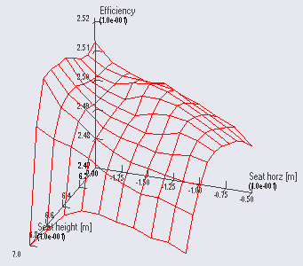

Parameter Studies and Optimization
===================================================

The AnyBody Modeling System has a nice mechanism that allows you to
perform investigations of the model's reaction to its parameters and
even to automatically find the set of parameters that causes a given
behavior of the model. Some examples of applications are:

-  Systematic investigations of the model's sensitivity to a group of
   parameters such as a muscle insertion point, muscle strength, or
   external support point.

-  Posture and movement prediction.

-  Optimization of muscular strength for a particular sports
   performance.

-  Optimization of the layout of a bicycle for a particular person.

-  Answering research questions such as: Could a T. rex jump? With
   optimization you can find the movement pattern that maximizes, for
   instance, the jump height given the body weight and limitations on
   muscular strength.

   Parameter study: Metabolic efficiency of a bicycle as a function of
   seat height and seat horizontal position.*

This functionality is provided through two complementary
:doc:`*studies* </A_study_of_studies/intro>`:

The **AnyParamStudy** performs an exhaustive search of the variable
space computing the model's reaction to every combination of the
variables within a given interval. For instance, a parameter study could
investigate the metabolic efficiency of a bicycle depending on the
horizontal and vertical position of the saddle. The advantage of this
study is that it gives you the ultimate overview of the system's
behavior. The disadvantage is that the number of computations grows
exponentially with the number of parameters. A two-parameter problem
with five values of each parameter leads to 5 x 5 = 25 analyses, which
is usually no problem to do, while a five parameter problem will lead to
5^5 = 3125 analyses, which obviously is a more time-consuming
undertaking, at least for larger models.

The **AnyOptStudy** performs a systematic search within a parameter
space using optimization techniques of solutions that fulfill certain
criteria. For instance, you could ask the study to find the saddle
position that maximizes the metabolic efficiency of the bicycle while
keeping the maximum muscle activity below a certain upper limit. The
advantage of this study is that it does not need to compute al
combinations of the parameters and therefore can handle spaces with
multiple parameters within a reasonable time. The disadvantage is that
it does not provide the overview of the design space that you get from a
parameter study.

This tutorial devotes one lesson to each of the two study types:

1. Defining a parameter study

2. Optimization studies

.. rst-class:: without-title
.. seealso::
    **Next lesson:** :doc:`lesson1`. 

