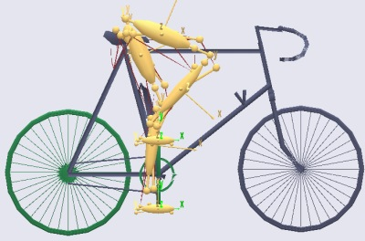
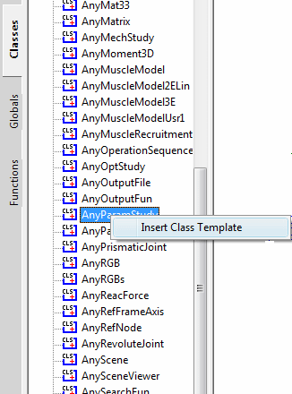
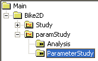
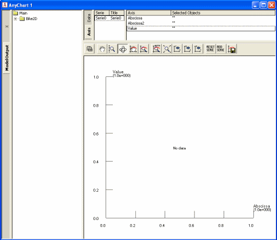
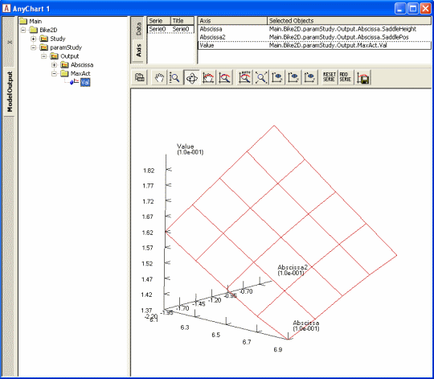
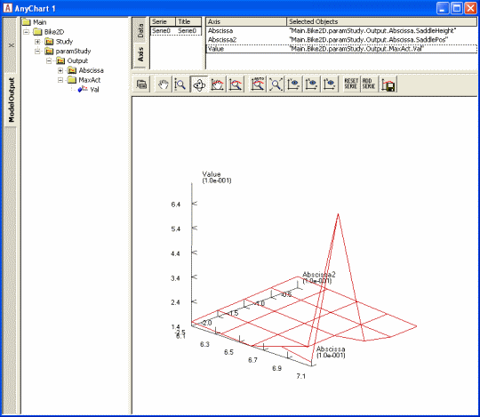
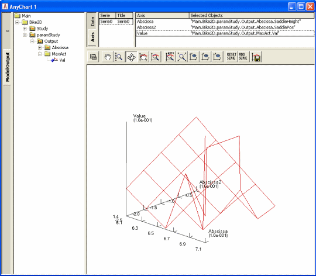
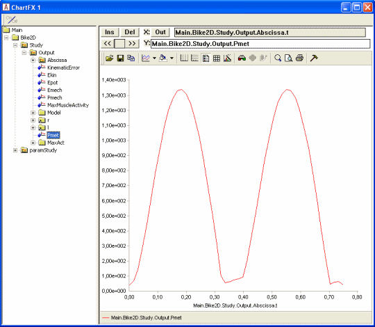

Defining a Parameter Study
==========================

.. include:: /caution_old_tutorial.rst

A parameter study is a systematic way to vary a number of model
parameters and have the system automatically run one or several analyses
for each combination of parameters.

For instance, you may want to know how the forces affecting a joint
prosthesis depend on the implanted position. Or you may be interested in
finding the standing posture by which you can hold a heavy box as easily
as possible between your hands. Or how the position of a handle
influences the muscular effort of operating it.

Or you may be interested in knowing how the seat height and horizontal
position influence the muscle effort and metabolism of the rider. This
is precisely what we shall do in this tutorial. To make life a bit
easier for you, we have prepared a bicycle model you can download and
play around with. :download:`Please click here to download the zip file
OptimBike.zip <Downloads/OptimBike.zip>` and unpack it to some
pertinent place on your hard disk.

The bicycle model is pretty much the 2DBike that you may know from the
`*AnyBody Managed Model
Repository* <https://www.anybodytech.com/anybody.html?fwd=modelrepository>`__.
In fact, the structure of the model is as in the repository, so we have
maintained the traditional division between the BRep directory
containing the human body model and the ARep directory containing the
bicycle. You will find the main file, OptTutorial.main.any, in
OptimBike\\ARep\\Aalborg\\OptTutorial (Notice the file
OptTutorial.final.main.any in the same location; this is a file that
contains most of the additions we make in the lessons of this tutorial).
Please open The AnyBody Modeling System and load the main file. Opening
a model view window should give you this picture:

|bike2d.jpg|

As you can see the model is very simple. It has two legs and a pelvis
that is rigidly fixed to the seat. The feet are attached to the crank
mechanism, and the crank is loaded by a sinusoidal torque and constant
angular velocity producing a mean mechanical output of 165 W. It has a
total of 18 muscles - nine on each leg. You can control the
design parameters of the bicycle and the way the rider propels the
pedals by means of the variables at the top of the main file. It might
be a good idea to play a bit around with the variables and run some
analyses. Try, for instance, to raise and lower the seat. Notice that if
you raise the seat more than a few centimeters, the model has trouble
reaching the pedals. This is really a kinematical problem, but it causes
momentarily very high muscle activities and, if you raise the seat
further, makes the kinematical analysis break down because the feet lose
the contact with the pedals.

The crank torque profile of a bicycle rider changes when the set is
moved horizontally because the location of the cycle's dead center
changes. To account for this, a special feature has been set up in this
model to adjust the phase shift of the crank torque profile to the seat
position such that the minimum crank torque occurs when the pedals point
towards the hip joint regardless of where the saddle is positioned.

Some General Terminology
------------------------

Before we proceed with the definition of a parameter study it might be
useful to introduce the terminology used by AnyBody for parameter and
optimization studies:

-  A design variable is an independent parameter controlling some aspect
   of the model, for instance the seat height, the pedal length, the
   pelvic angle, the crank torque variation, the cadence, the strength
   of a muscle, and so on. In short, just about any property you can set
   in the AnyScript model. A design variable is always a single number
   and it must be associated with upper and lower variation limits, but
   it is allowed to construct the model such that many properties depend
   on each variable. For instance, you might want to define a variable
   controlling the soleus muscle strength and then let the soleus muscle
   in both legs depend on it. In this way you can distinguish between
   dependent and independent parameters, and only independent parameters
   can be used as design variables. The AnyScript class defining a
   design variable is called AnyDesVar.

-  A design measure is a dependent parameter that results from an
   analysis with given values of design variables. Typical examples
   would be the maximum muscle activity, the metabolism, the mechanical
   work, the mechanical power generated by a specific muscle, or the
   force in a joint. The AnyScript class for definition of design
   measures is the AnyDesMeasure.

These two classes are common to parameter studies and optimization
studies, so the two types obviously share several concepts. Let us
proceed with the definition of a parameter study. Actually, both these
studies come from the same family of classes having the AnyDesStudy as
common parent; we commonly refer to these studies as design studies.
Within this kinship, they also share the definition of the "analysis" to
be performed when evaluating the design measures for a certain set of
design variables. The "analysis" is in fact an AnyScript operation
(AnyOperation), called Analysis, which is a member of all design
studies. To state an optimization or a parameter study properly, the
design variables, the design measures, and the analysis must all be
defined.

Definition of a Parameter Study
-------------------------------

|parinsert.gif|

A parameter study is as the name indicates a study. Therefore its
natural position in the model is below the existing AnyBodyStudy. We can
insert a new parameter study by means of the object inserter mechanism
from the class tree. Place the cursor below the definition of the
AnyBodyStudy Study, click the Classes tab in the tree view, locate the
AnyParamStudy, right-click, and insert a template of the class. You
should get the following result:

.. code-block:: AnyScriptDoc

        
         AnyBodyStudy Study = {
          
           AnyFolder &Model = .Model;     
          
           Gravity = {0.0, -9.81, 0.0};
          
           tEnd = Main.BikeParameters.T;           
         };
         
    
     §AnyParamStudy <ObjectName> =
         {
           //LogFile = "";
           /\*Analysis =
           {
           //AnyOperation &<Insert name0> = <Insert object reference (or
      full object definition)>;
           };\*/
           nStep = ;
           AnyDesVar &<Insert name0> = <Insert object reference (or full
      object definition)>;
           //AnyDesVar &<Insert name1> = <Insert object reference (or full
      object definition)>; 
           AnyDesMeasure &<Insert name0> = <Insert object reference (or
      full object definition)>;
           //AnyDesMeasure &<Insert name1> = <Insert object reference (or
      full object definition)>;
         };§

 As you can see, this requires a bit of additional specifications and
general tidying up:

.. code-block:: AnyScriptDoc

        AnyParamStudy §ParamStudy§ = {
           Analysis = {
           //AnyOperation &<Insert name0> = <Insert object reference (or
      full object definition)>;
           };
           nStep = ;
           AnyDesVar &<Insert name0> = <Insert object reference (or full
      object definition)>;
           //AnyDesVar &<Insert name1> = <Insert object reference (or full
      object definition)>;
           AnyDesMeasure &<Insert name0> = <Insert object reference (or
      full object definition)>;
           //AnyDesMeasure &<Insert name1> = <Insert object reference (or
      full object definition)>;
         };

 Here's a brief explanation of the different components of a parameter
study:

+-----------------+---------------------------------------------------------------------------------------------------------------------------------------------------------------------------------------------------------------------------------------------------------------------------------------------------------------------------------------------------------------------------------------------+
| **Parameter**   | **Function**                                                                                                                                                                                                                                                                                                                                                                                |
+=================+=============================================================================================================================================================================================================================================================================================================================================================================================+
| Analysis        | This is a specification of the operation(s) to perform to provide the data we are studying in the parameter study. This will typically be an InverseDynamicAnalysis operation, but it could also be simply an evaluation of some mathematical expression, or it could be a combination of multiple operations, for instance various calibrations followed by an inverse dynamic analysis.   |
+-----------------+---------------------------------------------------------------------------------------------------------------------------------------------------------------------------------------------------------------------------------------------------------------------------------------------------------------------------------------------------------------------------------------------+
| nStep           | This is a specification of how many steps to evaluate in the parameter study for each parameter.                                                                                                                                                                                                                                                                                            |
+-----------------+---------------------------------------------------------------------------------------------------------------------------------------------------------------------------------------------------------------------------------------------------------------------------------------------------------------------------------------------------------------------------------------------+
| AnyDesVar       | The study must declare at least one of these. It is the parameter(s) that are varied in the study and for combinations of which the model is analyzed. You can define as many as you like, but please beware that the number of analyses in the parameter study is the product of steps for each AnyDesVar, so the time consumption grows exponentially with the number of AnyDesVars.      |
+-----------------+---------------------------------------------------------------------------------------------------------------------------------------------------------------------------------------------------------------------------------------------------------------------------------------------------------------------------------------------------------------------------------------------+
| AnyDesMeasure   | Each of these objects specifies a property that is the result of the analysis and which must be collected for further inspection as the study proceeds. You can define as many of these as you like.                                                                                                                                                                                        |
+-----------------+---------------------------------------------------------------------------------------------------------------------------------------------------------------------------------------------------------------------------------------------------------------------------------------------------------------------------------------------------------------------------------------------+

Let us insert the necessary specifications to perform a parameter study
on the saddle position of the bicycle:

.. code-block:: AnyScriptDoc

        AnyParamStudy ParamStudy = {
           Analysis = {
            § AnyOperation &Operation = ..Study.InverseDynamicAnalysis;§
           };

As you can see, this is a pointer to the inverse dynamic analysis of the
existing AnyBodyStudy in the bicycle model. This specification simply
means that to evaluate the parameters we want to investigate in this
parameter study, we must execute the analysis of the bicycle. This may
seem obvious in a simple model like this one, but many AnyScript models
contain multiple studies and each study contains multiple operations.

The next specification deals with the parameters to vary:

.. code-block:: AnyScriptDoc

           nStep = ;
           AnyDesVar §SaddleHeight = {
             Val = Main.BikeParameters.SaddleHeight;
             Min = Val - 0.05;
             Max = Val + 0.03;
           };§
           AnyDesVar §SaddlePos = {
             Val = Main.BikeParameters.SaddlePos;
             Min = Val - 0.07;
             Max = Val + 0.10;
           };§
           AnyDesMeasure &<Insert name0> = <Insert object reference (or
      full object definition)>;
           //AnyDesMeasure &<Insert name1> = <Insert object reference (or
      full object definition)>;
         };

Please notice here that we have removed the '&'s that were inserted in
the template in front of the variable names. Instead of pointing at
AnyDesVars defined elsewhere we include the entire definition right here
in the study, and this is actually the usual way to do it. Each
AnyDesVar gets three properties set. The first one is called 'Val' and
is simply set equal to an existing parameter in the model. The best way
to understand this statement is to think of Val as a reference variable
that is equalized in the first case with the SaddleHeight, which is a
parameter defined at the top of the main file. At any time in the
parameter study, Val will be equal to the saddle height as one should
expect from the assignment. But in this special case, the assignment
also goes the other way: It lets the parameter study control the value
of what is on the right hand side of the equality sign, in this case the
SaddleHeight parameter. We have similarly defined a second parameter,
SaddlePos, which allows the parameter study to vary the
horizontal saddle position. This two-way linkage between Val and another
variable in the model implies certain restrictions on what assignments
AnyScript allows for this particular case. The referred variable must be
a scalar quantity, i.e. either a scalar or an element of a larger
structure (e.g. vector or matrix). Secondly, it must be an independent
scalar quantity, i.e., it cannot depend (by expressions) on other
variables; otherwise there would exist an ambiguity. Alternatively to
linking another independent variable in the model, Val can be
initialized with constants. In this case, Val will be the only instance
of the design variable and the model must depend directly on Val. This
latter use is a somewhat restricted exploitation of AnyDesVar and is
typically not practical when studies of existing models are to be
carried out.

The next step is to define the properties we wish to study, i.e. the
dependent parameters or "design measures" of the model. As you know,
after running an operation from a study the results are available in the
Output branch of the tree view of the operation and they can be plotted,
dumped and copied to the clipboard and so on. Now we are defining a
study that will execute operations from other studies and assemble the
results for later investigation. We might even want to make mathematical
operations on these results, combine results from different operations,
and so on. To do this we must refer to the result we wish to store for
further processing. There is just one semantic problem: The results do
not exist until we have performed the analysis, but we must refer to
them already when we author (and load) the model.

To solve this problem we must go back to the AnyBodyStudy Study, from
where we want to lift the results, and declare an object that will allow
us to refer to computational results before they are actually made. The
object is of class AnyOutputFun, and we shall add it to the existing
AnyBodyStudy:

.. code-block:: AnyScriptDoc

         // The study: Operations to be performed on the model
         AnyBodyStudy Study = {
          
           AnyFolder &Model = .Model;     
          
           Gravity = {0.0, -9.81, 0.0};
          
           tEnd = Main.BikeParameters.T;
           nStep = 50;
           
         §AnyOutputFun MaxAct = {
             Val = .MaxMuscleActivity;
           };§
           
         }; 

This allows us to refer to Study.Output.MaxMuscleActivity before it
actually gets created.

AnyOutputFun is actually a class of mathematical function that returns
the output (when existing) associated with the Val member. So here we
have created a function called MaxAct that takes no arguments and
returns the output data for .MaxMuscleActivity. Notice that AnyOutputFun
must be declared inside a study in order to resolve the association with
the output data structure of the particular study.

We can now use the output function, MaxAct, in our design measure simply
by calling the function in the assignment of the Val member of the
AnyDesMeasure:

.. code-block:: AnyScriptDoc

           AnyDesVar SaddlePos = {
             Val = Main.BikeParameters.SaddlePos;
             Min = Val - 0.07;
             Max = Val + 0.10;
           };
          §AnyDesMeasure MaxAct = {
             Val = max(..Study.MaxAct());     
           };§

Notice the definition. The MaxAct function for each
InverseDynamicAnalysis operation returns a vector of maximum muscle
activities in the model. The vector has as many components as the study
has time steps, i.e. 50 in the present case. In the definition of the
AnyDesMeasure we want to save only the largest value of each of the
vector, so we wrap the call of the MaxAct function in another max
function. AnyScript gives you a number of such data processing functions
and we shall study others further down. Please refer to the reference
manual for further details.

One thing is missing before we can try the whole thing out: We must
specify how many steps we want the parameter study to perform for each
parameter. As in AnyBodyStudies this is done by the nStep variable, but
where nStep in an AnyBodyStudy is an integer variable, it is a vector
with one component for each AnyDesVar in an AnyParamStudy. We shall be
modest at first and choose only five steps in each direction. And so,
the final AnyParamStudy looks like this:

.. code-block:: AnyScriptDoc

        AnyParamStudy ParamStudy = {
           Analysis = {
             AnyOperation &Operation = ..Study.InverseDynamicAnalysis;
           };
           nStep = §{5,5}§;
           AnyDesVar SaddleHeight = {
             Val = Main.BikeParameters.SaddleHeight;
             Min = Val - 0.05;
             Max = Val + 0.03;
           };
           AnyDesVar SaddlePos = {
             Val = Main.BikeParameters.SaddlePos;
             Min = Val - 0.07;
             Max = Val + 0.10;
           };
           AnyDesMeasure MaxAct = {
             Val = max(..Study.MaxAct());     
           };
       };

It is finally time try it out. If you have typed everything correctly,
then you should be able to load the model and expand the Operations Tree
in the left hand side of the Main Frame to this:

|parstudytree.gif|

 

Make sure you have a Model View window open. Select ParameterStudy as
indicated and hit the "Run" button. You should see the model starting to
cycle, and if you watch the vicinity of the saddle carefully, you will
see that the hip joint is changing its position on a 5 x 5 grid. With a
reasonably fast computer it should take a minute or less to do the 25
analyses after which the computations stop. Congratulations! You have
completed your first parameter study. Let us investigate the result.

The obvious way to visualize the results of a study with two parameters
is as a 3-D surface. AnyBody has a window to make that type of plots.
Please click Window -> AnyChart 2D/3D (new). A new window containing a
coordinate system and the usual model tree appears:

|anychart1.gif|

The toolbar of this window indicates a kinship with the Model View
window. Indeed, if you select the rotation button in the toolbar and
drag the mouse with the left button down inside the coordinate system
you will notice that the system rotates just like an ordinary Model
View. Now, expand the Bike2D node in the tree until you can click the
ParamStudy->Output->MaxAct->Val property. The coordinate system
automatically attains a second abscissa axis and you can see a nice
surface like this:

|anychart2.gif|

The surface shows the maximum muscle activity over the cycle for each of
the 25 combinations of parameters and provides a very nice overview of
the behavior of the model. The surface reveals that the highest and most
backward position is the best. Why not try higher and more backward,
then? It is very simply to do:

.. code-block:: AnyScriptDoc

           AnyDesVar SaddleHeight = {
             Val = Main.BikeParameters.SaddleHeight;
             Min = Val - 0.05;
             Max = Val + 0.0§5§;
           };
           AnyDesVar SaddlePos = {
             Val = Main.BikeParameters.SaddlePos;
             Min = Val - 0.§10§;
             Max = Val + 0.10;
           };

When you re-run the parameter study, things will go well in the
beginning, but towards the end of the 25 combinations you may notice
muscles beginning to bulge more and momentarily attain the color
of magenta. This is the system's way of demonstrating that the muscles
have been loaded above 100% of their strength. The reason why this
happens is that, as the seat rises, the model gets into positions where
it is difficult for the feet to reach the pedals. Just before the feet
cannot reach the pedals the knee movements are accelerated causing large
inertia forces in the system. All this happens a bit more drastically in
an ideal rigid body model than it would in real life where joints have a
bit of slack, segments are slightly elastic, and the prescribed
kinematics may be compromised. You can see very clearly what happens if
you go back to the AnyChart View and study the new surface:

|anychart3.gif|

The surface is now completely dominated by the one combination, which is
difficult for the model to do. You can still see the surface shape if
you change the scale of the value axis. This and all other settings are
available if you click
the \ |chartsettings.gif|
button in the toolbar. Doing so will produce a window with a tree view
in which you can select ValueAxis->Max. Try setting Max to 0.2 and you
should obtain the following:

|anychart4.gif|

What this study reveals is that in terms of muscle activity to drive the
bicycle a high seat is advantageous, but there seems to be a very sharp
limit where the leg gets close to not being able to reach the pedals,
and this should not be exceeded. One additional remark in this context
is that this bicycle model has a predefined ankle angle variation
whereas a real human can compensate for a higher seat by letting the
ankle operate in a more plantar-flexed position.

Before we finish this section, let us take a look at a particularly
important feature of AnyScript mathematics: The ability to compute
integral properties. AnyBody has a simple way of approximating the
metabolism of muscles based on the simulation of each muscle's
mechanical work. Metabolism is technically a power measured in Watt, and
the sum of the individual muscle metabolisms will give us an estimate of
the total metabolism involved in the bicycling process. It is fairly
simple to add up the muscle metabolisms in the AnyBody study:

.. code-block:: AnyScriptDoc

         // The study: Operations to be performed on the model
         AnyBodyStudy Study = {
          
           AnyFolder &Model = .Model;     
          
           RecruitmentSolver = MinMaxOOSolSimplex;
           Gravity = {0.0, -9.81, 0.0};
          
           tEnd = Main.BikeParameters.T;
           nStep = 50;
     §      
           // Useful variables for the optimization
           AnyFolder &r = Main.Bike2D.Model.Leg2D.Right.Mus;
           AnyFolder &l = Main.Bike2D.Model.Leg2D.Left.Mus;
           AnyVar Pmet =
      r.Ham.Pmet+r.BiFemSh.Pmet+r.GlutMax.Pmet+r.RectFem.Pmet+
     r.Vasti.Pmet+r.Gas.Pmet+r.Sol.Pmet+r.TibAnt.Pmet+
     l.Ham.Pmet+l.BiFemSh.Pmet+l.GlutMax.Pmet+l.RectFem.Pmet+
     l.Vasti.Pmet+l.Gas.Pmet+l.Sol.Pmet+l.TibAnt.Pmet;
     §
           AnyOutputFun MaxAct = {
             Val = .MaxMuscleActivity;
           };
           
     };</ANYSCRIPT>

Notice that we have defined the r and l variables for convenience to
limit the size of the expressions. If you run the InverseDynamicAnalysis
(go on and try!) you will find the new variable mentioned in the list of
output, and you can chart it in a ChartFX View:

|metabcurve.gif|

The area under this curve is the total metabolism combusted over a crank
revolution. To compute this we must introduce two more elements. The
first one is an AnyOutputFun as we have seen it before. The purpose if
this function is to make it semantically possible to refer to the output
of the Pmet variable before is has actually been computed:

.. code-block:: AnyScriptDoc

           // Useful variables for the optimization
           AnyFolder &r = Main.Bike2D.Model.Leg2D.Right.Mus;
           AnyFolder &l = Main.Bike2D.Model.Leg2D.Left.Mus;
           AnyVar Pmet =
      r.Ham.Pmet+r.BiFemSh.Pmet+r.GlutMax.Pmet+r.RectFem.Pmet+
     r.Vasti.Pmet+r.Gas.Pmet+r.Sol.Pmet+r.TibAnt.Pmet+
     l.Ham.Pmet+l.BiFemSh.Pmet+l.GlutMax.Pmet+l.RectFem.Pmet+
     l.Vasti.Pmet+l.Gas.Pmet+l.Sol.Pmet+l.TibAnt.Pmet;
           AnyOutputFun MaxAct = {
             Val = .MaxMuscleActivity;
           };
     §      AnyOutputFun Metabolism = {
             Val = .Pmet;
           };§      

The second missing element is the actual integration of the function.
This we perform in the parameter study where we define the
AnyDesMeasure:

.. code-block:: AnyScriptDoc

        AnyParamStudy ParamStudy = {
           Analysis = {
             AnyOperation &op = ..Study.InverseDynamicAnalysis;
           };
           nStep = {§10§,§10§};
           AnyDesVar SaddleHeight = {
             Val = Main.BikeParameters.SaddleHeight;
             Min = Val - 0.05;
             Max = Val + 0.0§3§;
           };
    
           AnyDesVar SaddlePos = {
             Val = Main.BikeParameters.SaddlePos;
             Min = Val - 0.0§7§;
             Max = Val + 0.10;
           };
          
           AnyDesMeasure MaxAct = {
             Val = max(..Study.MaxAct());     
           };
    
     §      AnyDesMeasure Metab = {
             Val = secint(..Study.Metabolism(),..Study.tArray);     
           };§
          
         };

The secint function performs a numerical integration of the first
argument against the second argument. Each argument must be an array and
the number of components in the two arguments must be the same.

Notice the other two changes: We have changed the variable limits back
to what they were before and we have decided to be a little more
adventurous and have specified 10 variable steps in each direction. It
is time to run the parameter study again. The new Metab variable is now
available in the list under the ParamStudy in the AnyChart window and
can be plotted:

|metab100.gif|

We shall return to the capabilities of the AnyChart in more detail in
the :doc:`next lesson <lesson2>`, which deals with the
definition of optimization studies.

.. rst-class:: without-title
.. seealso::
    **Next lesson:** :doc:`lesson2`. 

.. |metab100.gif| image:: _static/Defining_a_parameter/image10.gif
