Optimization Studies
====================

The parameter study introduced in the preceding lesson provides a
complete overview of the design space, but the study is only feasible
when the problem has few independent parameters, preferably one or two.
In the previous lesson we considered a problem with two parameters and 5
steps in each direction of the design space leading to 5^2 = 5 x 5 = 25
analyses. If the problem had 10 parameters we would be facing 5^10 = 9.7
million analyses, which is an entirely different matter in terms of
computation times. The truth is that such so-called full factorial
parameter studies are computationally infeasible when the problem has
more than very few independent parameters. So what to do?

The solution is to use a method that picks the combinations to compute
carefully and only has to evaluate a few of them. One class of such
methods is optimization. An optimization algorithm systematically
searches through the design space for the combination of parameters that
minimizes the value of a function of the parameters, the so-called
objective function. Some algorithms also allow the definition of
constraint functions, which are dependent parameters that must be
maintained below a certain upper limit.

The AnyBody Modeling System provides a study to handle optimization
problems. The mathematical definition of the problem it solves is as
follows:

Minimize

*g\ :sub:`0`*\ (*x\ :sub:`1`..x\ :sub:`n`*)

Subject to

*g\ :sub:`i`*\ (*x\ :sub:`1`..x\ :sub:`n`*) <= 0

*L*\ :sub:`j` <= *x*\ :sub:`j` <= *U\ :sub:`j`*

where *g\ :sub:`0`* is called the objective function, *x\ :sub:`j`*,
*j*\ =1..\ *n* are the design variables, and *g\ :sub:`i`*,
*i*\ =1..\ *m* are the constraints. The definition of an optimization
problem in AnyBody is therefore a question of appointing independent
parameters as design variables and dependent parameters as the objective
function and constraints. Please notice that *m* could be zero in which
case we have a problem that is only constrained by the simple bounds on
the variables.

In an optimization terminology, the parameter study from the preceding
lesson could be defined as:

Minimize

*Metabolic energy consumption* 

Subject to

    *Saddle height within predefined limits
    Saddle horizontal position within predefined limits*

In fact, this is precisely what we are going to do, but before we
proceed, let us briefly look at the properties of a typical
musculoskeletal objective function and how the optimization algorithm
solves the problem.

+-----------------------------------------------------------------------------------------+------------+
 |metab.gif|   | |image1|   |
+-----------------------------------------------------------------------------------------+------------+

The two pictures above both show the result of a parameter study. The
picture on the right is the section indicated by the magnifying glass on
the left amplified by 50 times. As you can see, the seemingly smooth
objective function has a microscopic jump. In other words the function
is non-smooth and in fact discontinuous at certain points. Not
all design measures have such discontinuities, but some do. The figure
also indicates that the function is smooth in between these
discontinuities. Optimization algorithms are trying to navigate on
multi-dimentional hyper-surfaces with such qualities and must
consequently be robust against a certain amount of non-smoothness. The
optimization algorithm in AnyBody is indeed capable of doing this in
most cases. It is a special version of a so-called feasible directions
algorithm, which seeks out the optimum in two-step loops. The two steps
are:

1. Decide on a search direction.

2. Perform a linear search to find the minimum along the chosen
   direction.

This means that it is only necessary to perform analyses of the function
values at the points that the algorithm actually visits and not all
points in a predefined grid as we did in the parameter study. It also
means that the algorithm depends on the smoothness of the surface when
it decides on a direction to take in step 1, but once the direction has
been chosen, the line search in step 2 can be done with methods that do
not predispose smoothness.

Now that we know what to expect, we can proceed to the actual definition
of the optimization study. The previous definition of the parameter
study will help us a lot because an optimization study has almost
exactly the same structure. So the first step would be to simply copy
the parameter study:

.. code-block:: AnyScriptDoc

         AnyParamStudy ParamStudy = {
           Analysis = {
             AnyOperation &Operation = ..Study.InverseDynamicAnalysis;
           };
           nStep = {5,5};
           AnyDesVar SaddleHeight = {
             Val = Main.BikeParameters.SaddleHeight;
             Min = Val - 0.05;
             Max = Val + 0.03;
           };
           AnyDesVar SaddlePos = {
             Val = Main.BikeParameters.SaddlePos;
             Min = Val - 0.07;
             Max = Val + 0.10;
           };
           AnyDesMeasure MaxAct = {
             Val = max(..Study.MaxAct());
           };
         };
         
        §AnyParamStudy ParamStudy = {
           Analysis = {
             AnyOperation &Operation = ..Study.InverseDynamicAnalysis;
           };
           nStep = {5,5};
           AnyDesVar SaddleHeight = {
             Val = Main.BikeParameters.SaddleHeight;
             Min = Val - 0.05;
             Max = Val + 0.03;
           };
           AnyDesVar SaddlePos = {
             Val = Main.BikeParameters.SaddlePos;
             Min = Val - 0.07;
             Max = Val + 0.10;
           };
           AnyDesMeasure MaxAct = {
             Val = max(..Study.MaxAct());
           };
           AnyDesMeasure Metab = {
             Val = secint(..Study.Metabolism(),..Study.tArray);
          };
         };§

We proceed to change a few parameters:

.. code-block:: AnyScriptDoc

        Any§Opt§Study §Opt§Study = {
           Analysis = {
             AnyOperation &Operation = ..Study.InverseDynamicAnalysis;
           };
           AnyDesVar SaddleHeight = {
             Val = Main.BikeParameters.SaddleHeight;
             Min = Val - 0.05;
             Max = Val + 0.03;
           };
           AnyDesVar SaddlePos = {
             Val = Main.BikeParameters.SaddlePos;
             Min = Val - 0.07;
             Max = Val + 0.10;
           };
           AnyDesMeasure Metab = {
             Val = secint(..Study.Metabolism(),..Study.tArray);
            §Type = ObjectiveFun;§
          };
         };

Please notice that the AnyDesMeasure MaxAct was removed, and so was the
entire line with the nStep specification. The optimization study does
not use any particular step size but rather adapts its steps
automatically to find the accurate position of the optimum. This is
another advantage of optimization over a parameter study. Finally, we
have added a type specification to the Metab object specifying that this
is the objective function of the problem.

This is the definition of an optimization problem that will vary the
saddle height and horizontal position to minimize the metabolism. Let
us run it and see what happens. Load the model in and please make sure
that you have a Model View window open so that you can see the
difference in the way the seat position is varied compared to the
parameter study.

|runopt.gif|

If the model loads you should get a screen picture similar to the one
above this text. Expand the OptStudy branch in the operations tree,
click Optimization once and then the Run button. The model starts
cycling and after a few rounds you will notice the saddle position
changing, but not in a systematic grid like in the parameters study.
What you will see is gradual changes back and forth in different
directions until the changes wear off and the position converges. Every
time you see the step counter below the Run button changing number it is
an indication that the optimizer has picked a new optimization direction
to try. You should see the number increasing in slow steps up to six
before the process stops and the system announces that it is finished.
Please notice that the changes of saddle position in the last several
steps is very minute, which is typical for optimization: the first steps
bring large changes and large improvements, while the last many steps
only improve slightly.

Now we are going to study the results in more detail using the AnyChart
window. Do you still have the AnyChart window from the previous lesson
with the Metabolism parameter study open? It should look like this:

|metab100.gif|

If not, please run the ParamStudy again and plot the surface. When you
have this surface ready, please open another AnyChart window by clicking
Window->AnyChart 2D/3D (new).  In the new window, please expand the tree
down to Main.Bike2D.OptStudy.Output.Metab. Then click the Val variable
under Metab. This produces a simple 2-D graph showing the development of
the metabolism over the 5 iterations: 

|metabcon2.gif|

The graph confirms that the vast majority of the improvement is obtained
in a couple of iterations and the final iteration contributes only by a
minor, almost insignificant adjustment. Such iterations
with insignificant improvements occur due to the convergence criterion,
i.e., the criterion that stops the optimization process. The optimizer
does not detect mathemtically that the objective function has an optimum
value; it merely detects that the changes of the found solution are
small from one iteration to the next. Therefore, the optimization
process will always end with one (or more) steps with insignificant
changes.

The optimal solution in the Model View looks like this:

|BikeOpt2.jpg|

Just above the Metab variable in the tree you can find the two
independent variables, SaddleHeight and SaddlePos, and they can be
graphed the same way revealing that their convergence is less monotone
over the iterations. This is also quite usual for optimization
processes.

An interesting way to investigate the convergence is to plot it in the
variable/objective space rather than over the iterations. This is what
we need the window with the parameter study surface for. At the top of
this window you will find panels listing series and data to be plotted.
Please right-click in the series window and select "New":

|newseries.gif|

This will give you a blank "Series 1". When you highlight it by clicking
with the mouse you will see the list of Selected Objects in the
right-hand pane is empty. We are going to fill in the SaddleHeight and
SaddlePos variables from the OptStudy as Abscissa and Abscissa2,
respectively.  This is done by selecting Abscissa and Abscissa2 in turn
and then expanding the OptStudy branch until the SaddleHeight.Val and
SaddlePos.Val, respectively, can be selected:

|selectheight.gif|

Finally, in the Value field select OptStudy.Metab.Val and look carefully
at the plot. You will see that an additional polyline has been added. It
originates approximately at the middle of the surface and shows the path
the optimization process has taken through the design space to the
minimum point. You can change the color of the line by clicking the
leftmost button (Properties) in the toolbar directly over the graphics
pane. This gives you access to all the settings and lets you control the
appearance of graphs in detail. In the picture below we have selected
RGB = {0,0,1}, i.e. blue, for Series1 and Thickness = 2: 

|optpath2.gif|

This plot illustrates the convergence history in the "landscape" of the
objective function. Here we can see the reasons for the convergence
being as it is. Actually, the optimum value lies in a relatively flat
region and therefore the exact mathematical location of the optimum may
be of a more academic importance than practical relevance since we can
find many design point with almost the same objective function value.

"A flat optimum", like this, can occasionally cause problems for the
optimization process to provide exact convergence because it is
difficult to distinguish between insignificant changes due to flatness
or convergence. Furthermore, one more obstacle for finding the exact
optimum is present in the given case. The objective function is not as
smooth as the parameter study with the relative crude grid indicates.
Below you see the result of a parameter study, we have prepared for a
small 2 by 2 mm design area in the vicinity of the end-point of the fist
optimization step.

  |metabzoom2.gif|

This reveals a somewhat jagged surface and a distinct (local) valley of
the objective function. Minor changes of the input to the optimization
process, whether it be the starting point or design variable bounds, can
actually make the optimization process dive into this local valley and
get stuck in there. 

An optimization process that gets stuck in this local minimum could have
a convergence history like in the plots shown below

|metabcon2_no_converge.gif|

|optpath2_no_converge.gif|

Notice how the final objective function value is slightly higher than
the previous optimization result. Notice also how only the first
iteration out of 7 provides significant improvement of the objective
function. This step brings the design value down into to the valley. The
remaining iterations zigzags in the bottom of the valley without being
able to get up and out and without providing any visible improvement.
Finally, the convergence criterion is fulfilled. It can be mentioned
that the convergence criterion requires both objective and design
changes to be small.

In the beginning of this lesson, we mentioned that the optimization
problem formulation also handles constraints. They can be used for all
sorts of purposes. For instance we notice that the optimal solution is a
rather low saddle position, cf. the picture above. Suppose that for some
reason, this position is too low. We, therefore, want to ensure that the
distance between the crank and the seat is not too small, for instance
larger than 0.66 m. This can be formulated very nicely as a constraint
like this:

.. code-block:: AnyScriptDoc

           AnyDesMeasure Metab = {
             Val = secint(..Study.Metabolism(),..Study.tArray);     
             Type = ObjectiveFun;
           };
    
           §AnyDesMeasure SeatDist = {
             Val = (.SaddleHeight.Val^2+.SaddlePos.Val^2)^0.5 - 0.66;
             Type = GreaterThanZero;
           };§

Notice that constraints are defined as AnyDesMeasures of type
LessThanZero or GreaterThanZero. In the mathematical formulation of the
optimization problem stated in the beginning of this lesson, we have
only less-than-or-equal-to constraints, but there is only a minus sign
in difference of making a greater-than-or-equal-to into a
less-than-or-equal-to constraint. You can put this minus sign manually
or you can use Type = GreaterThanZero, which is equivalent. Notice that
equality constraints are in principle also a possibility, but currently
the optimization solvers in AnyBody do not handle this type of
constraints. Moreover, it is most often possible to handle equality
constraints by means of inequality constraints, because the objective
function's gradient will put pressure on the constraint from one side;
thus, it is merely a matter of determining the proper type of inequality
constraint.

Notice also that the constraint is just an AnyDesMeasure, so anything
you could conceivably use as an objective function can also be a
constraint. In this case, the constraint is a simple mathematical
combination of variables, but in general it can also be properties such
as muscle forces, joint reactions, point locations, segment velocities,
and any other model property that the system can compute.

Enough talk; let's try the optimization with the constraint added.
Please load the model again, select the optimization operation, and
click the run button. The optimization process will have the following
convergence picture:

|metabcon2_constrained.gif|

If you alo re-run the parameter study, you can get this picture of the
convergence:

|optpath2_constrained.gif|

We see that the result is indeed a compromise since the objective
function value cannot be reduced as much as in the unconstrained
case. The path of the design values bounces off the constraint and
finally it gets stuck on the constraint even though the objective
function still has a downwards inclination. The constraint lies like a
wall through the design space. We can see the convergence path along the
constraint by plot the constraint value, i.e., the SeatDist.Val. This
looks like:

|SeatDist2_constrained.gif|

where it is obvious how the optimizer hits the constraint, bounces off,
hits again, etc. and finally it converges. At no point in time, the
constraint value becomes negative, which was exactly what we prescribed
in its definition.

A final look at the result could be the picture of the model after this
constained optimization, which shows a visible difference compared to
the unconstrained solution: The hip position is now higher, i.e., longer
from the crank and to achieve this it is further forward, see the
picture below:

|constrained|

This completes the introduction to optimization studies.

Optimization studies can be used for many purposes. A previous webcast
on “How to synthesize posture and movement with inverse dynamics” is
available for download and replay
`here <http://www.anybodytech.com/info.html?f=webcasts-on-demand>`__.

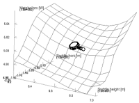
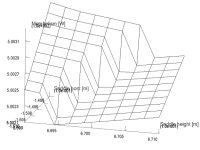
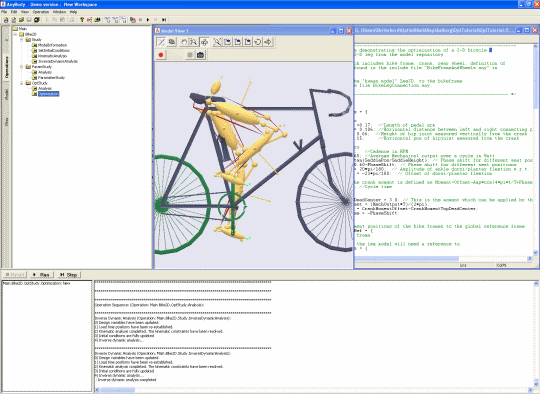
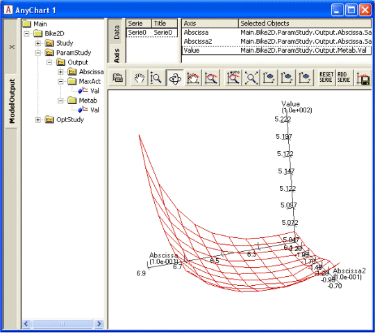
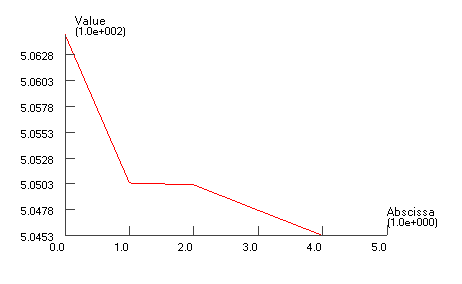
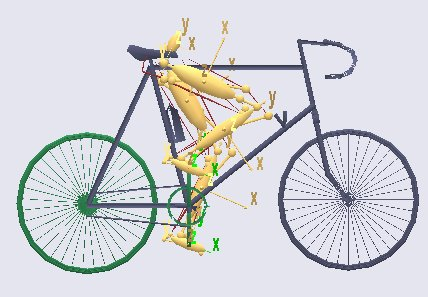
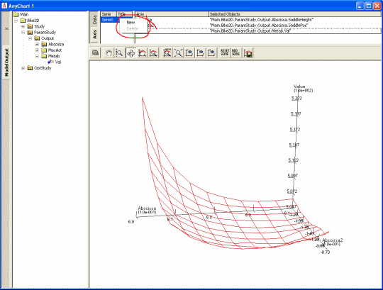
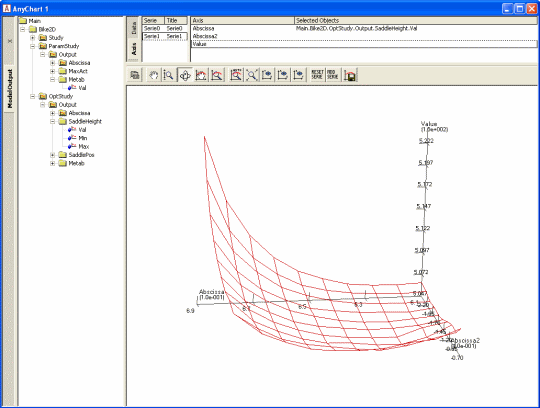
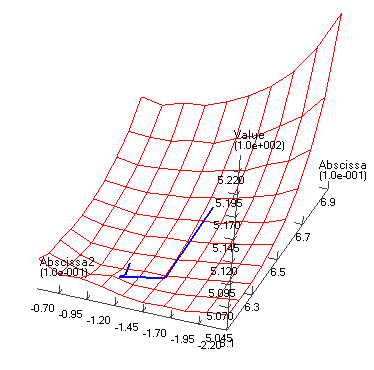
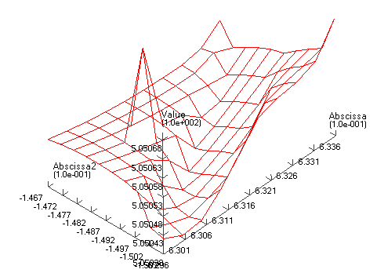
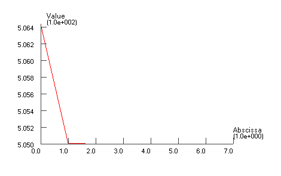
.. |optpath2_no_converge.gif| image:: _static/Optimization_studies/image12.gif
   :height: 3.43750in
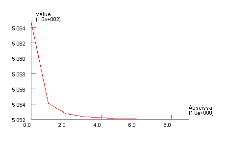
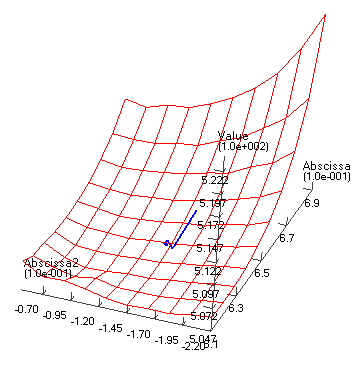
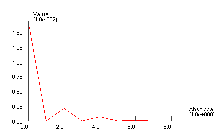
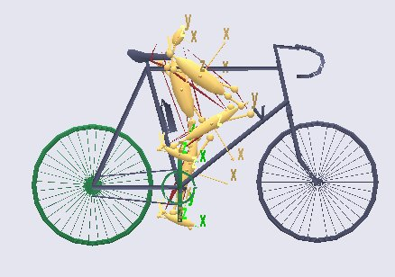