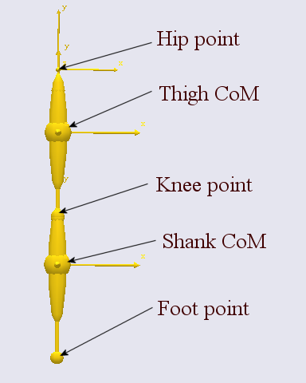
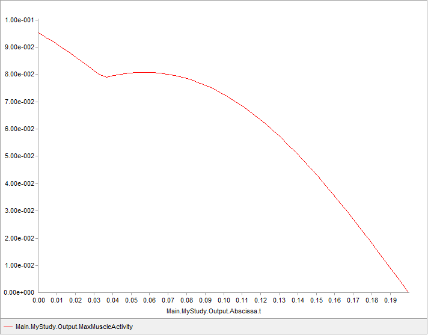
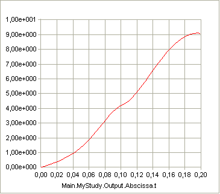
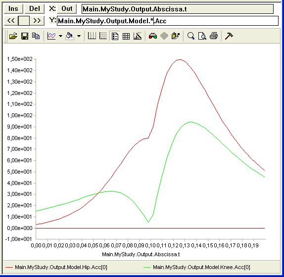

Posture and Movement Prediction
===============================

.. include:: /caution_old_tutorial.rst

Just about every example you find in these tutorials is based on the
concept of inverse dynamics, which in some sense is the opposite of
forward dynamics. To understand the difference between these two
concepts it is useful to have a brief look at Newton's second law. It
states the following:

**F** = *m* **a**

where **F** is the vector of resulting forces acting on a body with mass
*m* causing an acceleration vector, **a**. So, if we know the
acceleration, i.e. the movement of the system, then we can find the
forces acting on it. That is inverse dynamics, and this is why AnyBody
usually requires us to specify the movement or posture of the model
before it can compute anything for us.

But we can also re-arrange the equation to this form:

**a** = **F**/m

In this version, if we know the forces, we can determine the movement.
This is called forward dynamics. The problem with forward dynamics is
that input to the analysis will be some information about the muscle
forces and this is usually hard to determine experimentally and even
more difficult to guess.

But what if we know neither the movement nor the muscle forces? In that
case we have two unknowns and only one equation and it seems like our
venture into musculoskeletal analysis is destined to failure no matter
what we do. This tutorial shows how the optimization capability in
AnyBody can help you solve that kind of problems. They technically go
under the name "Posture and Motion Prediction" and the idea is that
rather than inputting a known posture or movement we want the model to
predict how a human body is likely going to move in a given situation.
Since this involves optimization and optimization takes time we are
going to formulate a very simple problem, but the principle applies to
much more complex models as well.

Understanding this tutorial requires a-priory knowledge of the tutorial
on :doc:`Parameter Studies and
Optimization </Parameter_studies_and_optimization/intro>`.

Definition of the Problem
-------------------------

As the name indicates, in posture and movement optimization we use
optimization to compensate for the fact that we do not know the movement
a-priori. So, instead of feeding the movement to the analysis we have to
feed something into an optimization problem, and that something has to
be the ultimate goal of the movement.

For some movements this goal is quite obvious. The objective of a high
jump, for instance, is to jump as high as possible, so we could simply
ask the optimizer to determine the movement pattern that leads to the
highest possible jump. Of course it would not be allowed to have
movements that require more muscle strength than the body has available,
so we would also have to formulate a constraint ensuring that the
maximum muscle activation stays below 100%.

For other movements the goal is less clear. If we want to predict the
movement of lifting a coffee cup from the table to the mouth then what
would a reasonable goal be? The constraints are rather easy: Start at
the table, end at the mouth, keep the cup horizontal all the time, avoid
accelerations that would spill the coffee and so on, but many different
movements would honor those conditions. Which of them would be the one a
given person would actually choose? Some investigations indicate that
for submaximal tasks like this, a lazyness criterion often applies; we
try to get around the task as effortlessly as possible in some sense.
But we really do not know. In this case, the user could try different
objectives and decide on one that leads to a plausible movement.

A Football Kick
---------------

So we need a simple model to play with. We are going to try to optimize
a two-dimensional football kick. There are all sorts of reasons why a
simple model of this task might be totally inadequate, but it will serve
well to demonstrate the idea. Please download a model to begin on.
:download:`Right-click the link and save the file
Kick1.any <Downloads/Kick1.any>` in some working directory. Then open
it up in the AnyBody Modeling System, load it in and open a Model View
window to have a look at the model. You should see something like this
(except the legends):

|kick1.png|

It is a two-segment model with revolute joints at the hip and the knee,
so it has in total two degrees of freedom. Let us imagine that no motion
capture experiment has been performed, so we do not really know how the
model will kick. But we have made the initial guess that both of the two
joints are moving with constant velocity just to have some movement to
look at. Please select the InverseDynamicAnalysis operation and run it.
You will be rewarded with a very fast analysis but should be able to see
that the leg performs a kick.

The system also gives you the following warning:

*MyStudy* : The muscles in the model are not loaded due to kinetically
over-constrained mechanical system.

*MyStudy.InverseDynamics* : No muscles in the model. 49) ...Inverse
dynamic analysis completed

We get this message because the model has no muscles and the necessary
joint torques to produce the movement are provided by the drivers. We
are going to want the model to relate to realistic joint strengths as
opposed to the infinitely strong driver reaction moments. On the other
hand we want to keep it simple. So rather than defining a lof of muscles
representing the real anatomy of the leg we shall just add "joint
muscles" to the hip and knee joints representing realistic strengths. We
are going to need such joint muscles for flexion and extension
respectively for both of the two joints. The red lines below add such
muscles with realistic joint strengths in Newton-meter. For an
explanation of the use of the AnyGeneralMuscle class, please refer to
the :doc:`muscle modeling
tutorial </Muscle_modeling/intro>`.

.. code-block:: AnyScriptDoc

         AnyKinEqSimpleDriver KneeDriver = {
           DriverPos = {-90*pi/180};
           DriverVel = {90*pi/180}/..MyStudy.tEnd;
           AnyRevoluteJoint &Joint = .Knee;
         };
         §// Hip joint muscles
         AnyGeneralMuscle HipFlex = {
           AnyMuscleModel Model = {F0 = 232;};
           ForceDirection = 1;
           AnyRevoluteJoint &Joint = .Hip;
         };
         AnyGeneralMuscle HipExtend = {
           AnyMuscleModel Model = {F0 = 251;};
           ForceDirection = -1;
           AnyRevoluteJoint &Joint = .Hip;
         };
        
         // Knee joint muscles
         AnyGeneralMuscle KneeExtend = {
           AnyMuscleModel Model = {F0 = 554;};
           ForceDirection = 1;
           AnyRevoluteJoint &Joint = .Knee;
         };
         AnyGeneralMuscle KneeFlex = {
           AnyMuscleModel Model = {F0 = 236;};
           ForceDirection = -1;
           AnyRevoluteJoint &Joint = .Knee;
         };§

Please copy and paste the red lines into your model just below the
KneeDriver definition as indicated. Then remove the reaction moments
from the drivers like this:

.. code-block:: AnyScriptDoc

         AnyKinEqSimpleDriver HipDriver = {
           DriverPos = {-90*pi/180};
           DriverVel = {90*pi/180}/..MyStudy.tEnd;
           §Reaction.Type = {Off};§
           AnyRevoluteJoint &Joint = .Hip;
         };
    
         AnyKinEqSimpleDriver KneeDriver = {
           DriverPos = {-90*pi/180};
           DriverVel = {90*pi/180}/..MyStudy.tEnd;
           §Reaction.Type = {Off};§
           AnyRevoluteJoint &Joint = .Knee;
         };

After you reload and re-run the model you should be able to open a Chart
window, plot the MaxMuscleActivity and get this:

|image1|

The movement we have imposed is unrealistic. Both joints move with
constant angular velocity while, in a realistic case, the model should
capture the fact that it is necessary to accelerate the leg from some
start position to the velocity it has at impact. To obtain a realistic
and "designable" movement we have to replace the two simple drivers on
the hip and knee with something more general. The interpolation driver
is excellent for this purpose because it allows us to determine the
position of each joint in certain time steps through the kick and
subsequently will interpolate between those loctions to generate a
smooth motion.

.. code-block:: AnyScriptDoc

     §//§    AnyKinEqSimpleDriver HipDriver = {
     §//§      DriverPos = {-90*pi/180};
     §//§      DriverVel = {90*pi/180}/..MyStudy.tEnd;
     §//§      Reaction.Type = {Off};
     §//§      AnyRevoluteJoint &Joint = .Hip;
     §//§    };
     §//§
     §//§    AnyKinEqSimpleDriver KneeDriver = {
     §//§      DriverPos = {-90*pi/180};
     §//§      DriverVel = {90*pi/180}/..MyStudy.tEnd;
     §//§      Reaction.Type = {Off};
     §//§      AnyRevoluteJoint &Joint = .Knee;
     §//§    };
        
         §// Some initial guesses for the hip and knee angle
         // movements.
         AnyKinEqInterPolDriver HipDriver = {
           T = {0, 0.25, 0.50, 0.75, 1}*..MyStudy.tEnd;
           Data = {{-30, -30, -15, 0, 30}}*pi/180;
           Type = Bspline;
           BsplineOrder = 4;
           AnyRevoluteJoint &Joint = .Hip;
           Reaction.Type = {Off};
         };
        
         AnyKinEqInterPolDriver KneeDriver = {
           T = {0, 0.25, 0.50, 0.75, 1}*..MyStudy.tEnd;
           Data = {{-70, -70, -50, -40, -30}}*pi/180;
           Type = Bspline;
           BsplineOrder = 4;
           AnyRevoluteJoint &Joint = .Knee;
           Reaction.Type = {Off};
         };§

A fast reload and run of the model will show that the movement is
somewhat different now, and plotting the joint rotation velocities will
also show that the initial velocity is now zero for both joints. This is
ensured by using similar values for the first two points in each
interpolation, for instance -30 and -30 degrees in the HipDriver. Now we
could generate infinitely many different motions simply by inserting
different angle values into these interpolation drivers. Among them will
be the motion that generates the fastest kick without overloading the
muscles. Unfortunately, infinity is a very high number and we could
never finish searching for our solution and this is where the optimizer
can help us. We ask the optimizer to determine the best movement by
making these variations.

The Optimization Problem
------------------------

We already have some data now that can be used in the definition of our
optimization problem. The first question is: What do we actually want to
optimize? Given that the mass of the foot and football are given in
advance we can presume that maximising the velocity of the football
after the impact is equivalent to maximizing the velocity of the foot
before the impact. In fact, the law of conservation of momentum says
something about that. If we presume the mass of the football to be 0.2
kg, the coefficient of restitution of the collision to be 0.5, which is
typical for a football kick, and presume that the ball is at rest before
impact then we have enough information to predict the velocity of the
ball after the impact given the velocity of the foot before the impact.
We can write this formula directly into the model like this:

.. code-block:: AnyScriptDoc

       // The study: Operations to be performed on the model
       AnyBodyStudy MyStudy = {
         AnyFolder &Model = .MyModel;
         RecruitmentSolver = MinMaxSimplex;
         Gravity = {0.0, -9.81, 0.0};
         nStep = 50;
         tEnd = 0.2;
         §AnyOutputFun BallVel= {
           Val =
      1.5*Main.MyModel.Shank.Mass*Main.MyModel.Shank.rDot[0]/(0.2+Main.MyModel.Shank.Mass);
         };§
       };

 Please load and run the model again, and then go to the Chart window
and plot the new output function. You should see this:

|kickvel1.gif|

The function shows the predicted post-impact velocity of the ball if the
foot were to hit is at any time during the imposed movement. As
expected, the exit velocity is higher the later in the movement the ball
is hit because the foot velocity increases all the time.

We also want to be able to limit the muscle activation to prevent
overloading of the muscles, and we make a similar function for that
purpose:

.. code-block:: AnyScriptDoc

       // The study: Operations to be performed on the model
       AnyBodyStudy MyStudy = {
         AnyFolder &Model = .MyModel;
         RecruitmentSolver = MinMaxSimplex;
         Gravity = {0.0, -9.81, 0.0};
         nStep = 50;
         tEnd = 0.2;
         AnyOutputFun BallVel= {
           Val =
      1.5*Main.MyModel.Shank.Mass*Main.MyModel.Shank.rDot[0]/(0.2+Main.MyModel.Shank.Mass);
         };
         §AnyOutputFun MaxAct = {
           Val = .MaxMuscleActivity;
         };§
       };

With that we should be ready to define an optimization problem. A basic
optimization study would look like this:

.. code-block:: AnyScriptDoc

       §// Optimize the ball velocity after the kick.
       AnyOptStudy OptStudy = {
         LogFile = "OptStudy.log";
         MaxIterationStep = 25;
         
         Analysis = {
           AnyOperation &op = ..MyStudy.InverseDynamicAnalysis;
         };
        
         // Constraint: All muscle activities below 100%
         AnyDesMeasure MaxActivity = {
           Val = max(..MyStudy.MaxAct()-1);
           Type = LessThanZero;
         };
        
         // Objective function: Max horizontal velocity of the foot
         AnyDesMeasure KickVel = {
           Val = -max(..MyStudy.BallVel());     
           Type = ObjectiveFun;
         };
       };§

Please copy and paste those lines into the model right after the end of
MyStudy but before the final ending brace of the model. The study
contains two AnyDesMeasures of which the first is the maximum activity
minus one. The actual constraint is

max(Activity) < 100%

but, because AnyBody requires zero right hand sides for all its
constraints, it is defined on the form

max(Activity) - 1< 0

The second AnyDesMeasure, KickVel, is defined as minus the maximum of
the ball velocity. This is because AnyBody's optimizer is set up to
always perform minimization where we want to maximize the velocity. So
we simply minimize the negative velocity instead. The max value is
derived first, presuming that the kicker will decide to hit the ball at
the optimal time in the kick.

Loading the model at this time will produce an error message because we
have not defined any design variables yet. Let us begin with a single
variable just to make sure we get it right before adding a lot of them:

.. code-block:: AnyScriptDoc

         // Objective function: Max horizontal velocity of the foot
         AnyDesMeasure KickVel = {
           Val = -max(..MyStudy.BallVel());     
           Type = ObjectiveFun;
         };
        
     §    AnyVar slack = 60*pi/180;
         AnyDesVar Knee4 = {
           Val = Main.MyModel.KneeDriver.Data[0][3];
           Min = Val - .slack;
           Max = Val + .slack;
         };§

This design variable controls the position of the fourth data
point (remember that items in arrays are numbered from zero, so number
three is the fourth position) in the knee joint driver. There are five
point in total in each driver, but we do not want to include the last
one in the optimization because it determines the position of the foot
at the end of the analysis and we want this to be on the ball.

The variable names "slack" determines the upper and lower bound of the
variations of joint angle position. We have placed this in a variable
because it makes it easy to change the bounds simultaneously for all
design variables later.

If you reload the model now you can actually already do an optimization
with the single variable. Open the OptStudy branch of the tree on the
left hand side of the screen, highlight "Optimization", and click "Run.
After a few moments the process will converge to a better kick. You can
see how much better by going to the Chart view, openeing the OptStudy
section and plotting "Main.OptStudy.Output.KickVel.Val". You will see
that the optimization decreased the value from about -9 to about -12,
indicating an improvement of the ball velocity from 9 to 12 m/s.

Let us quickly add some more variables:

.. code-block:: AnyScriptDoc

         AnyVar slack = 60*pi/180;
         AnyDesVar Hip3 = {
           Val = Main.MyModel.HipDriver.Data[0][2];
           Min = -30*pi/180;
           Max = Val + .slack;
         };
         AnyDesVar Hip4 = {
           Val = Main.MyModel.HipDriver.Data[0][3];
           Min = Val - .slack;
           Max = Val + .slack;
         };
         AnyDesVar Knee3 = {
           Val = Main.MyModel.KneeDriver.Data[0][2];
           Min = Val - .slack;
           Max = Val + .slack;
         };§
         AnyDesVar Knee4 = {
           Val = Main.MyModel.KneeDriver.Data[0][3];
           Min = Val - .slack;
           Max = Val + .slack;
         };   

Notice how we have only added design variables for points 3 and 4 in
each joint angle interpolation. This is because we want to retain the
beginning and ending positions and we want to make sure the velocity in
the beginning remains zero, which is accomplished by keeping the second
point the same as the first point.

Running the optimization at this stage will make the problem converge in
a few interations to an optimized ball velocity of a little over 13 m/s.
If we plot the two joint accelerations we get:

|kickacc1.gif|

The movement shows subtle signs of a whiplash action in the sense that
the movement is initiated by a knee acceleration, which is taken over by
the hip acceleration, after which the peak knee acceleration sets in
after the hip acceleration has topped. However, more whiplash effect
could be expected and the final ball velocity of 13 m/s is not very
impressive for a football kick.

In other words, the movement is not entirely satisfactory. This could
likely be because the optimizer does not have enough freedom to control
the movement, and this can possibly be improved by adding additional
points to the interpolation and making them variables in the
optimization problem. Optimization problems are often ongoing projects
in the sense that is it difficult to know when the model is good enough
to capture the features of the body's function that we are looking for.

 

