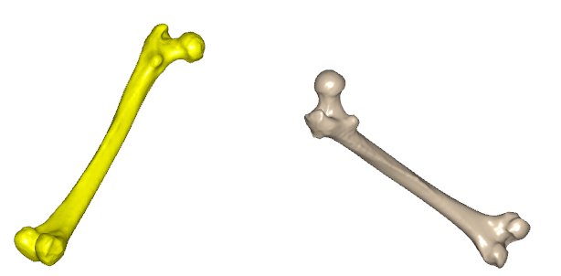
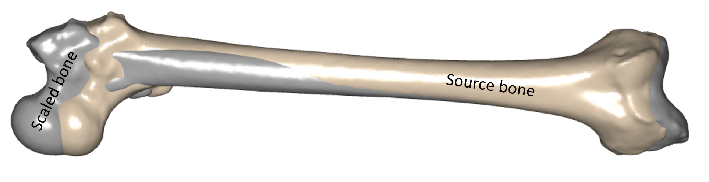
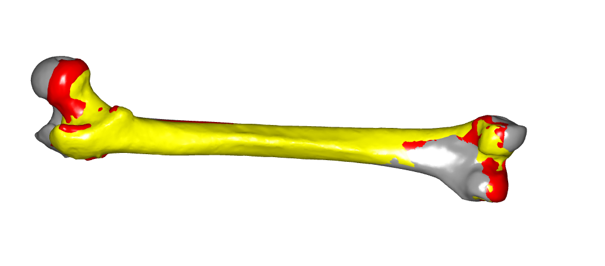
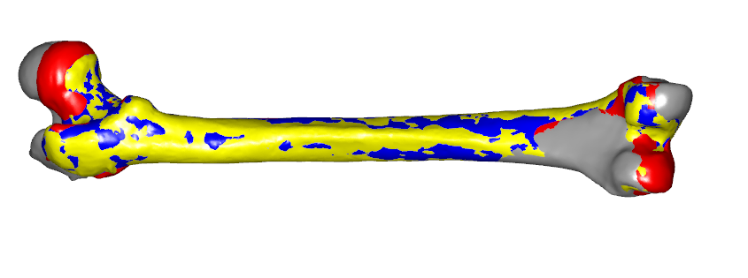
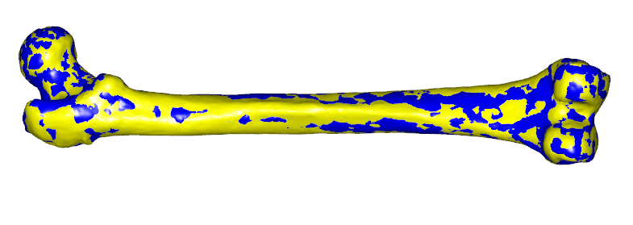

Lesson 1: Personalizing individual segments based on geometric data from medical images
===============================================================================================

This tutorial presumes that you have read the AMMR documentation and know 
how to personalize your model using information about height, weight, and 
individual segment lengths.

.. 
  on :doc:`Joint to joint scaling methods <ammr:Scaling/lesson1>` and :doc:`Scaling based on external body
  measurements <ammr:/Scaling/lesson2>`.

This lesson introduces an advanced approach to scaling based on a sequence of
affine and non-affine transformations. Each of these transforms is constructed
based either on subject-specific geometry or on a set of landmarks selected on
the bone surface. As opposed to the simple scaling laws explained in the AMMR
documentation, this lesson is rather methodological than conceptual and provides
a good overview of how to pipeline and combine different 3D transforms to obtain
subject-specific morphing and registration between frames of reference.

Linear point-based scaling
--------------------------

Scaling schemes described in the AMMR documentation are based on 
anthropometric measurements and affine transform scaling. Such schemes 
are good assumptions when more accurate measurements are not feasible or not
available. Therefore, these schemes are used quite often. However, a
natural next step would be to improve the precision of a model by
utilizing subject-specific geometry available from the medical images. Medical images
contain more subject-specific information about the bone shapes and local
deformities that cannot be handled by the anthropometric regression
equations.

The simplest inclusion of the subject-specific bone shape from medical
image data is to find the affine (linear) transformation that fits a
number of corresponding points that are selected on the source and the
target geometries. These points could be fitted e.g. in a least-squares
manner. This approach is similar to utilizing external body measurements
as it relies on a linear transform. However, it is less dependent on the
bone orientation and prior knowledge of dimensions to be measured. For
example, you can locate any two points on source and target surface
consistently without thinking of how a segment length was measured.

Let us make a simple example of using landmark-based affine scaling.
First, please download two femur surfaces,
:download:`SourceFemur.stl <Downloads/SourceFemur.stl>` and
:download:`TargetFemur.stl <Downloads/TargetFemur.stl>` and save them in your
working directory. These femur geometries will be used for the rest of
this tutorial. The source surface is an unscaled femur used in the
standard AnyBody models in the AMMR. The target surface is a femur
reconstructed from a CT image and saved as a surface mesh in STL format
(courtesy of Prof. Sebastian Dendorfer, OTH Regensburg,
Germany).

Next, please download the AnyScript file
:download:`lesson3a.main.any <Downloads/lesson3a.Main.any>`. This file contains
a model with two segments which contain the definition of a surface
each, one for the source and one for the target bone. When we load this
model, the Model View should show the following picture:

To define a new scaling function let us insert a new AnyFunTransform3DLin2
object after the target segment:

.. code-block:: AnyScriptDoc

    §AnyFunTransform3DLin2 <ObjectName> = 
    {
      //PreTransforms = {};
      Points0 = ;
      Points1 = ;
      //Mode = VTK_LANDMARK_RIGIDBODY;
    };§

The AnyFunTransform3DLin2 object allows us to build a transform that
fits a set of source and target landmarks in a least-squares manner as
mentioned before. The object constructs a linear transforms in a full
affine (linear transformation with translation, rotation, size-scaling
and skewing, i.e. 12 degrees of freedom), uniform (orthogonal rotation
with uniform scaling and translation, i.e., 9 d.o.f.), or rigid-body
manner (orthogonal rotation of unscaled object with translation, i.e., 6
d.o.f.). Please note that the AnyFunTransform3DLin2 object utilizes the
vtk-function/filter *vtkLandmarkTransform*, and, therefore inherits its
modes:

-  ``VTK_LANDMARK_AFFINE``

-  ``VTK_LANDMARK_SIMILARITY``

-  ``VTK_LANDMARK_RIGIDBODY``

A description of this function can be found
`here <http://davis.lbl.gov/Manuals/VTK-4.5/classvtkLandmarkTransform.html#w0>`__.

For this example we want to register our source surface into the target one by using a
full affine transform. Therefore, we select several corresponding points
on the surfaces and put them into the two point-sets called Points0 and
Points1, which are the source and target points, respectively. As the next
step, we change the mode of the AnyFunTransform3DLin2 object to
VFK\_LANDMARK\_AFFINE to use the affine transform:

.. code-block:: AnyScriptDoc

    AnyFunTransform3DLin2 §MyTransform§ = 
    {
      //PreTransforms = {};
      Points0 = 
          §{{0.0138, 0.0014, 0.0274},    // fovea capitis
          {0.0791,-0.3971,-0.0524},    // lateral anterior condyle
          {0.094, -0.3954,-0.0183},    // medial anterior condyle
          {0.0381,-0.1886,-0.0388},    // anterior mid shaft 
          {0.0188,-0.3965,-0.0205},    // lateral posterior condyle
          {0.0369,-0.3937, 0.0267}};    // medial posterior condyle§
      Points1 = 
          §{{0.2899, 0.4205, 0.0139},    // fovea capitis
          {0.3220, 0.4332,-0.3786},    // lateral anterior condyle
          {0.2893, 0.4268,-0.373},     // medial anterior condyle
          {0.3289, 0.4259,-0.175},     // anterior mid shaft 
          {0.3063, 0.4872,-0.3703},    // lateral posterior condyle
          {0.2619, 0.4759,-0.3729}};   // medial posterior condyle
      Mode = VTK_LANDMARK_AFFINE;§
    };

The selected points on the surface represent specific anatomical
landmarks and points described in the comments of the AnyScript code.
Final modification before we can use the constructed linear transform is
to give this transformation a name and apply it to the source surface:

.. code-block:: AnyScriptDoc

    AnySeg SourceFemur = 
    {
      Mass = 0; Jii = {0, 0, 0};
      AnyDrawSurf Surface = 
      {
        FileName = "SourceFemur.stl";
        §AnyFunTransform3D &ref = ..MyTransform;§
      };
    };

    

Reloading the model and looking at the bones shown in the Model View, we
can see that these bones are now merged. To highlight the differences,
we select one of them. This will produce the following picture.

.. image:: _static/lesson3/image2.png
   :width: 60%

The source bone is now transformed, i.e., translated, scaled and
skewed to match the target bone. To make that clear, let us add a new
AnyFunTransform3DLin2 called MyTransform2 to the model which we place
after MyTransform. The intention is to construct a rigid-body
registration transform between target and source surface. Please note, 
the roles of the source points Points0 and target points Points1 are swapped,
and the transformation mode is set to VTK\_LANDMARK\_RIGIDBODY.

Additionally to that, a combination transform, containing forward affine 
and back registration transforms, is added:

.. code-block:: AnyScriptDoc

    §AnyFunTransform3DLin2 MyTransform2 = {
      Points0 = .MyTransform.Points1;
      Points1 = .MyTransform.Points0;
      Mode = VTK_LANDMARK_RIGIDBODY;
    };
    AnyFunTransform3DIdentity MyTransform3 = 
    {
      PreTransforms = {&.MyTransform,&.MyTransform2};
    };§

Finally, let us look at the effect of the constructed transform. We
comment the transform used in the visualization of the source surface
and create another surface that will show the combined transformation
that we just constructed:

.. code-block:: AnyScriptDoc

    AnySeg SourceFemur = 
    {
      Mass = 0; Jii = {0, 0, 0};
      AnyDrawSurf Surface = 
      {
        FileName = "SourceFemur.stl";
        §//AnyFunTransform3D &ref = ..MyTransform;§
      };
      §AnyDrawSurf SurfaceMorphed = 
      {
        FileName = "SourceFemur.stl";
        AnyFunTransform3D &ref = ..MyTransform3;
      };§
    };

    

Looking at the Model View, we can see that the femur is now scaled, it
became shorter and now aligns with the original source femur position. 
From the previous picture, we also know that geometry is matching the
target quite well too (and if you want to convince yourself you can superimpose the
target geometry using the MyTransform2 registration transformation).

With this example, we have shown how to morph the source into the target
with a full affine scaling and subsequently applying a reverse
registration to move the morphed geometry back.

Notice that it is possible to reverse the combination, i.e., to apply
the registration step first and then the scaling/morphing step. For
instance, make a transformation similar to MyTransform, but insert
MyTransform2 as pre-transformation. In this tutorial lesson, we shall
however stay with the concept we presented so far.

If the morphing accuracy is sufficient for your task you can proceed 
with your modeling and stop at this step. However, for the purpose of 
this tutorial the desired accuracy have not been reached - some local 
features still do not match the target's ones, e.g. the lesser and the 
greater trochanter. The following steps explain how to capture more 
details and improved morphing for even better match.

Incorporating landmark-based nonlinearities into the scaling function
----------------------------------------------------------------------

The next level of detail can be achieved by introducing local nonlinear deformations
by means of the AnyFunTransform3DRBF class. This class represents a nonlinear 
interpolation/extrapolation transformation, which is based on the Radial Basis Functions (RBF) 
method and uses landmarks selected on source and target surfaces. Detailed behaviour 
of this transform is described in an :doc:`appendix tutorial <lesson3_appendix>`. 
However, the focus of this tutorial is to demonstrate available pipelines of transforms. For 
simplicity, we use a preselected set of femoral landmarks and RBF settings.

We start with the model from the previous steps to introduce the landmark-based 
nonlinear scaling. Several tranformations will build up into a pipeline, where
pre-transforms will be used to inherit obtained accuracy throughout different steps. 
A complete model can you find here: :download:`lesson3b.Main.any <Downloads/lesson3b.Main.any>`. 
The following tutorial shows how to add an RBF transform with the recommended settings 
into the previously created model.

First of all let us configure the visualization of the transformation.
Now that we know how to compare source and scaled geometries as well as
reverse registration, so we can switch off the registration step.

.. code-block:: AnyScriptDoc

    AnyFunTransform3DIdentity MyTransform3 = 
    {
      PreTransforms = {&.MyTransform§/*,&.MyTransform2*/§};
    };

This will return our morphed geometry back to the target bone location
and we can observe the improvements as we go. Let us now define an
RBF transformation and another AnyDrawSurf object that will show the
difference between the affine scaling and the new transformation 
pipeline employing nonlinear RBF transformations. For a better contrast 
of the different surfaces, we will also add some colors to the drawing 
of the surfaces:

.. code-block:: AnyScriptDoc

      §AnyDrawSurf SurfaceMorphedRBF = 
      {
        FileName = "SourceFemur.stl";
        AnyFunTransform3D &ref = ..MyRBFTransform;
        RGB={1,0,0};
      };§

    ...

    §AnyFunTransform3DRBF MyRBFTransform = 
    {
      PreTransforms = {&.MyTransform};
      RBFDef = 
      {
        Type = RBF_ThinPlate;
        Param = 1;
      };
      Points0 = {
        { 0.0138, 0.0014, 0.0274},
        { 0.0791,-0.3971,-0.0524},
        { 0.0940,-0.3954,-0.0183},
        {-0.0242,-0.0304,-0.0628},
        { 0.0381,-0.1886,-0.0388},
        { 0.0188,-0.3965,-0.0205},
        { 0.0369,-0.3937, 0.0267},
        {-0.0127, 0.0039, 0.0290},
        { 0.0188, 0.0092,-0.0153},
        {-0.0012, 0.0263, 0.0048},
        {-0.0088,-0.0583, 0.0057},
        {-0.0311,-0.0214,-0.0227},
        {-0.0462,-0.0078,-0.0064},
        {-0.0286,-0.0623,-0.0460},
        { 0.0010, 0.0013, 0.0069} 
      };
      PointNames = {
        "Medial_Head_Point",
        "Anterior_LateralCondyle_Point",
        "Anterior_MedialCondyle_Point",
        "Anterior_GreaterTrochanter_Point",
        "Anterior_Shaft_Point",
        "Posterior_LateralCondyle_Point",
        "Posterior_MedialCondyle_Point",
        "Posterior_Head_Point",
        "Anterior_Head_Point",
        "Proximal_Head_Point",
        "Medial_LesserTrochanter_Point",
        "Distal_TrochantericFossa_Point",
        "Proximal_Posterior_GreaterTrochanter_Point",
        "Lateral_Lesser_Trochanter_Point",
        "Femoral_COR"
      };

      Points1 = {
        { 0.2900, 0.4205, 0.0139},
        { 0.3220, 0.4332,-0.3786},
        { 0.2893, 0.4268,-0.3730},
        { 0.3599, 0.4429,-0.0050},
        { 0.3289, 0.4259,-0.1750},
        { 0.3062, 0.4872,-0.3703},
        { 0.2619, 0.4759,-0.3727},
        { 0.2900, 0.4405, 0.0139},
        { 0.3200, 0.4095, 0.0134},
        { 0.3100, 0.4295, 0.0314},
        { 0.3089, 0.4599,-0.0355},
        { 0.3349, 0.4579, 0.0050},
        { 0.3329, 0.4679, 0.0175},
        { 0.3519, 0.4599,-0.0355},
        { 0.3075, 0.4235, 0.0139}
      };
      BoundingBox = 
      {
        Type = BB_Cartesian;
        ScaleXYZ = {2, 2, 2};
        DivisionFactorXYZ = 5*{1, 1, 1};
      };
      BoundingBoxOnOff = On;
    };§    
    

This code constructs a transform, which deforms the source geometry 
into the target one using the thin-plate interpolation method and minimizes 
the distance between the selected key points (landmarks). This can be used 
when certain muscle attachment areas/points need to be scaled. Using this 
allows us improving the model by making some local features more accurate 
for the sensitive analyses. Please note that MyTransform object was
included as a pre-transform as a rough scaling preceding the nonlinear
RBF function, and it will be applied to the source entities, i.e. achieving
the result of the previous step. Target bone is color-coded with the green color, 
initial linear scaling is grey, RBF-scaled bone is red.

However, it still possible to improve the fitting of the femur surfaces and, thus,
improve the accuracy of the model. Looking at the Model View you can notice that 
the greater trochanter is elevated and makes a sharp corner – this is caused 
by the nature of the thin-plate interpolation and a low number of control points. 
The following section will describe how to utilize surface information for the 
construction of an improved scaling law.

Incorporating surface based nonlinearities into the scaling function
---------------------------------------------------------------------

In this section, next improvement to the morphing is added by utilizing
surface information. The surfaces will be requested to morphg into each 
other, which will at the same time deform all related soft tissue attachment 
points accordingly. The AnyFunTransform3DSTL class is used for this purpose. 
This class constructs an RBF transformation similarly to the AnyFunTransform3DRBF 
by using either corresponding vertices on the STL surfaces or seeding a number 
of vertices on one surface and finding a matching closest point on the second. 
For constructing a transformation using the vertices of STL surfaces, the surfaces 
have to be topologically equivalent, i.e. the surfaces have the same number of
triangles and each neighbor and vertices represent the same features on both surfaces.
For the latter option, we require an acceptable pre-registration
transform, e.g. the RBF transform that was described previously, in
order for the closest point search to make sense. Due to the implementation 
specifics most of the RBF recommendations apply to this class as well. 
More details about how to create this kind of transforms are described in :doc:`appendix
tutorial <lesson3_appendix>`. However, for this example the
recommended settings mentioned before will be used again.

Let us repeat the step from the previous section by adding one more
surface to the visualization and another scaling step. You can download
the model with all modifications :download:`here <Downloads/lesson3c.Main.any>`:

.. code-block:: AnyScriptDoc

      §AnyDrawSurf SurfaceMorphedSTL = 
      {
        FileName = "SourceFemur.stl";
        AnyFunTransform3D &ref = ..MySTLTransform;
        RGB={0,0,1};
      };§

    ...
    §    AnyFunTransform3DSTL MySTLTransform = 
    {
      PreTransforms = {&.MyRBFTransform};
      RBFDef.Type = RBF_ThinPlate;
      AnyFixedRefFrame Input = {
        AnySurfSTL SourceSurf = {
          FileName = "SourceFemur.stl";
          ScaleXYZ = {1, 1, 1};
        };
        AnySurfSTL TargetSurf = {
          FileName = "TargetFemur.stl";
          ScaleXYZ = {1, 1, 1};
        };
      };
      
      SurfaceObjects0 = {&Input.SourceSurf};
      SurfaceObjects1 = {&Input.TargetSurf};
      //FileName0 = "SourceFemur.stl";    // such definition was used previously
      //FileName1 = "TargetFemur.stl";    // such definition was used previously
      NumPoints = 400;
      BoundingBox.ScaleXYZ = {2, 2, 2};
      BoundingBox.DivisionFactorXYZ = {1, 1, 1};
      BoundingBoxOnOff = On;
    };§

   
   
Please note again the transform from the previous section of this
tutorial was included as a pre-transform, which means we will start working with 
the result of the previous step. Reloading the model, we can now see all steps 
of scaling in one place and can switch them on and off. For example, let us try 
to hide affine and RBF scaled femurs to see the final results:

   
If we just look at the green target surface and the blue STL-transformed
surface, we can see that the surfaces now match each other very well. That means
that now the subject-specificity will be taken into account in the inverse
dynamics simulation. The final model can be downloaded :download:`here
<Downloads/lesson3d.Main.any>`.

.. toctree::
   :hidden:

    Lesson 1 appendix <lesson3_appendix>

Finally, the only thing left is to include this scaling function into an
actual model. :doc:`Lesson 2 <lesson4>` describes how this can be
done.

.. rst-class:: without-title
.. seealso::
    **Next lesson:** :doc:`lesson4`.

