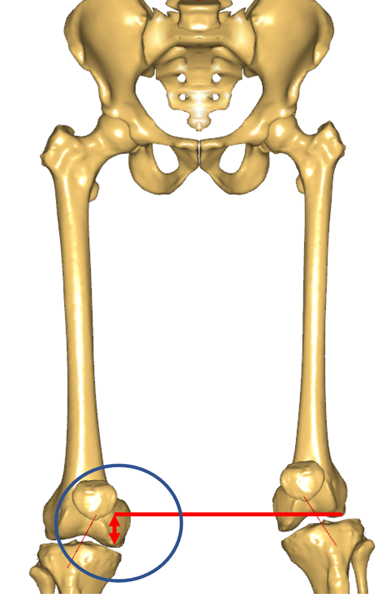

# Lesson 2: Including a custom scaling function into your model

This lesson explains how we can use our own custom scaling function,
which we designed in Lesson 3 and combine it with the overall human body scaling laws.

```{seealso}
The section on scaling in the AMMR documentation.
```

## Preparing for subject-specific scaling

When creating a musculoskeletal model, we have to decide on the
dimensions of the body parts. The Scaling section in the AMMR
documentation describes how anthropometric regression equations
and body measurements can be used to define these dimensions.
However, the most precise models include subject-specific geometries
of the bones or morph the underlying template model to take these shapes.
To explain how we can include these, let us consider a simple scenario:
We have a model of a person who matches the standard size man and we want
to perform an inverse dynamics analysis. Additionally, we have the geometry
from a CT-scan of one of his left femur. To increase the accuracy of our model,
let us improve it using a subject-specific scaling for the femur.

First of all, let us prepare a model matching the standard size man to
be the basis for further subject-specific improvements. Therefore we use the [StandingModelScalingDisplay](ammr:sphx_glr_auto_examples_other_plot_standingmodelscalingdisplay.py) from the AnyBody Managed Model Repository (AMMR), with the `_SCALING_STANDARD_`, option. This is well suited to show how
to use subject-specific geometry in a model.

## Including custom scaling for a single segment

Let us configure this example to use ScalingStandard. We need to define
`BM_SCALING` as `_SCALING_STANDARD_` and out-comment all other parts of
the scaling configuration block. With this setting, the model is now scaled to
the generic size. 

```AnyScriptDoc
/*------------- SCALING CONFIGURATION SECTION --------------------*/
// Actual scaling law
§ #define BM_SCALING _SCALING_STANDARD_§

// Scaling laws using joint to joint measures
//  #define BM_SCALING _SCALING_UNIFORM_
//  #define BM_SCALING _SCALING_LENGTHMASS_
//  #define BM_SCALING _SCALING_LENGTHMASS_FAT_
```


We can now include individual scaling functions for each segment,
which will be done in a special file {file}`CustomScaling.any`, where all the
modifications related to individual segment should be be done.
This file is already present in the example and you can include it as shown
below:

```AnyScriptDoc
//--------------- END OF SCALING CONFIGURATION -------------------

§#include "Model\CustomScaling.any"§

#include "<ANYBODY_PATH_BODY>/HumanModel.any"
```

:::{tip}
In case you want to personalize your own model - just copy {file}`CustomScaling.any` 
file into the Model folder and follow the instructions from this tutorial.
:::

If we open this file (by a double click it), we can see that a common place
to make modifications has already been prepared. Further, we can find
an access point to the geometrical scaling law folder, which will be
used to specify individual scaling laws.

```AnyScriptDoc
// This is a place holder for the inclusion of custom scaling laws
HumanModel.Scaling.GeometricalScaling = {
};
```

So let us introduce a custom scaling function for the left femur from
{doc}`Lesson 1 <lesson3>`. We prepared a single file
{download}`MyScalingFunction.any <Downloads/MyScalingFunction.any>` holding the scaling
transforms from the previous lesson. We also need to download the
{download}`source <Downloads/SourceFemur.stl>` (native to AMMR) and
{download}`target <Downloads/TargetFemur.stl>` (courtesy of Prof.
Sebastian Dendorfer, OTH Regensburg, Germany) femur surface
geometries. 

Next copy these three files into the {file}`Model` subfolder in  the 
*StandingModelScalingDisplay* example.

Now, we need to make several
small adjustments to the scaling law for smooth incorporation into the
model structure.

In the **A**nyBody **M**anaged **M**odel **R**epository (AMMR) scaling functions are
implemented in the anatomical reference frames. We will call this frame
a scaling reference frame, since there might be several definitions of
anatomical reference frames. In general, the segmental frame can be
different from the scaling reference frame. The human body model
internally handles relevant reference frame changes without needing
users to do anything. However, this leads to small modifications
needed for the subject-specific scaling function inclusion into
the full-body model.

In order to perform the scaling or moprhing in another reference frame – all source
entities need to be moved into that reference frame. This can be done
using a rigid body transformation to preserve sizes of all objects.
In our scaling law (MyScalingFunction.any) the source entities are

- MyScalingFunction.AffineTransform.Points0,
- MyScalingFunction.RBFTransform.Points0,
- MyScalingFunction.STLTransform.Input.SourceSurf.

In the **AMMR** such transformations will be segment dependent.  It is only be needed for right and left shank and femur as well as for
the pelvis. For all other segments this transform can be defined as an
identity transformation or does not have to be applied to the source
entities. The following transforms can be referenced as `TSeg2ScaleFrame` (**T**ransform **Seg**mental **2** to **Scale**ling **Frame**). That name that will be used further:

- `HumanModel.BodyModel.[Left/Right].Seg.[Thigh/Shank].Scale.T0`
- `HumanModel.BodyModel.Trunk.SegmentsLumbar.PelvisSeg.Scale_Trunk_Pelvis.ScaleAfterInterfaceMorphingDef.Scale.T0`

In the model repository this transform, `TSeg2ScaleFrame`, is already defined and can be found in the
subfolder of `HumanModel.Scaling.GeometricalScaling`, which corresponds to
the morphed segment and has a similar name. This transform can be easily
accessed as demonstrated below and no extra actions are needed.

Let us subject the source entities of the scaling law to the rigid body
transformation, `TSeg2ScaleFrame`. We will need to make the following 3
changes. Please note how we look up out of the `MyScalingFunction` folder
using `..` and `...` prefixes to the variables.:

```{code-block} AnyScriptDoc

  AnyFunTransform3DLin2 AffineTransform =
  {
    Points0 = §..TSeg2ScaleFrame(§
    {{0.0138187,0.00136731,0.0273618},    // fovea capitis
-->8--
      {0.0368766,-0.393677,0.0266919}}§)§;    // medial posterior condyle
    Points1 =
    {{0.289913,0.420538,0.0138931},    // fovea capitis
-->8--
  AnyFunTransform3DRBF RBFTransform =
  {
    PreTransforms = {&.AffineTransform};
    RBFDef =
    {
      Type = RBF_ThinPlate;
      Param = 1;
    };
    Points0 = §..TSeg2ScaleFrame(§{
      { 0.0138, 0.0014, 0.0274},
-->8--
      { 0.0010, 0.0013, 0.0069}
    }§)§;
-->8--
  AnyFunTransform3DSTL STLTransform =
  {
    PreTransforms = {&.RBFTransform};
    RBFDef.Type = RBF_ThinPlate;
    AnyFixedRefFrame Input = {
      AnySurfSTL SourceSurf = {
        FileName = "SourceFemur.stl";
        ScaleXYZ = {1, 1, 1};
        §AnyFunTransform3D &pre = ....TSeg2ScaleFrame; §
      };
```

As you will see from the following changes the modification simply links
the transformations to the folder containing our `MyScalingFunction.any` file.
In our case, this folder is
`HumanModel.Scaling.GeometricalScaling.Left.Thigh`, which corresponds to
the name of the segment, we are trying to morph, and contains our
`TSeg2ScaleFrame` rigid body transform.

So finally let us add this scaling function to the model. Please
insert the following lines as shown below into the file
{file}`CustomScaling.any`:

```AnyScriptDoc
HumanModel.Scaling.GeometricalScaling = {
§#define CUSTOM_SCALING_Left_Thigh
Left.Thigh = {
  #include "MyScalingFunction.any"
  AnyFunTransform3D &ScaleFunction = MyScalingFunction.Transform;
};§
};
```

In this modification, we added a pre-processor command (`#define`) that
notifies the model assembling block that the default anthropometric scaling
for the left thigh segment should be excluded. To process other body
parts you will need to add a similar definition, but utilize actual
bone segment, e.g. `#define CUSTOM_SCALING_<Side>_<SegmentName>` for
different sides or `CUSTOM_SCALING_<SegmentName>` for parts of the
body that do not have sides. You can find a list of segments by
browsing the scaling law in the Model tab:


The other change was to assign the new custom scaling function to be
used in the segment of the left thigh instead of the excluded one. If
we look in the Model View,
we can see that the left femur is now shorter and a little thinner
than with the standard scaling. So we have now successfully introduced
our custom scaling law into the model.





If we worked with a bone that does not have a controlateral pair, e.g.
vertebrae, skull, etc., or just wanted to personalize a single side, we would
continue with running the inverse dynamics. But as an exercise, we want to
continue and scale the other side as well to ensure symmetry of the model.
Normally, we would use the contralateral patient-specific bone and
copy the scaling code. But, in our case, only one side was available. We will assume
that the body is symmetric, which is only true up to a certain extent.
So let us include a similar scaling for the corresponding mirrored pair.
In the next section we will describe how to introduce mirroring to our
scaling functions.

## Introducing a mirrored custom scaling function

We start by making a copy of MyScalingFunction.any that will be used to
construct the mirrored transform and call it `MyScalingFunction_Mirrored.any`.
What we have to do is to define a symmetry plane and reflect relevant
entities accordingly. In this example such plane corresponds to the
global XY plane. To perform the reflection, we need to multiply all
relevant landmark points contained in the `MyScalingFunction_Mirrored.any`
file by a mirroring matrix:

```AnyScriptDoc
AnyFolder MyScalingFunction§_Mirrored§ = {
  §AnyMatrix AMirroring = { // XY plane symmetry
    {1,0,0},
    {0,1,0},
    {0,0,-1}
  };§
-->8--
  AnyFunTransform3DLin2 AffineTransform =
  {
    Points0 = ..TSeg2ScaleFrame({...} §* .AMirroring§);
    Points1 = {...} §* .AMirroring§;
    Mode = VTK_LANDMARK_AFFINE;
  };
-->8--
  AnyFunTransform3DRBF RBFTransform =
  {
    -->8--
    Points0 = ..TSeg2ScaleFrame({...} §* .AMirroring§);
    Points1 = {...} §* .AMirroring§;
    -->8--
  };
};  // MyScalingFunction§_Mirrored§
```

After mirroring the landmarks, we have to think about the surfaces
which were also used in the construction of this transform. So we have
to reflect them too. This can be done easily by just changing the
ScaleXYZ members of the input surfaces of the AnyFunTransform3DSTL
class:

```AnyScriptDoc
AnyFolder MyScalingFunction_Mirrored = {
  ...
  AnyFunTransform3DSTL STLTransform =
  {
    PreTransforms = {&.RBFTransform};
    PolynomDegree = 1;
    RBFDef.Type = RBF_Triharmonic;
    AnyFixedRefFrame Input = {
      AnySurfSTL SourceSurf = {
        FileName = "SourceFemur.stl";
        ScaleXYZ = §{1, 1, -1}§;
        AnyFunTransform3D &pre = ....TSeg2ScaleFrame;
      };
      AnySurfSTL TargetSurf = {
        FileName = "TargetFemur.stl";
        ScaleXYZ = §{1, 1, -1}§;
      };
    };

    SurfaceObjects0 = {&Input.SourceSurf};
    SurfaceObjects1 = {&Input.TargetSurf};
    //FileName0 = "SourceFemur.stl";    // such definition was used previously
    //FileName1 = "TargetFemur.stl";    // such definition was used previously
    NumPoints = 1000;
    BoundingBox.ScaleXYZ = {2, 2, 2};
    BoundingBox.DivisionFactorXYZ = {1, 1, 1};
    BoundingBoxOnOff = On;
  };
  ...
};  // MyScalingFunction_Mirrored
```

Finally, we have to include the mirrored scaling into the model exactly
the same way the left thigh scaling was included:

```AnyScriptDoc
#define CUSTOM_SCALING_Left_Thigh
§#define CUSTOM_SCALING_Right_Thigh§
Left.Thigh = {
  #include "MyScalingFunction.any"
  AnyFunTransform3D &ScaleFunction = MyScalingFunction.Transform;
};
§ Right.Thigh = {
  #include "MyScalingFunction_Mirrored.any"
  AnyFunTransform3D &ScaleFunction = MyScalingFunction_Mirrored.Transform;
};§
```

Now the right and left thigh are morphed using the custom scaling functions.
When we load the model and look at our Model View, we can see that the model
looks symmetric again and, compared to the standard scaling model, the bones
look smaller. We can also see this in the following image where the model
changed from the standard scaling case (left) to the custom scaling one (right):

```{image} _static/lesson4/image3.png
:width: 100%
```

This concludes the subject-specific scaling tutorial. The modifications
utilized for the mirrored transformed model can be downloaded from here:
{download}`Downloads/MyScalingFunction_Mirrored.final.any`
