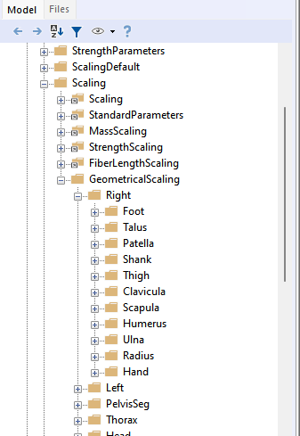
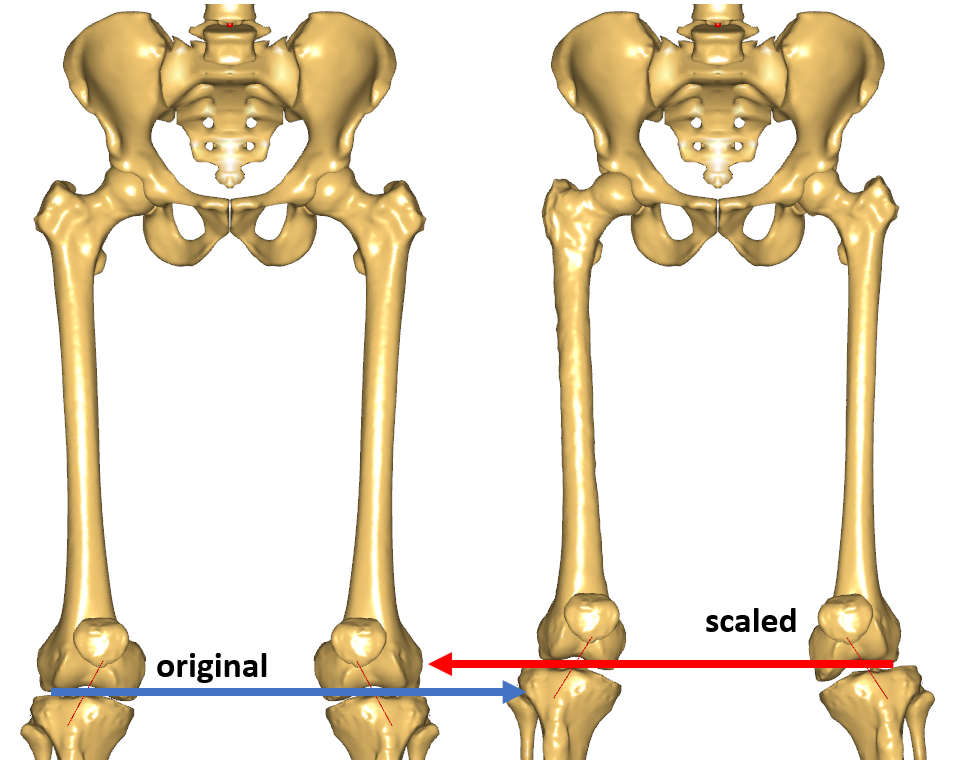

Lesson 4: Including a Custom Scaling Law
========================================

This lesson explains how we can utilize our own custom scaling function
which we designed in Lesson 3 and combine it with other scaling laws,
e.g. the scaling laws introduced in Lesson 1 and Lesson 2.

Preparing the model for introduction of subject-specific scaling
----------------------------------------------------------------

When creating a musculoskeletal model, we have to decide on the
dimensions of the model components. Lessons 1 and 2 described how
anthropometric regression equations and body measurements can be used to
define these dimensions. However, the most precise models include
subject-specific geometries of the bones. To explain how we can include
these, let us consider a simple scenario: We have a model of a person
who matches the standard size man and we want to perform an inverse
dynamics analysis. Additionally, we have the geometry from a CT-scan of
one of his femur bones. To increase the accuracy of our model, let us
improve it using a subject-specific scaling for the femur.

First of all, let us prepare a model matching the standard size man to
be the basis for further subject-specific improvements. Therefore, we
look back into :doc:`Lesson 1 <lesson1>` and use the model from the
first section **ScalingStandard,** StandingModelScalingDisplay from the
AnyBody Managed Model Repository (AMMR). This is well suited to show how
to use subject-specific geometry in a model.

Including custom scaling for a single bone
------------------------------------------

Let us configure this example to use ScalingStandard. Just like in
lesson 1, we need to define ``BM_SCALING`` as ``CONST_SCALING_STANDARD``
and out-comment all other parts of the scaling configuration block.
With this setting, the model is now scaled to the generic size. We can
now include individual scaling laws for each segment, which will be
done in a special file *CustomScaling.any*, where all the
modifications related to individual segment morphing are supposed to
be done. This file is already present in the example and you can
include it as shown below:

.. code-block:: AnyScriptDoc

    /*------------- SCALING CONFIGURATION SECTION --------------------*/
    // Actual scaling law
    § #define BM_SCALING CONST_SCALING_STANDARD§
    
    // Scaling laws using joint to joint measures
    //  #define BM_SCALING CONST_SCALING_UNIFORM
    //  #define BM_SCALING CONST_SCALING_LENGTHMASS
    //  #define BM_SCALING CONST_SCALING_LENGTHMASSFAT
    
    
    // Scaling laws using external measures
    //  #define BM_SCALING CONST_SCALING_UNIFORM_EXTMEASUREMENTS 
    //  #define BM_SCALING CONST_SCALING_LENGTHMASS_EXTMEASUREMENTS 
    //  #define BM_SCALING CONST_SCALING_LENGTHMASSFAT_EXTMEASUREMENTS 
      
    // Anthropometric data file (unchanged files can be found in AAUHuman\Scaling\AnyFamily)
    //  #path BM_SCALING_ANTHRO_FILE "Model\AnyFamily\AnyMan.any"
    //  #path BM_SCALING_ANTHRO_FILE "Model\AnyFamily\AnyManUniform.any"
    //  #path BM_SCALING_ANTHRO_FILE "Model\AnyFamily\AnyManExternal.any"
    //  #path BM_SCALING_ANTHRO_FILE
    "Model\AnyFamily\AnyManExtPercentile.any"
    //  #path BM_SCALING_ANTHRO_FILE
    "Model\AnyFamily\AnyWomanExtPercentile.any"
    //--------------- END OF SCALING CONFIGURATION -------------------
    
    §#include "Model\CustomScaling.any"§
    
    #include "<ANYBODY_PATH_BODY>/HumanModel.any"

If we open this file by a double click, we can see that a common place
to make modifications has already been prepared. Further, we can find
an access point to the geometrical scaling law folder, which will be
used to specify individual scaling laws.

.. code-block:: AnyScriptDoc

     // This is a place holder for the inclusion of custom scaling laws
     HumanModel.Scaling.GeometricalScaling = {
     };

So let us introduce a custom scaling law for the left femur from
:download::doc:`Lesson 3 <lesson3>`. We prepared a single file
`MyScalingLaw.any <Downloads/MyScalingLaw.any>` holding the scaling
transforms from the previous lesson. We also need to download the
:download:`source <Downloads/SourceFemur.stl>` (native to AMMR) and
`target <Downloads/TargetFemur.stl>` (courtesy of Prof. Sebastian
Dendorfer, University of Regensburg, Germany) femur surface
geometries, and copy them to the *Model* folder of the
StandingModelScalingDisplay example. Now, we need to make several
small adjustments to the scaling law for smooth incorporation into the
model structure.

Starting from the AMMR v1.6.2, individual segment scaling is
implemented in the anatomical reference frame. We will call this frame
a scaling reference frame, since there might be several definitions of
anatomical reference frames. In general, the segmental frame can be
different from the scaling reference frame. The human body model
internally handles relevant reference frame changes without needing
users to do anything. However, this leads to small modifications
needed for the subject-specific scaling inclusion into the full-body
model.

In order to perform the scaling in another reference frame – all source
entities need to be moved into that reference frame. This can be done
using a rigid body transformation to preserve sizes of the modelling
objects. In our scaling law (MyScalingLaw.any) the source entities are

-  MyScalingLaw.AffineTransform.Points0,

-  MyScalingLaw.RBFTransform.Points0,

-  MyScalingLaw.STLTransform.Input.SourceSrf.

We just need to get the rigid body transformation that we do not know
yet.

In the version 1.6.2 such transformations will be segment dependent and
will only be needed for right and left shank and femur as well as for
the pelvis. For all other segments this transform can be defined as an
identity transformation or does not have to be applied to the source
entities. The following transforms can be referenced as TSeg2ScaleFrame,
the name that will be used further:

-  HumanModel.BodyModel.Left[*Right*].Seg.Thigh[*Shank*].Scale.T0

-  HumanModel.BodyModel.Trunk.SegmentsLumbar.PelvisSeg.Scale\_Trunk\_Pelvis.ScaleAfterInterfaceMorphingDef.Scale.T0.

Starting from the AMMR v1.6.3 (corresponds to the AMS v 6.0.3) this
transform, TSeg2ScaleFrame, is already defined and can be found in the
subfolder of HumanModel.Scaling.GeometricalScaling, which corresponds to
the morphed segment and has a similar name. This transform can be easily
accessed as demonstrated below.

Let us subject the source entities of the scaling law to the rigid body
transformation, TSeg2ScaleFrame. We will need to make the following 3
changes. Please note how we look up out of the *MyScalingLaw* folder
using double and quadruple dots:

.. code-block:: AnyScriptDoc

      AnyFunTransform3DLin2 AffineTransform = 
      {
        Points0 = §..TSeg2ScaleFrame(§
        {{0.0138187,0.00136731,0.0273618},    // fovea capitis
    	... 
          {0.0368766,-0.393677,0.0266919}}§)§;    // medial posterior condyle
        Points1 = 
        {{0.289913,0.420538,0.0138931},    // fovea capitis
    	... 
          {0.261891,0.47585,-0.372696}};    // medial posterior condyle
        Mode = VTK_LANDMARK_AFFINE;
      };
    ...
      AnyFunTransform3DRBF RBFTransform = 
      {
        PreTransforms = {&.AffineTransform};
        RBFDef = 
        {
          Type = RBF_ThinPlate;
          Param = 1;
        };
        Points0 = §..TSeg2ScaleFrame(§{
          { 0.0138, 0.0014, 0.0274},
    	...
          { 0.0010, 0.0013, 0.0069} 
        }§)§;
    ...
      AnyFunTransform3DSTL STLTransform = 
      {
        PreTransforms = {&.RBFTransform};
        RBFDef.Type = RBF_ThinPlate;
        AnyFixedRefFrame Input = {
          AnySurfSTL SourceSurf = {
            FileName = "SourceFemur.stl";
            ScaleXYZ = {1, 1, 1};
            §AnyFunTransform3D &pre = ....TSeg2ScaleFrame; §
          };
    

As you will see from the following changes the modification simply links
the transformations to the folder containing our MyScalingLaw.any file.
In our case, this folder is
HumanModel.Scaling.GeometricalScaling.Left.Thigh, which corresponds to
the name of the segment, we are trying to morph, and contains our
TSeg2ScaleFrame rigid body transform.

So finally let us add this scaling function to the model. Please
insert the following lines as shown below into the file
CustomScaling.any:

.. code-block:: AnyScriptDoc

    HumanModel.Scaling.GeometricalScaling = {
    §#define CUSTOM_SCALING_Left_Thigh
    Left.Thigh = {
      #include "MyScalingLaw.any"
      AnyFunTransform3D &ScaleFunction = MyScalingLaw.Transform;
    };§ 
    };

In this modification, we added a pre-processor command (#define) that
notifies the model assembling block that the anthropometric scaling
for the left thigh segment is not being used. To process other body
parts you will need to add a similar definition, but utilize actual
bone segment, e.g. #define CUSTOM\_SCALING\_<Side>\_<SegmentName> for
different sides or CUSTOM\_SCALING\_<SegmentName> for parts of the
body that do not have sides. You can find a list of segments by
browsing the scaling law in the Model tab:

|Model tree|

The other change was to assign the new custom scaling function to be
used in the segment of the left thigh instead of the excluded one. If
we now comment in DrawExternalMeasures.any and look in the Model View,
we can see that the left femur is now shorter and a little thinner
than with the standard scaling. So we have now successfully introduced
our custom scaling law into the model.

|Model view Lower body custom femur|

If we would have used a bone that does not have a mirrored pair, e.g.
vertebrae, skull, etc., or we just want to scale a single side with a
patient-specific scaling law, we would be finished now and could
continue with running the inverse dynamics. But here, we want to
continue and scale the other side as well. Normally we would use the
patient-specific bones of the other side. In case that only one side
is available, we can assume that the body is symmetric, which is
typically true up to a certain accuracy. Thus, we will include a
similar scaling for the corresponding mirrored pair. In the next
section we will describe how to make mirroring modifications to our
transformation.

Introducing a mirrored pair of a custom scaling
-----------------------------------------------

We start by making a copy of MyScalingLaw.any that will be used to
construct the mirrored transform and call it MyScalingLaw\_Mirrored.any.
What we have to do is to define a symmetry plane and reflect relevant
entities accordingly. In this example such plane corresponds to the
global XY plane. To perform the reflection, we need to multiply all
relevant landmark points contained in the MyScalingLaw\_Mirrored.any
file by a mirroring matrix:

.. code-block:: AnyScriptDoc

    AnyFolder MyScalingLaw§_Mirrored§ = {
      §AnyMatrix AMirroring = { // XY plane symmetry
        {1,0,0},
        {0,1,0},
        {0,0,-1}
      };§
    ...
      AnyFunTransform3DLin2 AffineTransform = 
      {
        Points0 = ..TSeg2ScaleFrame({...} §* .AMirroring§);
        Points1 = {...} §* .AMirroring§;
        Mode = VTK_LANDMARK_AFFINE;
      };
    ...
      AnyFunTransform3DRBF RBFTransform = 
      {
        ...
        Points0 = ..TSeg2ScaleFrame({...} §* .AMirroring§);
        Points1 = {...} §* .AMirroring§;
        ...
      };
    };  // MyScalingLaw§_Mirrored§

After mirroring the landmarks, we have to think about the surfaces
which were also used in the construction of this transform. So we have
to reflect them too. This can be done easily by just changing the
ScaleXYZ members of the input surfaces of the AnyFunTransform3DSTL
class:

.. code-block:: AnyScriptDoc

    AnyFolder MyScalingLaw_Mirrored = {
      ...
      AnyFunTransform3DSTL STLTransform = 
      {
        PreTransforms = {&.RBFTransform};
        RBFDef.Type = RBF_ThinPlate;
        AnyFixedRefFrame Input = {
          AnySurfSTL SourceSurf = {
            FileName = "SourceFemur.stl";
            ScaleXYZ = §{1, 1, -1}§;
            AnyFunTransform3D &pre = ....TSeg2ScaleFrame; 
          };
          AnySurfSTL TargetSurf = {
            FileName = "TargetFemur.stl";
            ScaleXYZ = §{1, 1, -1}§;
          };
        };
        
        SurfaceObjects0 = {&Input.SourceSurf};
        SurfaceObjects1 = {&Input.TargetSurf};
        //FileName0 = "SourceFemur.stl";    // such definition was used previously
        //FileName1 = "TargetFemur.stl";    // such definition was used previously
        NumPoints = 400;
        BoundingBox.ScaleXYZ = {2, 2, 2};
        BoundingBox.DivisionFactorXYZ = {1, 1, 1};
        BoundingBoxOnOff = On;
      };
      ...
    };  // MyScalingLaw_Mirrored 

Finally, we have to include the mirrored scaling into the model exactly
the same way the left thigh scaling was included:

.. code-block:: AnyScriptDoc

    #define CUSTOM_SCALING_Left_Thigh 
    §#define CUSTOM_SCALING_Right_Thigh§ 
    Left.Thigh = {
      #include "MyScalingLaw.any"
      AnyFunTransform3D &ScaleFunction = MyScalingLaw.Transform;
    };    
    § Right.Thigh = {
      #include "MyScalingLaw_Mirrored.any"
      AnyFunTransform3D &ScaleFunction = MyScalingLaw_Mirrored.Transform;
    };§     

Now the right and left thigh are morphed according to the custom scaling
law. When we load the model and look at our Model View, we can see that
the model looks symmetric again and, compared to the standard scaling
model, the bones look smaller. We can also see this in the following
image where the model changed from the standard scaling case (left) to
the custom scaling one (right):

|Model view scaling comparison|

This concludes the subject-specific scaling tutorial. The modifications
utilized for the mirrored transformed model can be downloaded from here:
MyScalingLaw\_Mirrored.final.any

.. |Model view Lower body custom femur| image:: _static/lesson4/image2.png
   :width: 3.37089in
   :height: 4.48958in
