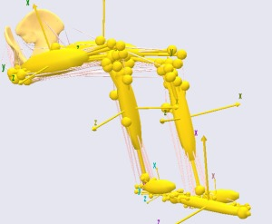
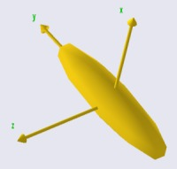
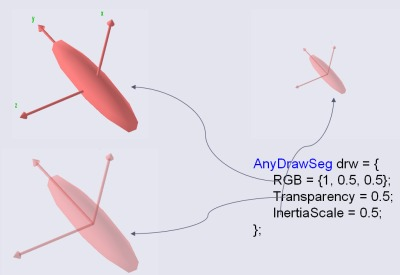

# Lesson 1: Segments

{{ caution_old_tutorial }}

Segments are defined by the AnySeg keyword in AnyScript. They are the
rigid bodies on which the system bases its analysis. In a body model,
segments are usually bones, but since an AnyBody model often comprises
various equipment and other items, segments are also used to model
cranks, pedals, handles, tools, sports equipment, tables, chairs, and
all the other environmental objects a body may be connected to.

In fact, An AnyBody model does not have to entail a living body. You can
easily create an AnyBody model of a machine in which no biological
elements take part.

Segments in AnyBody are basically a set of mass properties as you can
see below.



Segments do not have any particular shape associated with them. By
default a segment is originated in its Center of Mass (CoM), but it is
possible to move the CoM away from the origin of the segment's reference
frame. The mass properties are defined by means of a mass and an inertia
tensor. The segments in the picture above visualize their mass
properties by ellisoids.

Another important property of a segment is that it can have nodes,
so-called AnyRefNodes, assigned to it. The connections between the
segment and the AnyRefNodes are rigid, so the nodes move with the
segment. The nodes are visualized by the heads of the pins sticking out
from the ellipsoids.

A basic definition of a segment could go like this:

```AnyScriptDoc
AnySeg Potato = {
      Mass = 1;
      Jii = {0.01, 0.001, 0.01};
      AnyDrawSeg drw = {};
};
```

Notice that the AnyDrawSeg is just an empty pair of braces signifying
that we are using the standard settings. This will produce the following
image:



The AnyDrawSeg always represents segments as ellipsoids with axis ratios
corresponding to the inertia properties. But the AnyDrawSeg class has
multiple settings that can be used to control the appearence of the
segment:



Please refer to the reference manual for further explanation. The
{doc}`Getting Started with AnyScript <../A_Getting_started_anyscript/intro>` tutorial
provides examples of segment definitions.

:::{rst-class} without-title
:::

:::{seealso}
**Next lesson:** Next up is {doc}`lesson2`.
:::
