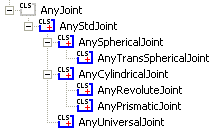

Lesson 2: Joints
================

.. include:: /caution_old_tutorial.rst

You normally think of a joint as something that provides the body with
its movement capability. We interpret joints that way because we would
not be able to move if our joints were rigid. But there is also an
opposite perception of a joint: as a constraint. If we did not have
joints, then our bodies would disconnect into a heap of bones.

The latter perception is how joints really work in AnyBody. Imagine you
have two segments with no joints at all. They each have 6 degrees of
freedom in space: 3 translations and 3 rotations. So two disjoint
segments give us 12 degrees of freedom. If we connect them by a ball and
socket joint, then we eliminate 3 degrees of freedom because they can no
longer translate freely with respect to each other, and we are left with
a mechanism with 12 - 3 = 9 degrees of freedom. AnyBody will keep rack
of all this for you, but it makes things much easier to understand if
you get used to thinking of joints as constraints.

As a final word about perceiving joints as constraints, it might be
worth mentioning that these constraints are not taken into account at
the moment when you load a model into AnyBody. By that time, the
segments are simply positioned in space where you located them in their
definition. In principle, the segments may be in one big, disorganized
heap.

The joint constraints are not imposed until you perform some sort of
analysis. Each study has the SetInitialConditions operation for the
particular purpose of resolving the constraints and connecting things.
The mathematics of that is a nonlinear system of equations. Such a
system may have multiple solutions or no solutions at all. Even if it
has a unique solution, it may de impossible to find. This means that if
the segments are too disorganized from their final positions when they
are defined, then the system might not be able to resolve the
constraints and put them in their correct positions. The remedy is to
define the segments so that their initial positions are not too far away
from the configuration they will have when the constraints are resolved.
You can read much more about this subject in the tutorial :doc:`A study of
Studies <../A_study_of_studies/intro>`.

AnyBody provides you with a variety of ways you can connect segments by
joints. The class tree reveals the following joint class structure:

|Class tree joints|

The different types are described in detail in the AnyScript Reference
manual (Find it in AnyBody->Help). For examples on how to use joints,
please download and study the following two examples:

-  :download:`Slider crank in 2D <Downloads/Demo.SliderCrank2D.any>`

-  :download:`Slider crank in 3D <Downloads/Demo.SliderCrank3D.any>`

.. rst-class:: without-title
.. seealso::
    **Next lesson:** :doc:`lesson3`. 

