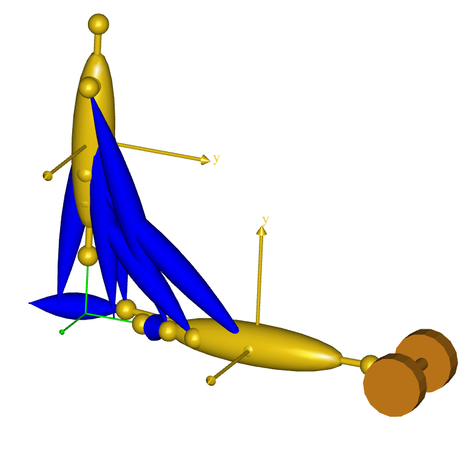
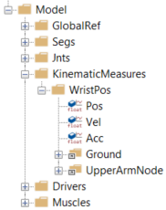
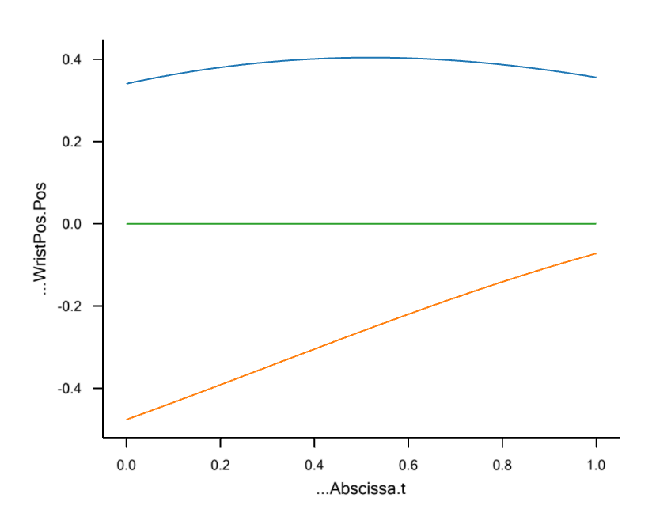

# Lesson 4: Kinematic Measures

{{ caution_old_tutorial }}

You are not likely to have any sort of idea what a kinematic measure is.
Don't worry - you're not supposed to know about it. The concept was
invented by AnyBody Technology as a way of describing dimensions in a
kinematic model that you might want to get information about or control
with drivers. A joint angle or a distance between two points are
examples of kinematic measures. The position of the center of gravity of
the entire model or a subset of its segments are other examples.

If you define a kinematic measure in your model, then you can study its
development. But more importantly you can control it. You can add a
driver to a kinematic measure, and that way control the movement of the
mechanism. Such a driver can be added even when the measure is a less
tangible quantity like the collective center of gravity that is not
attached to a particular segment.

Joints can be understood as kinematic measures equipped with drivers.
For instance, a spherical joint is a distance between two points on two
different segments that is driven to be zero. This means that, using
kinematic measures, you can define types of joints that are not
available as predefined objects in AnyScript.

Do you remember the simple arm example of the "{doc}`Getting Started: AnyScript Programming <../A_Getting_started_anyscript/intro>`"
tutorial? That was a 2-D model of an arm where we produced the movement
by driving the angles of the shoulder and elbow joints directly.



But let us imagine that we wanted the hand to reach out and grab
something at a specific position. It would probably be difficult to
figure out precisely how to drive the two joint angles to put the hand
in the position we wanted it to attain. Instead, we would want to be
able to put the hand (actually the wrist since this simple model has no
hand) directly at the desired position in space and have the elbow and
shoulder joints follow implicitly. This is where the kinematic measures
come into play. Let's start off with the model just about where we left
in the "Getting Started with AnyScript" tutorial. Please {download}`click here to download the necessary file (Measures.any) <Downloads/Measures.any>`,
and save it in some working directory on your own hard disk.

Let us try initially to create a kinematic measure that will allow us to
track the movement of the wrist. To honor the folder structure of the
model we shall create a new folder for the kinematic measure. Let's
place it just below the Jnts folder to reflect the kinship between
kinematic measures and joints:

```AnyScriptDoc
 }; // Jnts folder

 §AnyFolder KinematicMeasures = {
    AnyKinLinear WristPos = {
      
      // These are the nodes that the measure refers to
      AnyFixedRefFrame &Ground = Main.ArmModel.GlobalRef;
      AnyRefNode &UpperArmNode = Main.ArmModel.Segs.LowerArm.HandNode;
      
      Ref = 0;
    };
  }; // KinematicsMeasures§
```

An AnyKinLinear is a kinematic measure that gauges the spatial
vector between two points. The line Ref = 0 means that the coordinates
of this linear distance are measured in the coordinate system first of
the measure's end points which in this case happens to be the global
reference frame. For other options, please refer to the AnyScript
Reference Manual.

So far, we have just added a measure that allows us to track the
movement of the hand, but it is still driven by the joint drivers as
before. Let's investigate what we have. Load the model and run a
KinematicAnalysis or an InverseDynamicAnalysis, and subsequently open a
ChartFX view.

Expanding the tree though
Main.ArmModelStudy.Output.Model.KinematicMeasures.WristPos will give you
the options shown to the below.



Click Pos, and you will get three graphs tracking the x, y, and z
components of the WristPos kinematic measure.



The z component (blue curve) of the measure remains zero throughout the
movement because the model is two-dimensional. The top curve (red) is
the x component, and the bottom curve (green) is the y component.

**Now comes the beauty of kinematic measures: Rather than just observing
them, you can actually drive them!**

We shall replace the existing drivers on the shoulder and elbow joints
by drivers on the x and y components of the WristPos kinematic measure.

We need to remove the existing elbow and shoulder drivers to avoid
kinematic redundancy. You can enclose the drivers in comment characters
`/*  */`, or you can simply erase them, leaving you with an empty
drivers folder:

```AnyScriptDoc
AnyFolder Drivers = {
}; // Drivers folder
```

The next step is to fill drivers for the WristPos measure into the
Drivers folder. We initially make an empty skeleton. Notice that we are
using an AnyKinSimpleDriver here. If you had measured the hand position
by a motion tracking technology and wanted to reproduce the movement,
you would probably want to use an interpolation driver instead.

```AnyScriptDoc
AnyFolder Drivers = {
  § AnyKinEqSimpleDriver HandMotionXY = {
   };§
}; // Drivers folder
```

We can now fill contents into the HandMotionXY driver that will guide
the hand through space:

```AnyScriptDoc
AnyFolder Drivers = {
  AnyKinEqSimpleDriver HandMotionXY = {
    §AnyKinLinear &Jnt = ..KinematicMeasures.WristPos;
    MeasureOrganizer = {0,1};
    DriverPos = {0.4,-0.5};
    DriverVel = {0.2,0.5};
    DriverAcc = {0.0,0.0};
    Reaction.Type = {Off,Off};  // The muscles must do thework§
  };
}; // Drivers folder
```

The first of the red lines above refers to the WristPos kinematic
measure. It simply specifies that this is the measure we want to drive.
Notice, however that this measure has three components, namely the x, y
and z coordinates. But we only want to drive two of them. The
MeasureOrganizer handles that problem. It lines up the coordinates of
the measure in a row for driving. MeasureOrganizer = {0,1} means that
the vectors of driver specifications, such as DriverPos and DriverVel,
refer to the x (number 0) and y (number 1) coordinates of the measure.

The values we suggest for DriverPos and DriverVel have been found by
inspection of the graphs depicted above showing the development of the
measure coordinates when we used the shoulder and elbow drivers. This is
good practice because it is so easy to specify wrist positions that the
arm cannot reach and thereby provoke a kinematic incompatibility that
may be difficult to find in more complex cases.

To conclude, the special feature about kinematic measures is that you
can drive them. In AnyBody, you can drive anything that you can measure,
and this is really a unique facility. If something went wrong for you
along the way, you can {download}`download a commented version of the final result here (Measures2.any) <Downloads/Measures2.any>`.

:::{rst-class} without-title
:::

:::{seealso}
**Next lesson:** The last lesson in the tutorial on mechanical elements is {doc}`lesson5`.
:::
