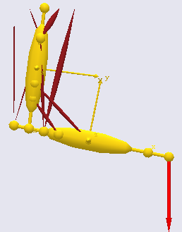
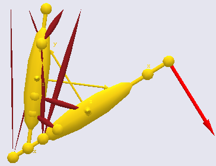

Lesson 5: Forces
================

There are several types of forces in an AnyBody model; forces in joints,
forces in muscles, and gravity forces working on the segments. This
section, however, deals only with the application of external forces. We
need something to work on, and here's a copy of the simple arm model you
can use. Please right-click here and save to your local disk
(Demo.Forces.1.any). When you have saved the file, please open it up in
AnyBody.

At the end of the ArmModel folder you will find that we have added an
empty folder named Loads:

.. code-block:: AnyScriptDoc

    §AnyFolder Loads = {
           
       };  // Loads folder§
 }; // ArmModel

AnyForce3D: External forces
---------------------------

External forces on a mechanical system are usualy perceived as vectors
with some point of attack, and this is indeed one of the ways you can
define forces in AnyScript. Let us begin by defining a force acting on
the PalmNode of the ForeArm segment. The way to go is to first make sure
the model is loaded successfully (by having pressed F7). Please do not
reload the model again before we are finished making the necessary
changes.

Place the cursor on the empty line inside the new Loads folder. Then
select the Classes tab in the tree view on the left hand side of the
editor window, expand the Class List and scroll down until you come to
AnyForce3D. Right-click the class and pick Insert Class Template. This
will give you:

.. code-block:: AnyScriptDoc

    AnyFolder Loads = {
          §AnyForce3D <ObjectName> =
           {
             //F = {0, 0, 0};
             //Flocal = {0, 0, 0};
             AnyRefFrame &<Insert name0> = <Insert object reference (or full object definition)>;
           };§
     };  // Loads folder

Let us initially give the force a descriptive name:

.. code-block:: AnyScriptDoc

     AnyFolder Loads = {
          AnyForce3D §PalmLoad§ = {
             //F = {0, 0, 0};
             //Flocal = {0, 0, 0};
             AnyRefFrame &<Insert name0> = <Insert object reference (or full object definition)>;
           };
     };  // Loads folder

One of the missing blanks is an AnyRefFrame. This is the point of attack
of the force. In our case we want it to work on the PalmNode. We first
prepare for inserting the name of the node:

.. code-block:: AnyScriptDoc

    AnyFolder Loads = {
          AnyForce3D PalmLoad = {
             //F = {0, 0, 0};
             //Flocal = {0, 0, 0};
             AnyRefFrame §&PointOfAttack = §;
           };
     };  // Loads folder

Now, please place the cursor just before the semicolon at the end of the
PointOfAttack line, select the Model tab in the tree view on the left
hand side of the editor window, unfold the ArmModel.Segs.ForeArm branch,
locate the PalmNode, right-click it and select Insert Object Name. You
should get the following result:

.. code-block:: AnyScriptDoc

      AnyFolder Loads = {
           AnyForce3D PalmLoad = {
             //F = {0, 0, 0};
             //Flocal = {0, 0, 0};
             AnyRefFrame &PointOfAttack = §Main.ArmModel.Segs.ForeArm.PalmNode§;
           };
     };  // Loads folder

Please notice now that two lines in the middle of the object are
commented out. We need to enable exactly one of them and we shall begin
with the first one, specifying also a non-zero force vector:

.. code-block:: AnyScriptDoc

    AnyFolder Loads = {
           AnyForce3D PalmLoad = {
             §F = {0, -50, 0};§
             //Flocal = {0, 0, 0};
             AnyRefFrame &PointOfAttack =
      Main.ArmModel.Segs.ForeArm.PalmNode;
           };
     };  // Loads folder

When this specification is used, the force vector gets defined in global
coordinates. The global *y* direction in this model is upwards, so the
vector F = {0, -50, 0} specifies a load directed downwards. Now is the
time to reload the model and open a Model View window if you have not
already done so. After successful load, please select the
InverseDynamicAnalysis and click the Run button. You will see the
bulging of the muscles in response to the downward load on the hand.

It may be nice to be able to actually see the force we have applied.
This can be done with an AnyDrawVector object that we can conveniently
place inside the PalmLoad object like this:

.. code-block:: AnyScriptDoc

    AnyFolder Loads = {
        AnyForce3D PalmLoad = {
            F = {0, -50, 0};
            //Flocal = {0, -50, 0};
            AnyRefFrame &PointOfAttack = Main.ArmModel.Segs.ForeArm.PalmNode;
            §AnyDrawVector drF = {
              Vec = .Fout/200;   // Scale the length down
              Line = {
                Style = Line3DStyleFull;
                Thickness = 0.01;
                RGB = {1, 0, 0};
                End = {
                  Style = Line3DCapStyleArrow;  // This specifies the end to be an arrowhead
                  RGB = {1, 0, 0};
                  Thickness = 0.02;  // The head begins with twice the thickness of the shaft
                  Length = 0.05;
                };
              };
        // attach the arrow to the hand
            AnyRefFrame &Palm = Main.ArmModel.Segs.ForeArm.PalmNode;
        };§
    }; 
    
As you can see, the AnyDrawVec is a class with a lot of different
settings available, and there are actually much more than listed here.
You get to see all of them if you use the class tree to insert the
object. For now, let's just reload the object and run the model. You
should see a red arrow pointing down from the hand indicating the
direction of the force.

|Simple arm model with force|

One of the advantages of defining models in a computer language is that
numbers can be replaced by mathematical expressions. So instead of the
constant force vector we can write a function of time, for instance:

.. code-block:: AnyScriptDoc

    AnyFolder Loads = {
           AnyForce3D PalmLoad = {
             F = {0, -50, 0}§*sin(2*pi*t)§;
             //Flocal = {0, 0, 0};
             AnyRefFrame &PointOfAttack = Main.ArmModel.Segs.ForeArm.PalmNode;
           };
     };  // Loads folder

If you reload and run the InverseDynamicAnalysis again you will see the
force arrow chage direction and you will also see that the muscle
activation changes from the frontal to the posterior side of the arm in
response to the changing load.

Let's impose some movement. It is easily done by a small change in the
elbow driver:

.. code-block:: AnyScriptDoc

    AnyKinEqSimpleDriver ElbowMotion = {
             AnyRevoluteJoint &Jnt = ..Jnts.Elbow;
             DriverPos = {1.5};
             DriverVel = {§60*pi/180§};
             Reaction.Type = {Off};
       }; // Elbow driver

After this change try reloading the model and running the inverse
dynamic analysis again. You should see the model flex its elbow.

For the next issue it is better to change the force back to a constant
value:

.. code-block:: AnyScriptDoc

    AnyFolder Loads = {
           AnyForce3D PalmLoad = {
             F = §{0, -50, 0}§;
             //Flocal = {0, 0, 0};
             AnyRefFrame &PointOfAttack =
      Main.ArmModel.Segs.ForeArm.PalmNode;
           };
     };  // Loads folder

Please load and run again and notice how the external force is vertical
all the time regardless of the movement of the forearm. This is because
we used the property F to specify the force in the PalmLoad object. How
would we go about defining a force that follows the direction of the
hand instead? Well, this is what the Flocal property is for. Let's make
a small change in the force specification:

.. code-block:: AnyScriptDoc

    AnyFolder Loads = {
           AnyForce3D PalmLoad = {
             §//§F = {0, -50, 0};
             §Flocal = {0, -50, 0};§
             AnyRefFrame &PointOfAttack =
      Main.ArmModel.Segs.ForeArm.PalmNode;
           };
     };  // Loads folder

The only change here is that we are using the Flocal property rather
than F to specify the force. Loading and running the model again will
show the force now changind direction with the movement of the arm but
maintaining its direction perpendicular to the forearm, i.e. in the
negative *y* axis of the PalmNode to which it is attached.

|Arm model with force 2|

AnyForce: Internal forces (sort of)
-----------------------------------

Many applications in biomechanics deal with some notion of joint moment.
Let us imagine we wanted to apply a given joint moment to the elbow and
check how the muscles would cope with carrying that.

Our first idea might be that the Flocal property of AnyForce3D would be
ideal for this. If we just work out the distance between the elbow and
the PalmNode then we can easily compute how much Flocal we have to apply
to the forearm to obtain the desired joint moment in the elbow.

But first ideas don't always fly and in this situation the use of
AnyForce3D with Flocal would have an undesirable side effect: The
applied force would also generate a moment about the shoulder joint, and
since there are bi-articular muscles crossing the shoulder as well as
the elbow this is likely to disturb the muscle recruitment pattern
significantly. So, what to do?

Well, what we really want is something that just affects the elbow and
is balanced perfectly from the point-of-view of the rest of the model.
We could come up with an applied force that goes from the upper arm to
the forearm, and should this force then be perpendicular to the forearm
or to the upper arm? Obviously it cannot be both.

It looks like it might be nice with a more general force application
option, and this is what the AnyForce class is. It allows us to apply a
generalized force to any kinematic measure we can possibly define. The
AnyForce takes the form of the kinematic measure, so a linear measure
results in a force and a rotational measure results in a moment.
Moreover, because kinematic measures are such a general concept there
are very few limits to the kinds of forces that they can be used to
specify. So, the elbow moment might simply be applied as an AnyForce
applied to some rotational measure of the elbow angle, and as the
measure we can conveniently use the elbow joint.

We start by disabling the external forces from before:

.. code-block:: AnyScriptDoc

    AnyFolder Loads = {
           AnyForce3D PalmLoad = {
             //F = {0, -50, 0};
         Flocal = {0, §0§, 0};

Instead, we define an AnyForce. Place the cursor inside the Loads folder
right after the ending brace of the PalmLoad object. Then click the
Classes tab in the tree on the left hand side of the editor window,
unfold the Class list, scroll down to the AnyForce class, right-click it
and insert a template. You should get this:

.. code-block:: AnyScriptDoc

    AnyFolder Loads = {
           AnyForce3D PalmLoad = {
             //F = {0, -50, 0};
             Flocal = {0, -50, 0};
             AnyRefFrame &PointOfAttack = Main.ArmModel.Segs.ForeArm.PalmNode;
             AnyDrawVector drF = {
               Vec = .Fout/200;
               Line = {
                 Style = Line3DStyleFull;
                 Thickness = 0.01;
                 RGB = {1, 0, 0};
                 End = {
                   Style = Line3DCapStyleArrow;
                   RGB = {1, 0, 0};
                   Thickness = 0.02;
                   Length = 0.05;
                 };
               };
               AnyRefFrame &Palm = Main.ArmModel.Segs.ForeArm.PalmNode;
             };
           };
          
           §AnyForce <ObjectName> =
           {
             F = ;
             //AnyKinMeasure &<Insert name0> = <Insert object reference (or full object definition)>;
           };§
          
     };  // Loads folder

The structure of the AnyForce class is obviously very simple. This is
because it draws so heavily on the kinematic measure inside it for its
definition. Let's apply a moment to the elbow:

.. code-block:: AnyScriptDoc

    AnyForce §ElbowMoment§ = {
             F = §{-50}§;
             AnyKinMeasure &§Elbow§ = §Main.ArmModel.Jnts.Elbow§;
    };

This applies a moment of -50 units to the elbow. This happens to be an
extension moment, so when you load and run the model again, you will
notice activity mainly in the flexor muscles. But how did we know that a
negative value corresponds to an extension moment? It is actually rather
simple. The joint has a positive angle direction and the applied
AnyForce follows the sign convention of the kinematic measure it is
attached to. In our case we know from the setting of the driver moving
the elbow joint that a positive angular velocity corresponds to flexion,
so a negative moment on the corresponding kinematic measure must be an
extension moment.

If you look carefully, you will also see activity in some of the
mono-articular shoulder muscles. Why does this happen? Wasn't the
AnyForce supposed to only affect the elbow? Indeed it was and does, but
some of the muscles crossing the elbow also affect the shoulder, so
co-contraction is necessary to stabilize the shoulder in the presence of
elbow muscle activity.

What makes the AnyForce local, then? The answer is that the AnyForce
refers to the elbow joint, and the elbow joint refers to the upper arm
and the forearm. So these are the segments affected by the AnyForce. If
the AnyForce includes a reference to a fixed reference frame then the
force applied will have a component going to ground and it will at least
partially work as an external force, but otherwise it is strictly
internal.

AnyForces have many interesting applications. For instance they can be
used to specify gravity-type force fields if you apply them to an AnyCoM
measure. Another interesting use of AnyForces is for specification of
predefined muscle forces. There is a kinematic meaure inside any muscle,
and if an AnyForce is applied to this measure, that force will be
predefined in the muscle. Please notice, that the system may decide to
recruit muscle force beyond what you have applied unless the muscle has
been set to zero strength.

Further studies:
----------------

The following two examples illustrate more of the features of forces in
AnyBody.

1. :download:`*Demo.Forces.any* <Downloads/Demo.Forces.any>`

2. :download:`*Demo.AnyForce.any* <Downloads/Demo.AnyForce.any>`

The first example is a rather basic application of time-varying forces
to the aimple arm model. In addition to the subjects covered in the
sections above it shows forces defined directly as interpolated values a
set of measured data points, for instance from a force platform.

The second example illustrates among other things how forces acting on a
segment can be summed up.

 

