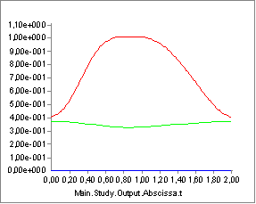
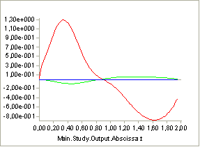
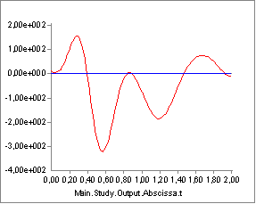

# Kinematic Input Validation

The picture below shows the thorax position variation over time recorded
by digitizing images from a video capture (model curtesy of the
Technical University of Vienna) of ergometer rowing. The red curve is
the horizontal position, and the green curve is the vertical position.
The lateral position remains zero and is the blue curve. It looks very
reasonable, and it does not seem to be infested with significant noise.

To find velocities, the system automatically differentiates positional
data with respect to time and we get the following:

It still looks reasonable except for a suspicion that the maximum
velocity around 12 m/s may be a bit high over such a short distance. The
system dfferentiates the velocity function to obtain the accelerations,
which subsequently according to the second law of Newton will generate
forces:

This graph still looks nice and smooth, but notice the values: The
maximum acceleration is around 300 m/s^2 or 30 g. Notice that this is
for the thorax and not a distal segment like a hand or a foot. It is not
realistic, and it is in fact an artifact produced by the amplification
of small errors in the positional signal through the two subsequent
differentiations.

If you work with recorded movement data, then it is very important to
check that the accelerations are within reasonable limits. The movement
is input in inverse dynamics, and if the accelerations are unrealistic,
then the muscle and joint forces will be too.

Too high acceerations are usually due to lack of smoothness of the
recorded motion data. The solution is often to apply smoothing with a
low pass filter to reduce the unrealistic acceleratons.
